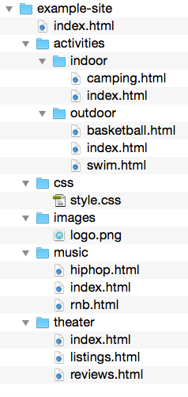

# Oefenreeks 5: Communicatie

Vervang `...` in de onderstaande vragen door jouw antwoord.

## Oefening 1

Een website heeft de volgende mappenstructuur:



* Je wilt de afbeelding `logo.png` gebruiken in het bestand `index.html` op het hoogste niveau. Schrijf de juiste source URL neer:
> images/logo.png

* Je wilt verwijzen naar `style.css` in het bestand `swim.html`. Schrijf de juiste source URL neer:
> ../../css/style.css

* Je wilt de afbeelding `logo.png` gebruiken in het bestand `hiphop.html`. Schrijf de juiste source URL neer:
> ../music/hiphop.html

## Oefening 2

* Een API stuurt je de gegevens van 3 metingen in JSON-formaat. Elke meting bevat:
    * een id: is een uniek nummer.
    * een datum: is de datum en tijd van de meting.
    * een frequentie: is een getal.
    * een amplitude: is ook een getal.
* De API stuurt eveneens de volgende informatie:
    * longitude: is de lengtegraad van de locatie van het meetpunt.
    * latitude: is de breedtegraad is van de locatie van het meetpunt.
    * naam: is de naam van de persoon die verantwoordelijk is voor de sensor.
* Probeer de JSON response van deze API uit te schrijven:

```json
[
    {
        "trackid": "AA-1234",
        "reported_dt": "12/12/2024",
        "frequentie": "8",
        "amplitude": "5",
        "longitude": "-111.12500000",
        "latitude": "33.37500000",
        "sender": "Kyell De Windt"
    },
    {
        "trackid": "AA-1235",
        "reported_dt": "16/12/2024",
        "frequentie": "9",
        "amplitude": "4",
        "longitude": "-120.12500000",
        "latitude": "50.37500000",
        "sender": "Kyell De Windt"
    },
    {
        "trackid": "AA-1236",
        "reported_dt": "18/12/2024",
        "frequentie": "4",
        "amplitude": "9",
        "longitude": "-163.12500000",
        "latitude": "75.37500000",
        "sender": "Kyell De Windt"
    }
]

...

```