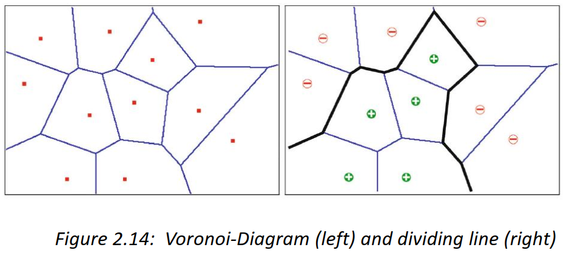
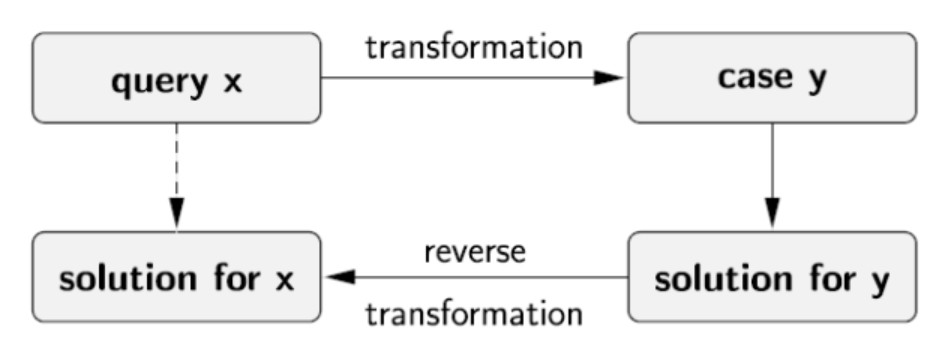
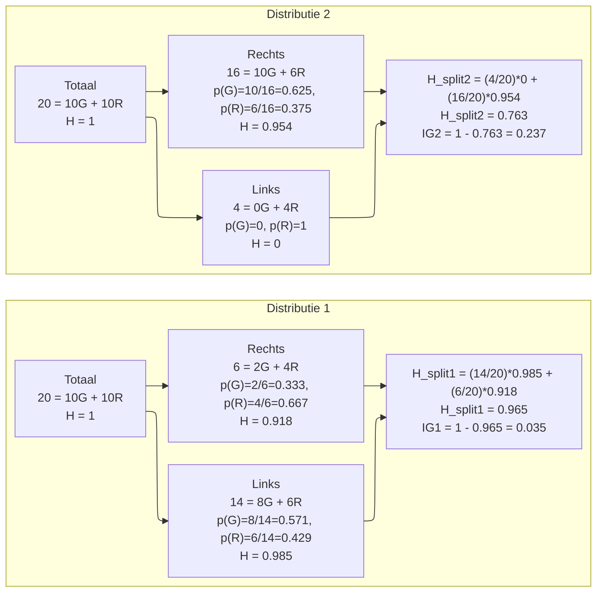

# AI Fundamentals – Samenvatting en Antwoorden

---

## Hoofdstuk 1 – Introduction and Examples

<details>
<summary><strong>Wat is Artificiële Intelligentie? Geef een mogelijke definitie en licht de sterke en zwakke
aspecten toe in deze definitie.</strong></summary>

**Definitie (Elaine Rich):**  
AI is de studie van hoe we computers dingen kunnen laten doen waar mensen op dit moment beter in zijn.

**Sterktes:**

- Dynamische definitie
- Niet vastgepind op mens-nabootsing

**Zwaktes:**

- Wat vandaag AI is, is morgen gewone software

</details>

<details>
<summary><strong>Omschrijf het experiment van psycholoog Valentin Braitenberg om intelligent gedrag bij
systemen te demonsteren.</strong></summary>

Eenvoudige systemen met sensoren en motoren kunnen **schijnbaar intelligent gedrag** vertonen.

**opzet**

- Voertuig met twee sensoren (licht) en twee motoren
- Sensoren verbonden met motoren (direct of cross-wired)
- Verschillende verbindingen leiden tot verschillend gedrag (aantrekken, vermijden, nieuwsgierigheid)

**resultaten**

- Eenvoudige verbindingen leiden tot complex gedrag.


💡 Belangrijk: complex gedrag betekent niet dat het systeem intern complex is.

</details>

<details>
<summary><strong>Wat zijn de vier fundamentele strategieën binnen AI? Eén ervan is: ‘systemen’ gedragen zich als
mensen. Geef telkens een concreet voorbeeld voor elk van deze strategieën.</strong></summary>

1. Handelen als mensen – chatbots

   - chatbots zoals ELIZA imiteren menselijk gesprek.

2. Denken als mensen – IBM Watson

    - IBM Watson gebruikt natuurlijke taalverwerking en kennisrepresentatie om vragen te beantwoorden.

3. Rationeel denken – logische systemen

    - Logische systemen gebruiken formele logica om geldige conclusies te trekken.

4. Rationeel handelen – intelligente agents

    - Intelligente agents nemen beslissingen om hun doelen te bereiken, zoals zelfrijdende auto's.

</details>

<details>
<summary><strong> Bespreek de Turing test om intelligentie bij ‘systemen’ aan te tonen.</strong></summary>

De Turingtest stelt dat een machine intelligent is als een mens haar, via tekstuele interactie, niet kan onderscheiden van een andere mens.


</details>

<details>
<summary><strong>Vijf belangrijke mijlpalen in AI</strong></summary>

- **1936 – Alan Turing: Turing machine**

  - Basis voor computationele theorie.
  - Formele definitie van algoritmen.

- **1956 – Dartmouth Conference**

  - Eerste officiële AI-conferentie.
  - Introductie van de term "Artificial Intelligence".
  - Start van AI-onderzoek als academisch veld.

- **1997 – Deep Blue**

  - Eerste schaakcomputer die wereldkampioen Garry Kasparov versloeg.
  - Toonde de kracht van brute-force zoekalgoritmen in games.
  - Legde de basis voor verdere ontwikkeling van AI in strategische spellen.

- **2012 - ImageNet & AlexNet**

  - Doorbraak in beeldherkenning met diepe neurale netwerken.
  - Significant verbeterde nauwkeurigheid bij het classificeren van afbeeldingen.
  - Versnelde de adoptie van deep learning in diverse AI-toepassingen.

- **2016 – AlphaGo**

  - Eerste AI die een professionele Go-speler versloeg.
  - Combineerde deep learning met Monte Carlo Tree Search.
  - Toonde het potentieel van AI in complexe, strategische omgevingen.

</details>

<details>
<summary><strong> Veel gekende inferentie- of leerprocessen zijn onbepaalbaar/onbeslisbaar. Wat betekent dit
praktisch voor artificiële intelligentie?</strong></summary>

het betekent dat er geen algemene algoritmen bestaan die voor alle mogelijke gevallen een oplossing kunnen bieden. In de praktijk betekent dit dat AI-systemen vaak heuristieken, benaderingen of beperkingen moeten gebruiken om problemen op te lossen, omdat ze niet altijd een perfecte of optimale oplossing kunnen garanderen.

heuristieken zijn vuistregels of benaderingen die helpen bij het vinden van goede oplossingen binnen redelijke tijd, ook al garanderen ze niet altijd de beste oplossing. AI-onderzoekers moeten dus vaak compromissen sluiten tussen nauwkeurigheid, efficiëntie en haalbaarheid bij het ontwerpen van AI-systemen.

</details>

<details>
<summary><strong>Wat is de NP-compleetheid van een algoritme?</strong></summary>

Een probleem is NP-compleet als een oplossing snel te controleren is, maar het probleem zelf even moeilijk is als alle andere NP-problemen.
Als er ooit een efficiënt algoritme wordt gevonden voor één NP-compleet probleem, dan zijn alle NP-problemen efficiënt oplosbaar.
Omdat dit niet het geval is, gebruikt artificiële intelligentie in de praktijk heuristieken en benaderingen in plaats van exacte oplossingen.

</details>

<details>
<summary><strong>
Verklaar volgende begrippen:

- Reflex agent
- Distributed agent
- Learning agent
- Hardware agent

</strong></summary>

- **Reflex agent** :

  - Neemt beslissingen op basis van de huidige perceptie.
  - Werkt met conditionele regels (if-then).
  - Voorbeeld: thermostaat die de temperatuur regelt.

- **Distributed agent** :

  - Bestaat uit meerdere samenwerkende agents.
  - Verdeelt taken en informatie.
  - Voorbeeld: swarm robots die samenwerken om een taak uit te voeren.

- **Learning agent** :

  - Kan zijn prestaties verbeteren door ervaring.
  - Bestaat uit een leercomponent, een prestatiecomponent, een criticus en een probleemomgevingsmodel.
  - Voorbeeld: een zelfrijdende auto die leert van rijervaringen.

- **Hardware agent** :

  - Fysieke entiteit die taken uitvoert.
  - Voorbeeld: robotarm in een fabriek.

</details>

<details>
<summary><strong>
Gegeven:

    een ‘agent met geheugen’ kan zich verplaatsen in een 2D-vlak.
    Via een real-time klok ontvangt de ‘agent’ periodiek (∆𝑡) zijn exacte positie (𝑥, 𝑦) in Cartesiaanse coördinaten.

  • Opgave :

    Geef de formule, om de snelheid te bepalen op basis van de positie op tijdstippen 𝑡 en 𝑡 − ∆𝑡.
    Geef de formule, om de versnelling te bepalen op basis van de positie op tijdstippen 𝑡, 𝑡 − ∆𝑡 en 𝑡 − 2∆𝑡

</strong></summary>

### Snelheid en versnelling van een agent in 2D

**Snelheid**

De snelheid vector op tijdstip \(t\) wordt berekend met:  


**Versnelling**

De versnelling vector op tijdstip \(t\) wordt berekend met:  

 
---

### Uitleg van componenten

| Symbool | Betekenis |
|---------|-----------|
| \(x_t, y_t\) | Positie van de agent op tijdstip \(t\) |
| \(x_{t-\Delta t}, y_{t-\Delta t}\) | Positie één tijdstap eerder |
| \(x_{t-2\Delta t}, y_{t-2\Delta t}\) | Positie twee tijdstappen eerder |
| \(\Delta t\) | Tijd tussen twee opeenvolgende metingen |
| \(\vec{v}(t)\) | Snelheid vector op tijdstip \(t\) |
| \(\lvert\vec{v}(t)\rvert\) | Absolute snelheid (snelheidsnorm) |
| \(\vec{a}(t)\) | Versnelling vector op tijdstip \(t\) |

</details>

<details>
<summary><strong>Teken de generieke architectuur van een knowledge-based system en licht toe.</strong></summary>

**Een Knowledge-Based System (KBS) bestaat uit twee dingen:**

Kennisbank (Knowledge Base) – hier staat alle info en regels over een onderwerp.

Denkmachine (Inference Engine) – dit gebruikt de kennis om dingen te berekenen of beslissingen te nemen.

**Waarom scheiden handig is:**

- Je hoeft de denkmachine maar één keer te maken.

- Wil je het systeem voor iets nieuws gebruiken? Vervang gewoon de kennisbank, niet alles opnieuw programmeren.

- De kennis staat los van hoe het gebruikt wordt, dus makkelijk aan te passen en te onderhouden.

**Kort voorbeeld:**

- Stel je hebt een medisch systeem voor griep.

- Wil je hetzelfde systeem voor verkoudheid?

- Gewoon de kennisbank vervangen → de denkmachine blijft hetzelfde.


**Uitleg van componenten:**

- **Knowledge Base** : Bevat feiten en regels over de wereld.

- **Inference Engine** : Past logica toe om nieuwe kennis af te leiden.

</details>

---

## Hoofdstuk 2 – Machine Learning & Data Mining

<details>
<summary><strong>
Bespreek bondig volgende types machine learning en geef van elk voorbeeld een aantal toepassingen:

- Supervised learning
- Unsupervised learning
- Reinforcement learning

</strong></summary>

- **Supervised learning** :

  - Model leert van gelabelde data.
  - Toepassingen:

    - spamdetectie
    - beeldherkenning
    - medische diagnose.

- **Unsupervised learning** :

  - Model leert van ongelabelde data.
  - Toepassingen:

    - klantsegmentatie
    - anomaliedetectie
    - marktanalyses.

- **Reinforcement learning** :

  - Model leert door beloningen en straffen.
  - Toepassingen:

    - robotica
    - spelstrategieën
    - zelfrijdende auto's.

</details>

<details>
<summary><strong>Wat betekent generalization binnen machine learning?</strong></summary>

Het vermogen van een model om zowel met nieuwe als ongeziene data goed om te gaan.

Een goed gegeneraliseerd model kan patronen herkennen die niet alleen in de trainingsdata voorkomen, maar ook in nieuwe situaties.

</details>

<details>
<summary><strong>Wat is een learning agent en wat is de primaire taak van een learning agent?</strong></summary>

Een learning agent is een type artificiële intelligentie dat in staat is om te leren van ervaringen en zijn prestaties te verbeteren naarmate het meer data verzamelt.

De primaire taak van een learning agent is om zijn gedrag aan te passen op basis van de feedback die het ontvangt uit zijn omgeving, zodat het effectiever kan handelen en betere beslissingen kan nemen in toekomstige situaties.

</details>

<details>
<summary><strong>Wat is Data Mining en geef enkele praktische toepassingen van Data Mining?</strong></summary>

Automatisch ontdekken van **patronen in grote datasets**.

Voorbeelden:

- Fraudedetectie
- Marketing
- Gezondheidszorg
- Sociale netwerken
- Productaanbevelingen

</details>

### Statistische formules

Beschrijf de wiskundige vorm voor het bepalen van
- het groepsgemiddelde,
- de standaardafwijking,
- de covariantie  
- de correlatiecoëfficiënt  

- hoe kunnen deze parameters de keuze van de features vectors bij supervised machine learning ondersteunen?

<details>
<summary><strong>Gemiddelde</strong></summary>

**Formule:**  


▶️ Het gemiddelde is de centrale waarde van de dataset.

</details>

<details>
<summary><strong>Standaardafwijking</strong></summary>

**Formule:**  


- Trek van elke waarde het gemiddelde af.
- Kwadrateer die verschillen.
- Tel ze op en deel door (aantal - 1).
- Neem de wortel.

Resultaat: hoe groter $s_i$, hoe meer spreiding.

➡️ Geeft aan hoe sterk data verspreid is.

</details>

<details>
<summary><strong>Covariantie</strong></summary>

**Formule:**


➡️ Positief = samen stijgen, negatief = tegengesteld.

</details>

<details>
<summary><strong>Correlatiecoëfficiënt</strong></summary>

**Formule:**  


➡️ toont in AI hoe sterk twee kenmerken (features) lineair met elkaar samenhangen.
Waarde tussen −1 en +1.

</details>

<details>
<summary><strong>nut in supervised learning</strong></summary>

Goede feature vectors hebben:

- Sterk verschillend groepsgemiddelde per klasse

- Lage standaardafwijking binnen elke klasse

- Lage correlatie met andere features

- Hoge relevantie t.o.v. de output (label)

Doel:
➡️ maximale informatie
➡️ minimale redundantie
➡️ minder ruis
➡️ betere generalisatie

</details>

---

### Perceptron


<details>
<summary><strong>Waarom wordt het Perceptron gecatalogeerd als een linear classifier?</strong></summary>

Omdat het een lineaire combinatie van inputfeatures gebruikt om beslissingen te nemen.

Het Perceptron berekent een gewogen som van de inputs en past een drempelwaarde toe om te bepalen tot welke klasse een input behoort.

Hierdoor kan het alleen lineair scheidbare problemen oplossen, wat kenmerkend is voor lineaire classifiers.

</details>

<details>
<summary><strong>
Bespreek het Perceptron Learning Algorithm en pas dit iteratief toe op een aantal datapunten in twee lineair gescheiden datasets, tot alle datapunten correct zijn geclassificeerd.
</strong></summary>

**Perceptron Learning Algorithm:**

deze werkt via 2 formules:

**beslissingsfunctie:**


dit beslist of een punt tot klasse +1 of -1 behoort.

**updatefunctie:**


Hiermee worden de gewichten aangepast als een punt verkeerd geclassificeerd is.

Leert via iteratieve gewichtsaanpassing.

**stappenplan:**


berekening


omdat n = 1 mag deze in de berekening weg gelaten worden

---

punt 1

( 0, 1.8 )  t = +1   b = 0

a = ( 0 *0 ) + ( 0* 1.8 ) + 0 =  0 ==> is niet > 0 ==> updaten

w = ( 0 , 0 ) + ( +1 ) ( 0 , 1.8 ) = ( 0 , 1.8 )

b = 0 + 1 * 1 = 1

---

punt 2

( 2 , 0.6 )  t = +1  b = 1  w = ( 0 , 1.8 )

a = ( 0 *2 ) + ( 1, 8* 0,6 ) + 1 = 2.08 ==>  is  > 0 ==> niet updaten

w = ( 0 , 1.8 )

---

punt 3

( -1.2 , 1.4 )  t = -1  w = ( 0, 1.8 )   b = 1

a = ( 0 *( -1,2) ) + ( 1,8* 1,4 ) + 1 = 3,52 ==> is > 0 ==> updaten

w = ( 0 , 1.8 ) + ( -1 ) ( -1.2 , 1.4 ) = ( 1.2 , 0.4 )

b = 1 +  1 * ( -1 ) = 0

---

punt 4

( 0.4 , -1 )   w = ( 1.2 , 0.4 )   t = -1   b = 0

a = ( 1,2 *0,4 ) + ( 0,4* ( -1 )) + 0 = 0,08 ==> is > 0 ==> updaten

w = ( 1.2 , 0.4 ) + ( -1 ) ( 0.4 , -1 ) = ( 0.8 , 1.4 )

b = 0 + 1 * ( -1 ) = -1

resultaat w = ( 0.8 , 1.4 ) b = -1

---


indien gegeven kan verder gerekend worden met een ander punt


---

</details>

<details>
<summary><strong>
Het convergeren van het Perceptron Learning Algorithm is sterk afhankelijk van de keuze van
de gewichten-vector (w).
Welke technieken kunnen worden toegepast om de snelheid van de
convergentie op te drijven?
</strong></summary>

**Technieken om convergentiesnelheid te verbeteren:**

- **Normailisatie van de w-factor:**

  - dit zorgt ervoor dat de gewichten evenveel waarde hebben tijden training los van de zwaarte van zijn waarde.

    

- **heuristische initiële waarden:**
  - kies gewichten op basis van domeinkennis of voorafgaande analyses.
  - dit zorgt ervoor dat de startwaarden dichter bij de optimale oplossing liggen.

- **learning rate aanpassing:**
  - pas de learning rate dynamisch aan tijdens training.
  - een hogere learning rate in het begin kan snellere vooruitgang boeken, terwijl een lagere rate later fijnere aanpassingen mogelijk maakt.

- **learning rate slim kiezen:**
  - experimenteer met verschillende learning rates om de optimale waarde te vinden die snelle convergentie bevordert zonder overshooting.
  - grote stappen eerst klenere stappen later.

- **data shuffling:**
  - randomiseer de volgorde van trainingsvoorbeelden in elke epoch.
  - dit voorkomt dat het model vastloopt in patronen van de data.

- margin based perceptron:
  - focus op het maximaliseren van de marge tussen klassen.
  - dit kan leiden tot snellere convergentie en betere generalisatie.

De convergentie van het perceptron wordt versneld door een goede initiële keuze van 𝑤.

het normaliseren van de inputfeatures en het gebruik van aangepaste update-strategieën zoals een afnemende learning rate of margin-based updates.

</details>

---

### Afstanden (Nearest Neighbor)

<details>
<summary><strong>
Hoe worden volgende afstanden wiskundig bepaald bij het Nearest Neighbor Algorithm?

- Euclidean distance
- Hamming distance
- Manhattan distance

</strong></summary>

| Afstand | Formule | Betekenis | Gebruik |
|--------|---------|-----------|---------|
| Euclidisch | √Σ(xi−yi)² | Rechte lijn | Continue data |
| Manhattan | d = |v1 - x1| + |v2 - x2| | Rasterafstand | Grid / stadsblokken |
| Hamming |  verschillen | Bits tellen | Binaire data |

</details>

---

details>
<summary><strong>
Bespreek het k-Nearest Neighbor algoritme en pas dit toe op een aantal datapunten in een 2D-vlak.
</strong></summary>

Het k-Nearest Neighbor algoritme is een niet-parametrisch classificatie-algoritme dat een nieuw datapunt toewijst aan de klasse die het meest voorkomt bij zijn k dichtstbijzijnde buren, waarbij de afstand meestal berekend wordt met de Manhattan afstand.

```math
Manhattan\;Distance\;
= d(v,x)= |v_1 - x_1| + |v_2 - x_2| 
```

betekenis:
- d: afstand tussen twee punten
- (v1, v2): coördinaten van de vector
- (x1, x2): coördinaten van het trainingspunt

bereken eerst alle afstanden tot v om dan de gevraagde k te nemen ( punten )
k = aantal buren

en op basis hiervan de meerderheid te laten beslissen tot welke klasse v behoort.

⚠️ k moet oneven zijn bij binaire classificatie om gelijke stemmen te vermijden.

voorbeeld:

v = (8, 3.5)

**stap 1:**
noteer alle trainingspunten met hun klasse

| Punt | X1 | X2 | Klasse |
|------|----|----|--------|
| 1    | 6  | 1  | 0      |
| 2    | 7  | 3  | 0      |
| 3    | 8  | 2  | 0      |
| 4    | 9  | 0  | 0      |
| 5    | 8  | 4  | 1      |
| 6    | 8  | 6  | 1      |
| 7    | 9  | 2  | 1      |
| 8    | 9  | 5  | 1      |

**stap 2:**
bereken de Manhattan afstand tot v voor elk punt
steeds dezelfde formule gebruiken:

```math
d(v,x) = |8 - x_1| + |3.5 - x_2|

```

**stap 3:**

sorteren op afstand

| Rang | Punt | Afstand | Klasse |
|------|------|---------|--------|
| 1    | 5    | 0.5     | 1      |
| 2    | 2    | 1.5     | 0      |
| 3    | 3    | 1.5     | 0      |
| 4    | 6    | 2.5     | 1      |
| 5    | 7    | 2.5     | 1      |
| 6    | 8    | 2.5     | 1      |
| 7    | 1    | 4.5     | 0      |
| 8    | 4    | 4.5     | 0      |


**stap 4:**
k kiezen (bijv. k=3) en stemmen

**k1**
dichtstbijzijnde buur:

| Rang | Punt | Afstand | Klasse |
|------|------|---------|--------|
| 1    | 5    | 0.5     | 1      |

stemmen:

- Klasse 1: 1 stem

➡️ v wordt geclassificeerd als klasse 1.

---

**k3**

dichtstbijzijnde buren:

| Rang | Punt | Afstand | Klasse |
|------|------|---------|--------|
| 1    | 5    | 0.5     | 1      |
| 2    | 2    | 1.5     | 0      |
| 3    | 3    | 1.5     | 0      |

stemmen:

- Klasse 0: 2 stemmen
- Klasse 1: 1 stem

➡️ v wordt geclassificeerd als klasse 0.

---

**K5**

dichtstbijzijnde buren:

| Rang | Punt | Afstand | Klasse |
|------|------|---------|--------|
| 1    | 5    | 0.5     | 1      |
| 2    | 2    | 1.5     | 0      |
| 3    | 3    | 1.5     | 0      |
| 4    | 6    | 2.5     | 1      |
| 5    | 7    | 2.5     | 1      |

stemmen:

- Klasse 0: 2 stemmen
- Klasse 1: 3 stemmen

➡️ v wordt geclassificeerd als klasse 1.

</details>

---

Wat is een Voronoi diagram en wat is de functie van het Voronoi diagram in het Nearest
Neighbor Algorithm?

dit is een techniek om de ruimte op te delen in regio's rond elk trainingspunt.
Elk punt in een regio is dichter bij het bijbehorende trainingspunt dan bij enig ander trainingspunt.
Het Voronoi-diagram helpt bij het visualiseren van de beslissingsgrenzen van het k-NN-algoritme en maakt het efficiënter om de dichtstbijzijnde buren te vinden door de zoekruimte te beperken tot relevante regio's.



dit houd in dat je snel kan bepalen tot welke klasse een nieuw punt behoort door te kijken in welke regio het valt.

- regio + = punt is automatisch +

- regio - = punt is automatisch -

---

Hoe wordt de dominante invloed van de punten, die verder verwijderd zijn van een nieuw
datapunt, in het Nearest Neighbor Algorithm aangepakt en wat is distance weighted
optimization?

in plaats van alle k buren gelijk te behandelen, krijgen de dichterbij gelegen buren meer gewicht bij het stemmen.
want je kan punten hebben die nearest neighbors zijn maar toch ver weg liggen.

**Distance Weighted Optimization:**

elke buur krijgt een gewicht dat omgekeerd evenredig is met zijn afstand tot het nieuwe datapunt.
Dit betekent dat dichterbij gelegen buren een grotere invloed hebben op de classificatie dan verder weg gelegen buren.

```math
w_i = \frac{1}{d_i + \varepsilon}

```

waarbij:

- \(w_i\) = {gewicht van buur i}
- \(d_i\) = afstand van buur i tot het nieuwe datapunt
- \(\varepsilon\) = kleine constante om deling door nul te voorkomen

voor alle k buren worden de gewichten berekend en gebruikt bij het stemmen.

```math
class1 = (w_1 + w_2 + ... + w_k)
```

```math
class2 = (w_1 + w_2 + ... + w_k)
```

```math
classN = (w_1 + w_2 + ... + w_k)
```

de class met de hoogste waarde wint en het punt wordt daaraan toegewezen.

---

Verklaar Lazy learning en Eager learning en wat is de relatie met het Nearest Neighbor
Algorithm?

lazy learning: ( goed voor locally optimal solutions )

- leert pas bij een query
- slaat alle data op
- traag bij predictie
- voorbeeld: k-NN

eager learning: ( goed voor globale optimal solutions )

- leert vooraf
- bouwt een model
- snel bij predictie
- voorbeeld: Decision Tree

| Kenmerk       | Lazy Learning            | Eager Learning                   |
| ------------- | ------------------------ | -------------------------------- |
| Training      | Minimal / alleen opslaan | Model bouwen                     |
| Voorspellen   | Rekent veel              | Snel                             |
| Voorbeeld     | kNN                      | Decision Tree, Linear Regression |
| Flexibiliteit | Goed voor nieuwe data    | Moeilijk aan te passen           |

---

Hoe werkt de machine learning techniek van case-based reasoning (CBR) en wat zijn de
voornaamste problemen als CBR in de praktijk wordt toegepast?

Case-Based Reasoning (CBR) is een machine learning techniek waarbij nieuwe problemen worden opgelost door te putten uit oplossingen van vergelijkbare, eerder opgeloste problemen (cases).

**Werking van CBR:**

1. **Retrieve**: Zoek naar vergelijkbare cases in de casebase.
2. **Reuse**: Pas de oplossing van de gevonden case(s) toe op het nieuwe probleem.
3. **Revise**: Evalueer en verbeter de voorgestelde oplossing indien nodig.
4. **Retain**: Sla de nieuwe case en oplossing op voor toekomstig gebruik

deze cyclus heet ook wel de 4 R's van CBR.



case x wordt vergeleken met case y op basis van feature similarity.
daarna wordt de oplossing van case y aangepast voor case x.

bv

voorlicht fiets defect bij case y
achterlicht fiets defect bij case x

stappen voor oplossing case y aanpassen naar case x

**Problemen bij CBR in de praktijk:**

**Modeling**:

de domain moet goed begrepen worden om relevante features te kiezen.

- alle kenmerken en keuzes moeten goed gedefinieerd zijn.
- men kan niet alle specifieke gevallen voorzien of uitzonderingen.
- maakt het moeilijk om complete of rebuste modellen te bouwen.

**gelijkheid**

bij numerieke data is het makelijk om te vergelijken.
bij categorische data is het moeilijker om gelijkenis te bepalen.

- hoe meet je het verschil tussen categoreren zoals kleuren, merken, types, etc?

bv hoest vs droge hoest

- dit kan leiden tot verkeerde vergelijkingen en slechte oplossingen.

**transformatie**

het aanpassen van oude oplossingen naar nieuwe problemen kan complex zijn.
en niet alle oplossingen zijn direct toepasbaar.

- vereist vaak domeinkennis en creativiteit. er is geen unviversele manier om oplossingen te transformeren.

| Uitdaging      | Beschrijving                                                                                |
| -------------- | ------------------------------------------------------------------------------------------- |
| Modeling       | Niet alle special cases en varianten kunnen vooraf gemodelleerd worden                      |
| Similarity     | Moeilijk om een goede gelijkenismaat te vinden voor symbolische / niet-numerieke data       |
| Transformation | Moeilijk om oplossingen van vergelijkbare cases correct aan te passen voor nieuwe problemen |

---

## Entropy & Information Gain


<summary><strong>
Wat is de wiskundige vorm van de entropy H van een probability distribution en de information
content van een dataset I(D) in relatie tot het bepalen van de information gain G(D,A)?

- Gegeven: een tabel met het overzicht van attributen en hun waarden
- Opgave: verklaar hoe de decision tree wordt bepaald a.d.h.v. de information gain</strong></summary>

men start met de entropy van de volledige dataset D.
om daarna met de nieuwe splitsing de informatie winst te berekenen aka van entropy naar minder entropy "orde"

**Formule:**

```math 
H(D) = -(p_1 \cdot log_2(p_1) + p_2 \cdot log_2(p_2) + ... + p_k \cdot log_2(p_k))
```

**Uitleg per onderdeel:**
- **D**: dataset
- **k**: aantal klassen
- **p1, p2, ..., pk**: proportie van elk klasse in D
- **log2(pi)**: informatie-inhoud in bits

⚠️ kan niet groter worden dan 1 = 100%

- 0 = zuivere dataset (allezelfde klasse)
- 1 = maximale onzekerheid (gelijke verdeling)

➡️ Meet onzekerheid in de data.
</details>

details>
<summary><strong>Information Gain</strong></summary>

**Formule:**

```math
IG(S,A) = H(S) - \sum_{i=1}^{k} \frac{|S_i|}{|S|} \cdot H(S_i)
```

**Uitleg per onderdeel:**

- **S**: dataset
- **A**: attribuut = de test "splitsing" die je wilt evalueren
- **H(S)**: entropy vóór splitsing van dataset S zie formule entropy.
- **k**: aantal mogelijke waarden van attribuut A
- **i=1**: index voor elke mogelijke waarde van A
- **Si**: subset van S na splitsing op attribuut A
- **|Si|**: aantal elementen in subset Si
- **|S|**: totaal aantal elementen in S
- **H(Si)**: entropy van subset Si

➡️ Hoogste gain = beste splitsing.

vb

er zijn 20 datapoints:

- 10 rood 
- 10 groen

**Stap 1: Bereken H(D)**

kansen:

p(rood) = 10/20 = 0.5
p(groen) = 10/20 = 0.5

formule invullen:

```math
H_{totaal} = -(0.5 \cdot log_2(0.5) + 0.5 \cdot log_2(0.5)) = 1
```

entropy is dus 1 ( maximale onzekerheid )

**stap 2:**

je doet dit voor elke kant apart 

1. Bereken kans groen/rood links en rechts
2. Bereken H voor links en rechts
3. neem het gewogen gemiddelde van links en rechts

verdeling:

| verdeling | links(G/R)| rechts(G/R)|
|-----------|------|-------|
| 1     | 8/6  | 2/4    |
| 2    | 0/4   | 10/6    |

- **Splitsing 1:**

entropy links:

```math
P(G) = 8/14 \hspace{1cm}P(R) = 6/14 \\
```

```math
H_L = -(\frac{8}{14} \cdot log_2(\frac{8}{14}) + \frac{6}{14} \cdot log_2(\frac{6}{14})) \approx 0.985
```

entropy rechts:

```math
P(G) = 2/6 \hspace{1cm}P(R) = 4/6 \\
```

```math
H_R = -(\frac{2}{6} \cdot log_2(\frac{2}{6}) + \frac{4}{6} \cdot log_2(\frac{4}{6})) \approx 0.918
```
gewogen gemiddelde:

```math
H_{split1} = \frac{14}{20} \cdot 0.985 + \frac{6}{20} \cdot 0.918 \approx 0.967
```

```math
IG_{1} = 1 - 0.967 = 0.033
```

---

- **Splitsing 2:**

entropy links:

```math
P(G) = 0 \hspace{1cm}P(R) = 1 \\
```

```math
H_L = - (0 \cdot log_2(0) + 1 \cdot log_2(1)) = 0
```

entropy rechts:

```math
P(G) = 10/16 \hspace{1cm}P(R) = 6/16 \\
```

```math
H_R = -(\frac{10}{16} \cdot log_2(\frac{10}{16}) + \frac{6}{16} \cdot log_2(\frac{6}{16})) \approx 0.954
```
gewogen gemiddelde:

```math
H_{split2} = \frac{4}{20} \cdot 0 + \frac{16}{20} \cdot 0.954 \approx 0.763
```

```math
IG_{2} = 1 - 0.763 = 0.237
```



**Conclusie:**
Splitsing 2 is beter met een hogere Information Gain van 0.237 versus 0.033 voor splitsing 1.

# Hoofdstuk 3 – Neural Networks
 – Neural Networks

## Neuron model

📷 *Afbeelding van een artificieel neuron met inputs, gewichten, som en activatiefunctie.*

z = w·x − θ  
y = σ(z)

Activation function: introduceert **niet-lineariteit**.

---

## Fitting

- Underfitting: te simpel
- Overfitting: te complex
- Optimal: juiste balans

---

## Sigmoid

σ(x) = 1 / (1 + e^(−(x−θ)/T))

Gebruikt in **hidden & output layers**.

---

## Hebb rule

Δw = η · x · y

"Neurons that fire together, wire together."

---

## Gradient descent / Delta rule

Δw = −η · ∂E/∂w

---

## Backpropagation

- Fout van output naar input
- Gewichten aangepast via gradient descent

---

## Support Vector Machine (SVM)

Zoekt **maximale marge** tussen klassen.

Support vectors = kritische punten.

---

## Deep learning & Autoencoders

- Unsupervised pretraining
- Daarna supervised fine-tuning

---

## CNN

📷 *Schema van een CNN: convolution → pooling → fully connected.*

Structuur:
- Convolution layers
- Pooling
- Fully connected

Principe: **lokale filters + weight sharing**.

---

# Hoofdstuk 4 – Search, Games and Problem Solving

## Aantal knooppunten

N ≈ b^d

---

## Branching factor

- Average: gemiddeld
- Effective: echte impact

---

## Eigenschappen zoekalgoritmen

- Deterministic
- Observable
- Complete
- Optimal

---

## BFS & DFS

| Eigenschap | BFS | DFS |
|-----------|-----|-----|
| Strategie | Level per level | Zo diep mogelijk |
| Geheugen | Hoog | Laag |
| Volledig | Ja | Nee (oneindig) |
| Optimale oplossing | Ja (gelijke kosten) | Nee |

---

## Iterative Deepening

Combineert:
- Volledigheid BFS
- Geheugen DFS

➡️ Beste uninformed search.

---

## Heuristic search

Gebruikt schatting h(s).

---

## Greedy Search

f(s) = h(s)

---

## A* Search

<details>
<summary><strong>Evaluatiefunctie</strong></summary>

**Formule:**  
f(s) = g(s) + h(s)

**Uitleg per onderdeel:**
- **s**: huidige toestand
- **g(s)**: kost van start tot s
- **h(s)**: geschatte kost tot doel
- **f(s)**: totale geschatte kost

➡️ A* kiest de toestand met laagste f(s).
</details>

---

## Alpha-Beta Pruning

📷 *Voorbeeld-search tree met gesnoeide takken (klassiek Minimax-diagram).*

Snoeit takken als:

α ≥ β

➡️ Minder knooppunten, zelfde resultaat.

---

## Monte Carlo Tree Search (MCTS)

- Random simulaties
- Statistische evaluatie

➡️ Zeer efficiënt bij grote spelbomen.

---

## Conclusie

AI combineert:
- Leren uit data
- Zoeken in complexe ruimtes
- Rationeel handelen

Moderne AI is **data-gedreven, pragmatisch en schaalbaar**.

