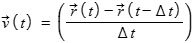
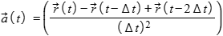
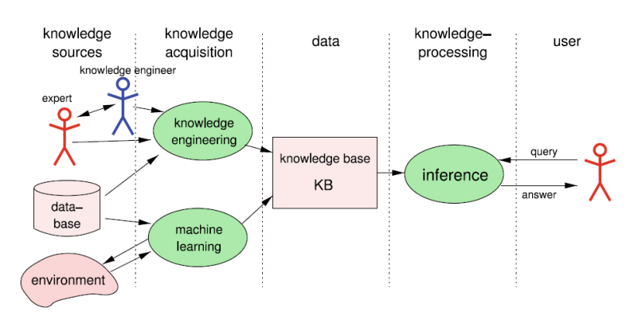
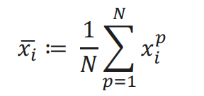
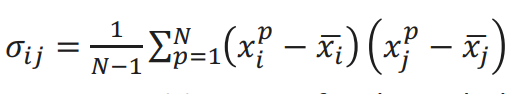
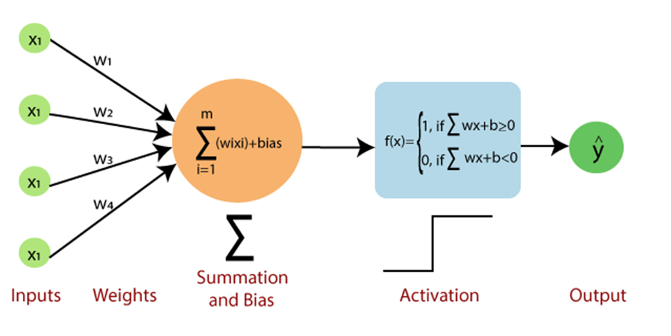
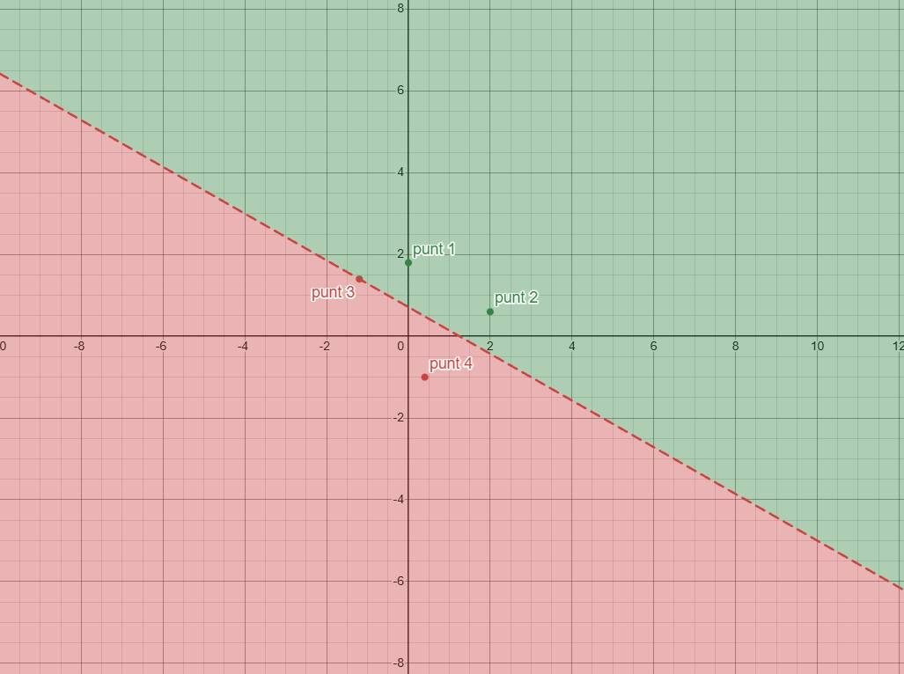

# AI Fundamentals – Samenvatting en Antwoorden

---

## Hoofdstuk 1 – Introduction and Examples

<strong>Wat is Artificiële Intelligentie? Geef een mogelijke definitie en licht de sterke en zwakke
aspecten toe in deze definitie.</strong>

**Definitie (Elaine Rich):**  
AI is de studie van hoe we computers dingen kunnen laten doen waar mensen op dit moment beter in zijn.

**Sterktes:**

- Dynamische definitie
- Niet vastgepind op mens-nabootsing

**Zwaktes:**

- Wat vandaag AI is, is morgen gewone software

<strong>Omschrijf het experiment van psycholoog Valentin Braitenberg om intelligent gedrag bij
systemen te demonsteren.</strong>

Eenvoudige systemen met sensoren en motoren kunnen **schijnbaar intelligent gedrag** vertonen.

**opzet**

- Voertuig met twee sensoren (licht) en twee motoren
- Sensoren verbonden met motoren (direct of cross-wired)
- Verschillende verbindingen leiden tot verschillend gedrag (aantrekken, vermijden, nieuwsgierigheid)

**resultaten**

- Eenvoudige verbindingen leiden tot complex gedrag.

💡 Belangrijk: complex gedrag betekent niet dat het systeem intern complex is.

<strong>Wat zijn de vier fundamentele strategieën binnen AI? Eén ervan is: ‘systemen’ gedragen zich als
mensen. Geef telkens een concreet voorbeeld voor elk van deze strategieën.</strong>

1. Handelen als mensen – chatbots

   - chatbots zoals ELIZA imiteren menselijk gesprek.

2. Denken als mensen – IBM Watson

    - IBM Watson gebruikt natuurlijke taalverwerking en kennisrepresentatie om vragen te beantwoorden.

3. Rationeel denken – logische systemen

    - Logische systemen gebruiken formele logica om geldige conclusies te trekken.

4. Rationeel handelen – intelligente agents

    - Intelligente agents nemen beslissingen om hun doelen te bereiken, zoals zelfrijdende auto's.

<strong> Bespreek de Turing test om intelligentie bij ‘systemen’ aan te tonen.</strong>

De Turingtest stelt dat een machine intelligent is als een mens haar, via tekstuele interactie, niet kan onderscheiden van een andere mens.

<strong>Vijf belangrijke mijlpalen in AI</strong>

- **1936 – Alan Turing: Turing machine**

  - Basis voor computationele theorie.
  - Formele definitie van algoritmen.

- **1956 – Dartmouth Conference**

  - Eerste officiële AI-conferentie.
  - Introductie van de term "Artificial Intelligence".
  - Start van AI-onderzoek als academisch veld.

- **1997 – Deep Blue**

  - Eerste schaakcomputer die wereldkampioen Garry Kasparov versloeg.
  - Toonde de kracht van brute-force zoekalgoritmen in games.
  - Legde de basis voor verdere ontwikkeling van AI in strategische spellen.

- **2012 - ImageNet & AlexNet**

  - Doorbraak in beeldherkenning met diepe neurale netwerken.
  - Significant verbeterde nauwkeurigheid bij het classificeren van afbeeldingen.
  - Versnelde de adoptie van deep learning in diverse AI-toepassingen.

- **2016 – AlphaGo**

  - Eerste AI die een professionele Go-speler versloeg.
  - Combineerde deep learning met Monte Carlo Tree Search.
  - Toonde het potentieel van AI in complexe, strategische omgevingen.

<strong> Veel gekende inferentie- of leerprocessen zijn onbepaalbaar/onbeslisbaar. Wat betekent dit
praktisch voor artificiële intelligentie?</strong>

het betekent dat er geen algemene algoritmen bestaan die voor alle mogelijke gevallen een oplossing kunnen bieden. In de praktijk betekent dit dat AI-systemen vaak heuristieken, benaderingen of beperkingen moeten gebruiken om problemen op te lossen, omdat ze niet altijd een perfecte of optimale oplossing kunnen garanderen.

heuristieken zijn vuistregels of benaderingen die helpen bij het vinden van goede oplossingen binnen redelijke tijd, ook al garanderen ze niet altijd de beste oplossing. AI-onderzoekers moeten dus vaak compromissen sluiten tussen nauwkeurigheid, efficiëntie en haalbaarheid bij het ontwerpen van AI-systemen.

<strong>Wat is de NP-compleetheid van een algoritme?</strong>

Een probleem is NP-compleet als een oplossing snel te controleren is, maar het probleem zelf even moeilijk is als alle andere NP-problemen.
Als er ooit een efficiënt algoritme wordt gevonden voor één NP-compleet probleem, dan zijn alle NP-problemen efficiënt oplosbaar.
Omdat dit niet het geval is, gebruikt artificiële intelligentie in de praktijk heuristieken en benaderingen in plaats van exacte oplossingen.

<strong>
Verklaar volgende begrippen:

- Reflex agent
- Distributed agent
- Learning agent
- Hardware agent

</strong>

- **Reflex agent** :

  - Neemt beslissingen op basis van de huidige perceptie.
  - Werkt met conditionele regels (if-then).
  - Voorbeeld: thermostaat die de temperatuur regelt.

- **Distributed agent** :

  - Bestaat uit meerdere samenwerkende agents.
  - Verdeelt taken en informatie.
  - Voorbeeld: swarm robots die samenwerken om een taak uit te voeren.

- **Learning agent** :

  - Kan zijn prestaties verbeteren door ervaring.
  - Bestaat uit een leercomponent, een prestatiecomponent, een criticus en een probleemomgevingsmodel.
  - Voorbeeld: een zelfrijdende auto die leert van rijervaringen.

- **Hardware agent** :

  - Fysieke entiteit die taken uitvoert.
  - Voorbeeld: robotarm in een fabriek.

<strong>
Gegeven:

    een ‘agent met geheugen’ kan zich verplaatsen in een 2D-vlak.
    Via een real-time klok ontvangt de ‘agent’ periodiek (∆𝑡) zijn exacte positie (𝑥, 𝑦) in Cartesiaanse coördinaten.

  • Opgave :

    Geef de formule, om de snelheid te bepalen op basis van de positie op tijdstippen 𝑡 en 𝑡 − ∆𝑡.
    Geef de formule, om de versnelling te bepalen op basis van de positie op tijdstippen 𝑡, 𝑡 − ∆𝑡 en 𝑡 − 2∆𝑡

</strong>

### Snelheid en versnelling van een agent in 2D

**Snelheid**

De snelheid vector op tijdstip \(t\) wordt berekend met:  

**Versnelling**

De versnelling vector op tijdstip \(t\) wordt berekend met:  

 
---

### Uitleg van componenten

| Symbool | Betekenis |
|---------|-----------|
| \(x_t, y_t\) | Positie van de agent op tijdstip \(t\) |
| \(x_{t-\Delta t}, y_{t-\Delta t}\) | Positie één tijdstap eerder |
| \(x_{t-2\Delta t}, y_{t-2\Delta t}\) | Positie twee tijdstappen eerder |
| \(\Delta t\) | Tijd tussen twee opeenvolgende metingen |
| \(\vec{v}(t)\) | Snelheid vector op tijdstip \(t\) |
| \(\lvert\vec{v}(t)\rvert\) | Absolute snelheid (snelheidsnorm) |
| \(\vec{a}(t)\) | Versnelling vector op tijdstip \(t\) |

<strong>Teken de generieke architectuur van een knowledge-based system en licht toe.</strong>

**Een Knowledge-Based System (KBS) bestaat uit twee dingen:**

Kennisbank (Knowledge Base) – hier staat alle info en regels over een onderwerp.

Denkmachine (Inference Engine) – dit gebruikt de kennis om dingen te berekenen of beslissingen te nemen.

**Waarom scheiden handig is:**

- Je hoeft de denkmachine maar één keer te maken.

- Wil je het systeem voor iets nieuws gebruiken? Vervang gewoon de kennisbank, niet alles opnieuw programmeren.

- De kennis staat los van hoe het gebruikt wordt, dus makkelijk aan te passen en te onderhouden.

**Kort voorbeeld:**

- Stel je hebt een medisch systeem voor griep.

- Wil je hetzelfde systeem voor verkoudheid?

- Gewoon de kennisbank vervangen → de denkmachine blijft hetzelfde.

**Uitleg van componenten:**

- **Knowledge Base** : Bevat feiten en regels over de wereld.

- **Inference Engine** : Past logica toe om nieuwe kennis af te leiden.

---

## Hoofdstuk 2 – Machine Learning & Data Mining

<strong>
Bespreek bondig volgende types machine learning en geef van elk voorbeeld een aantal toepassingen:

- Supervised learning
- Unsupervised learning
- Reinforcement learning

</strong>

- **Supervised learning** :

  - Model leert van gelabelde data.
  - Toepassingen:

    - spamdetectie
    - beeldherkenning
    - medische diagnose.

- **Unsupervised learning** :

  - Model leert van ongelabelde data.
  - Toepassingen:

    - klantsegmentatie
    - anomaliedetectie
    - marktanalyses.

- **Reinforcement learning** :

  - Model leert door beloningen en straffen.
  - Toepassingen:

    - robotica
    - spelstrategieën
    - zelfrijdende auto's.

<strong>Wat betekent generalization binnen machine learning?</strong>

Het vermogen van een model om zowel met nieuwe als ongeziene data goed om te gaan.

Een goed gegeneraliseerd model kan patronen herkennen die niet alleen in de trainingsdata voorkomen, maar ook in nieuwe situaties.

<strong>Wat is een learning agent en wat is de primaire taak van een learning agent?</strong>

Een learning agent is een type artificiële intelligentie dat in staat is om te leren van ervaringen en zijn prestaties te verbeteren naarmate het meer data verzamelt.

De primaire taak van een learning agent is om zijn gedrag aan te passen op basis van de feedback die het ontvangt uit zijn omgeving, zodat het effectiever kan handelen en betere beslissingen kan nemen in toekomstige situaties.

<strong>Wat is Data Mining en geef enkele praktische toepassingen van Data Mining?</strong>

Automatisch ontdekken van **patronen in grote datasets**.

Voorbeelden:

- Fraudedetectie
- Marketing
- Gezondheidszorg
- Sociale netwerken
- Productaanbevelingen

### Statistische formules

Beschrijf de wiskundige vorm voor het bepalen van
- het groepsgemiddelde,
- de standaardafwijking,
- de covariantie  
- de correlatiecoëfficiënt  

- hoe kunnen deze parameters de keuze van de features vectors bij supervised machine learning ondersteunen?

<strong>Gemiddelde</strong>

**Formule:**  

▶️ Het gemiddelde is de centrale waarde van de dataset.

<strong>Standaardafwijking</strong>

**Formule:**  

- Trek van elke waarde het gemiddelde af.
- Kwadrateer die verschillen.
- Tel ze op en deel door (aantal - 1).
- Neem de wortel.

Resultaat: hoe groter $s_i$, hoe meer spreiding.

➡️ Geeft aan hoe sterk data verspreid is.

<strong>Covariantie</strong>

**Formule:**

➡️ Positief = samen stijgen, negatief = tegengesteld.

<strong>Correlatiecoëfficiënt</strong>

**Formule:**  

➡️ toont in AI hoe sterk twee kenmerken (features) lineair met elkaar samenhangen.
Waarde tussen −1 en +1.

<strong>nut in supervised learning</strong>

Goede feature vectors hebben:

- Sterk verschillend groepsgemiddelde per klasse

- Lage standaardafwijking binnen elke klasse

- Lage correlatie met andere features

- Hoge relevantie t.o.v. de output (label)

Doel:
➡️ maximale informatie
➡️ minimale redundantie
➡️ minder ruis
➡️ betere generalisatie

---

### Perceptron

<strong>Waarom wordt het Perceptron gecatalogeerd als een linear classifier?</strong>

Omdat het een lineaire combinatie van inputfeatures gebruikt om beslissingen te nemen.

Het Perceptron berekent een gewogen som van de inputs en past een drempelwaarde toe om te bepalen tot welke klasse een input behoort.

Hierdoor kan het alleen lineair scheidbare problemen oplossen, wat kenmerkend is voor lineaire classifiers.

<strong>
Bespreek het Perceptron Learning Algorithm en pas dit iteratief toe op een aantal datapunten in twee lineair gescheiden datasets, tot alle datapunten correct zijn geclassificeerd.
</strong>

**Perceptron Learning Algorithm:**

deze werkt via 2 formules:

**beslissingsfunctie:**

dit beslist of een punt tot klasse +1 of -1 behoort.

**updatefunctie:**

Hiermee worden de gewichten aangepast als een punt verkeerd geclassificeerd is.

Leert via iteratieve gewichtsaanpassing.

**stappenplan:**

berekening

omdat n = 1 mag deze in de berekening weg gelaten worden

---

punt 1

( 0, 1.8 )  t = +1   b = 0    

a = ( 0 * 0 ) + ( 0 * 1.8 ) + 0 =  0 ==> is niet > 0 ==> updaten

w = ( 0 , 0 ) + ( +1 ) ( 0 , 1.8 ) = ( 0 , 1.8 )

b = 0 + 1 * 1 = 1

---

punt 2

( 2 , 0.6 )  t = +1  b = 1  w = ( 0 , 1.8 )

a = ( 0 * 2 ) + ( 1, 8 * 0,6 ) + 1 = 2.08 ==>  is  > 0 ==> niet updaten

w = ( 0 , 1.8 )

---

punt 3

( -1.2 , 1.4 )  t = -1  w = ( 0, 1.8 )   b = 1

a = ( 0 * ( -1,2) ) + ( 1,8 * 1,4 ) + 1 = 3,52 ==> is > 0 ==> updaten

w = ( 0 , 1.8 ) + ( -1 ) ( -1.2 , 1.4 ) = ( 1.2 , 0.4 )

b = 1 +  1 * ( -1 ) = 0

---

punt 4

( 0.4 , -1 )   w = ( 1.2 , 0.4 )   t = -1   b = 0

a = ( 1,2 * 0,4 ) + ( 0,4 * ( -1 )) + 0 = 0,08 ==> is > 0 ==> updaten

w = ( 1.2 , 0.4 ) + ( -1 ) ( 0.4 , -1 ) = ( 0.8 , 1.4 )

b = 0 + 1 * ( -1 ) = -1

resultaat w = ( 0.8 , 1.4 ) b = -1

---

indien gegeven kan verder gerekend worden met een ander punt

---

## Afstanden (Nearest Neighbor)

| Afstand | Formule | Betekenis | Gebruik |
|--------|---------|-----------|---------|
| Euclidisch | √Σ(xi−yi)² | Rechte lijn | Continue data |
| Manhattan | Σ|xi−yi| | Rasterafstand | Grid / stadsblokken |
| Hamming | # verschillen | Bits tellen | Binaire data |

---

## k-Nearest Neighbor (k-NN)

📷 *2D-plot met datapunten en cirkel rond het nieuwe punt (visualisatie van k).*

Classificatie via **meerderheid van k dichtste buren**.

---

## Lazy vs Eager learning

| Kenmerk | Lazy learning | Eager learning |
|--------|---------------|----------------|
| Leren | Bij query | Vooraf |
| Voorbeeld | k-NN | Decision Tree |
| Opslag | Veel data | Model |
| Snelheid predictie | Traag | Snel |

---

## Case-Based Reasoning (CBR)

Oplossing zoeken via **gelijkaardige gevallen**.

Problemen:
- Modellering
- Similariteit
- Transformatie

---

## Entropy & Information Gain

<strong>Entropy</strong>

**Formule:**  
H = − Σ pi log2(pi)

**Uitleg per onderdeel:**
- **pi**: kans op klasse i
- **log2(pi)**: informatie-inhoud in bits
- **pi · log2(pi)**: bijdrage per klasse
- **Σ**: som over alle klassen
- **−**: maakt resultaat positief

➡️ Meet onzekerheid in de data.

<strong>Information Gain</strong>

**Formule:**  
G(D,A) = H(D) − Σ (|Di|/|D|) · H(Di)

**Uitleg per onderdeel:**
- **H(D)**: entropy vóór splitsing
- **Di**: subsets na splitsing
- **|Di|/|D|**: gewicht van subset
- **H(Di)**: entropy per subset
- **G(D,A)**: informatie-winst

➡️ Hoogste gain = beste splitsing.

# Hoofdstuk 3 – Neural Networks
 – Neural Networks

## Neuron model

📷 *Afbeelding van een artificieel neuron met inputs, gewichten, som en activatiefunctie.*

z = w·x − θ  
y = σ(z)

Activation function: introduceert **niet-lineariteit**.

---

## Fitting

- Underfitting: te simpel
- Overfitting: te complex
- Optimal: juiste balans

---

## Sigmoid

σ(x) = 1 / (1 + e^(−(x−θ)/T))

Gebruikt in **hidden & output layers**.

---

## Hebb rule

Δw = η · x · y

"Neurons that fire together, wire together."

---

## Gradient descent / Delta rule

Δw = −η · ∂E/∂w

---

## Backpropagation

- Fout van output naar input
- Gewichten aangepast via gradient descent

---

## Support Vector Machine (SVM)

Zoekt **maximale marge** tussen klassen.

Support vectors = kritische punten.

---

## Deep learning & Autoencoders

- Unsupervised pretraining
- Daarna supervised fine-tuning

---

## CNN

📷 *Schema van een CNN: convolution → pooling → fully connected.*

Structuur:
- Convolution layers
- Pooling
- Fully connected

Principe: **lokale filters + weight sharing**.

---

# Hoofdstuk 4 – Search, Games and Problem Solving

## Aantal knooppunten

N ≈ b^d

---

## Branching factor

- Average: gemiddeld
- Effective: echte impact

---

## Eigenschappen zoekalgoritmen

- Deterministic
- Observable
- Complete
- Optimal

---

## BFS & DFS

| Eigenschap | BFS | DFS |
|-----------|-----|-----|
| Strategie | Level per level | Zo diep mogelijk |
| Geheugen | Hoog | Laag |
| Volledig | Ja | Nee (oneindig) |
| Optimale oplossing | Ja (gelijke kosten) | Nee |

---

## Iterative Deepening

Combineert:
- Volledigheid BFS
- Geheugen DFS

➡️ Beste uninformed search.

---

## Heuristic search

Gebruikt schatting h(s).

---

## Greedy Search

f(s) = h(s)

---

## A* Search

<strong>Evaluatiefunctie</strong>

**Formule:**  
f(s) = g(s) + h(s)

**Uitleg per onderdeel:**
- **s**: huidige toestand
- **g(s)**: kost van start tot s
- **h(s)**: geschatte kost tot doel
- **f(s)**: totale geschatte kost

➡️ A* kiest de toestand met laagste f(s).

---

## Alpha-Beta Pruning

📷 *Voorbeeld-search tree met gesnoeide takken (klassiek Minimax-diagram).*

Snoeit takken als:

α ≥ β

➡️ Minder knooppunten, zelfde resultaat.

---

## Monte Carlo Tree Search (MCTS)

- Random simulaties
- Statistische evaluatie

➡️ Zeer efficiënt bij grote spelbomen.

---

## Conclusie

AI combineert:
- Leren uit data
- Zoeken in complexe ruimtes
- Rationeel handelen

Moderne AI is **data-gedreven, pragmatisch en schaalbaar**.

