# sammenvating AI Programming

## Intuïtie van kunstmatige intelligentie ( Hoofdstuk 1 )

Waarom bestaat er geen eensluidende definitie van kunstmatige intelligentie?

Er bestaat geen vaste of eenvoudige definitie van intelligentie.

Wat men onder “intelligentie” verstaat, verschilt van persoon tot persoon en hangt af van de context.

Daarom bestaat er ook geen eenduidige definitie van kunstmatige intelligentie.

De betekenis van AI is dus subjectief en afhankelijk van hoe men intelligentie zelf bekijkt.

---

Wat is het verschil tussen kwantitatieve en kwalitatieve data? Geef enkele concrete voorbeelden van beide soorten data.

**Soorten gegevens**

- Kwantitatieve gegevens

  - Kwantitatieve gegevens zijn **meetbaar** en kunnen in **getallen** worden uitgedrukt.

    **Voorbeelden:**

    - Aantal mensen in een ruimte
    - Temperatuur van een ruimte
    - Gewicht van een persoon

- Kwalitatieve gegevens

  - Kwalitatieve gegevens zijn **niet meetbaar met getallen** en beschrijven een **eigenschap of kenmerk**.

    **Voorbeelden:**

    - Kleur van een ruimte
    - Geur van een ruimte
    - Smaak van een gerecht

---

Wat is het verschil tussen data, informatie en kennis?

- Data, Informatie en Kennis

  - **Data** = ruwe feiten en cijfers zonder betekenis.
  - **Informatie** = verwerkte data die **betekenis** heeft gekregen.
  - **Kennis** = informatie die **begrepen** is en kan worden gebruikt om **beslissingen te nemen**.

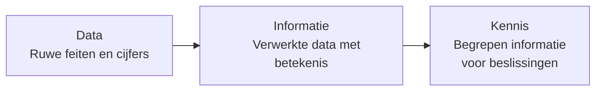

---

Wat is een algoritme? Wat is een AI-algoritme? Wat zijn de componenten van een algoritme?

- **Algoritme**

  - een reeks duidelijke instructies om een probleem op te lossen.

- **AI-algoritme**

  - een algoritme dat gebruikt wordt voor problemen waarvoor menselijke intelligentie nodig is.

    - Het kan leren uit data
    - Het wordt beter naarmate het meer gebruikt wordt

- Elk algoritme bestaat uit:

  - **Input**

    - de gegevens die je erin stopt

  - **Verwerking**

    - de stappen/instructies die worden uitgevoerd

  - **Output**

    - het resultaat

---

Noem een ​​paar categorieën problemen die mensen proberen op te lossen met behulp van (AI) algoritmen.

- Enkele problemen die met AI-algoritmen worden opgelost:

  - Beeldherkenning (bv. gezichten of objecten herkennen)

  - Spraakherkenning (bv. spraak omzetten naar tekst)

  - Natuurlijke taalverwerking (bv. tekst begrijpen en genereren)

  - Autonoom rijden (bv. zelfrijdende auto’s)

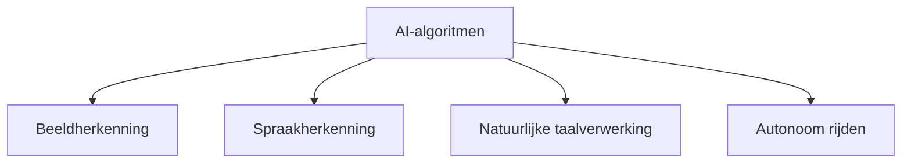

---

Wat is het verschil tussen een lokale beste oplossing en een globale beste oplossing?

- Lokale beste oplossing:

  - De beste oplossing binnen een **beperkt deel** van de oplossingsruimte
  
  - Niet noodzakelijk de allerbeste oplossing

- Globale beste oplossing:

  - De beste oplossing binnen de **volledige** oplossingsruimte

  - Dit is de **echte optimale** oplossing

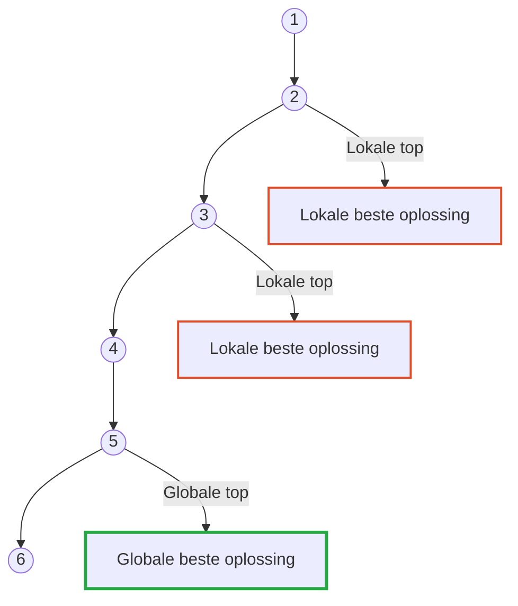

---

Wat is het verschil tussen superintelligentie, algemene intelligentie en smalle intelligentie?

- Superintelligentie:

  - Intelligentie die **hoger is dan menselijke intelligentie**

- Algemene intelligentie:

  - Intelligentie die **op elk probleem** kan worden toegepast

- Smalle intelligentie:

  - Intelligentie die **slechts op één specifiek probleem** kan worden toegepast

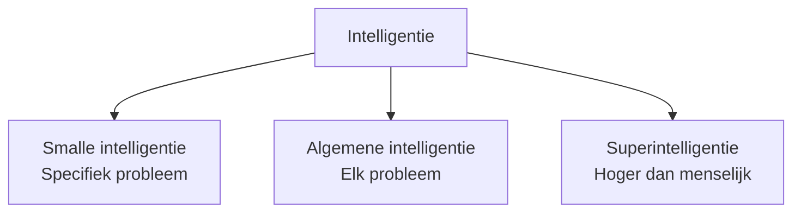

---

Wat is het verband tussen op biologie geïnspireerde algoritmen, machine learning, deep learning en zoekalgoritmen?

- Biologisch geïnspireerde algoritmen:

  - Geïnspireerd door biologische processen

  - Voorbeelden:

    - genetische algoritmen
    - genetisch programmeren
    - mierenkolonie-optimalisatie
    - deeltjeszwermoptimalisatie

  - Vaak onderdeel van evolutionaire computationele methoden

- Machine learning:

  - AI-type dat **leert van data** en **in de loop van de tijd verbetert**

  - Maakt voorspellingen en beslissingen op basis van geleerde data

- Deep learning:

  - Richt zich op **diepe neurale netwerken** met veel lagen

  - Kan hoogwaardige kenmerken en representaties uit data leren

  - Kenmerken: meerlaagse architectuur, end-to-end leren

- Zoekalgoritmen:

  - Worden gebruikt om een oplossing voor een probleem te **vinden**

  - Vaak toegepast bij **optimalisatieproblemen** om de beste oplossing te vinden

- Relatie tussen deze algoritmen:

  - Allemaal typen **AI-algoritmen**

  - Gebruikt om problemen op te lossen die **intelligentie vereisen**

  - Ontworpen om **menselijke intelligentie na te bootsen** en te **leren van data**

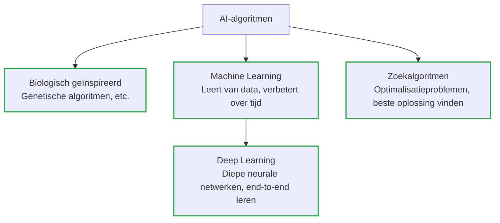

---

Welke drie soorten 'leren' vallen onder machine leren en kunt u elk type 'leren' kort toelichten?

- **Machine learning types**

  - **Supervised learning**
  
    - Leert van **gelabelde data**  

    - Algoritme wordt getraind om **voorspellingen** te doen op basis van geleerde data

  - **Unsupervised learning**  

    - Leert van **ongelabelde data**  

    - Algoritme ontdekt **patronen en verbanden** in de data

  - **Reinforcement learning**  

    - Leert van **feedback/beloningssysteem**

    - Algoritme leert **beslissingen nemen** op basis van ontvangen feedback

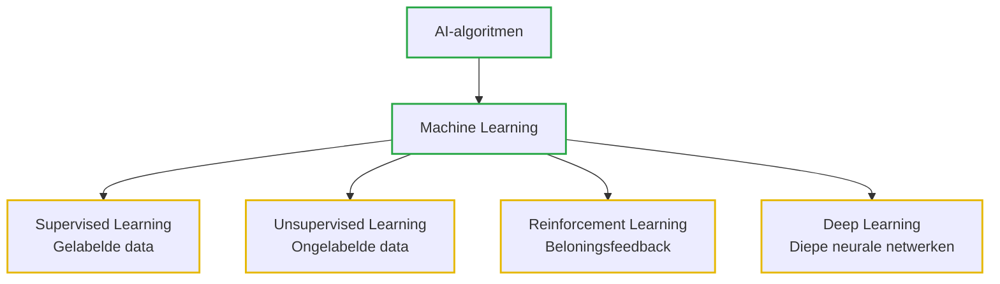

---

## Basisprincipes van zoeken ( Hoofdstuk 2 )

Wat is een datastructuur en geef enkele concrete voorbeelden van datastructuren?

- **Datastructuur**  

  - Manier om **gegevens te organiseren en op te slaan** 

  - Zorgt voor **efficiënte toegang en bewerking** van data  

- **Voorbeelden van datastructuren:**  

  - Arrays  
  - Gekoppelde lijsten  
  - Stacks  
  - Queues  
  - Bomen  
  - Grafieken  
  - Hashtabellen

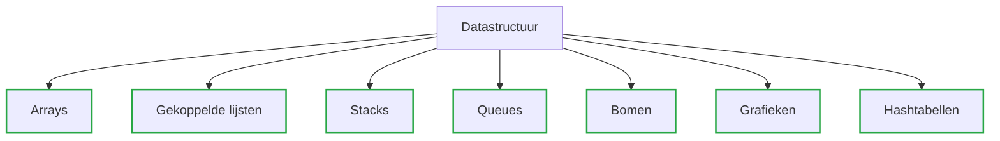

---

Leg de volgende termen uit:

- graph
- vertex
- node
- edge

- **Graaf (Graph)**

  - Datastructuur bestaande uit

    - **knooppunten (vertices)**
  
    - **verbindingen (edges)**
  
- **Vertex**
  
  - vertegenwoordigt een toestand of entiteit  

- **Node**

  - synoniem voor vertex; vertegenwoordigt een toestand of entiteit

- **Edge**

  - vertegenwoordigt een relatie tussen twee knooppunten

---

Gegeven: een graaf

- opdracht:

  - bepaal de :

    - array of edges
    - the incidence matrix
    - and the adjacency matrix

| Structuur        | Wat het laat zien                       | Rijen/Kolommen                              |
| ---------------- | --------------------------------------- | ------------------------------------------- |
| Array of edges   | Lijst van alle verbindingen             | (lijst, geen matrix)                      |
| Incidence matrix | Welke knooppunten horen bij welke edges | Rijen = knooppunten, Kolommen = edges       |
| Adjacency matrix | Welke knooppunten zijn direct verbonden | Rijen = knooppunten, Kolommen = knooppunten |

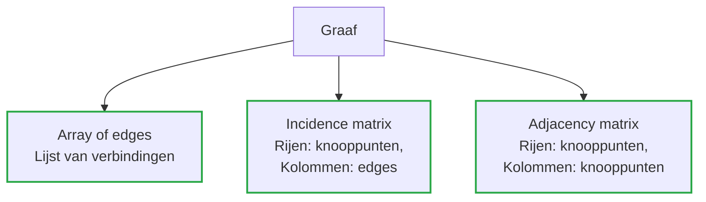

graf voorbeeld:


- **Array of edges:**

```python
[
  # Node 0
  [0, 3], [0, 2], [0, 4],

  # Node 1
  [1, 2], [1, 3], [1, 5],

  # Node 2
  [2, 0], [2, 1],[2, 6],

  # Node 3
  [3, 0], [3, 1], [3, 5], [3, 7],

  # Node 4
  [4, 0], [4, 6], [4, 7],

  # Node 5
  [5, 1], [5, 3], [5, 6], [5, 7],

  # Node 6
  [6, 4], [6, 5], [6, 7],

  # Node 7
  [7, 3], [7, 5], [7, 4], [7, 6]
]

```

- **Incidence matrix: (verbandenmatrix)**

|   | e1 | e2 | e3 | e4 | e5 | e6 | e7 | e8 | e9 | e10 | e11 | e12 | e13 |
|---|----|----|----|----|----|----|----|----|----|-----|-----|-----|-----|
| 0 | 1  | 1  | 1  | 0  | 0  | 0  | 0  | 0  | 0  | 0   | 0   | 0   | 0   |
| 1 | 0  | 0  | 0  | 1  | 1  | 1  | 0  | 0  | 0  | 0   | 0   | 0   | 0   |
| 2 | 0  | 1  | 1  | 0  | 1  | 0  | 0  | 0  | 0  | 0   | 0   | 0   | 0   |
| 3 | 1  | 0  | 0  | 1  | 0  | 0  | 1  | 0  | 0  | 1   | 0   | 0   | 0   |
| 4 | 0  | 1  | 0  | 0  | 0  | 0  | 0  | 0  | 1  | 0   | 0   | 0   | 1   |
| 5 | 0  | 0  | 0  | 0  | 0  | 1  | 1  | 1  | 0  | 0   | 1   | 0   | 0   |
| 6 | 0  | 0  | 0  | 0  | 0  | 0  | 0  | 1  | 1  | 0   | 0   | 1   | 0   |
| 7 | 0  | 0  | 0  | 0  | 0  | 0  | 0  | 0  | 0  | 1   | 1   | 1   | 1   |

- **Adjacency matrix: (aangrenzen matrix)**

|   | 0 | 1 | 2 | 3 | 4 | 5 | 6 | 7 |
|---|---|---|---|---|---|---|---|---|
| 0 | 0 | 0 | 1 | 1 | 1 | 0 | 0 | 0 |
| 1 | 0 | 0 | 1 | 1 | 0 | 1 | 0 | 0 |
| 2 | 1 | 1 | 0 | 0 | 0 | 0 | 0 | 0 |
| 3 | 1 | 1 | 0 | 0 | 0 | 1 | 0 | 1 |
| 4 | 1 | 0 | 0 | 0 | 0 | 0 | 1 | 1 |
| 5 | 0 | 1 | 0 | 1 | 0 | 0 | 1 | 1 |
| 6 | 0 | 0 | 0 | 0 | 1 | 1 | 0 | 1 |
| 7 | 0 | 0 | 0 | 1 | 1 | 1 | 1 | 0 |

---

Leg uit : een boom is een verbonden acyclische graaf.

- **Boom (Tree)**
  
  - Een type **graaf**
  - bv familie-stamboom  

  - Kenmerken:  

    - Elk knooppunt is verbonden

    - **Geen cycli** (geen rondjes)  

    - Lijkt op een **hiërarchie**

      - Eén **wortelknooppunt** (root)  

      - Verbonden **kindknooppunten** (children)

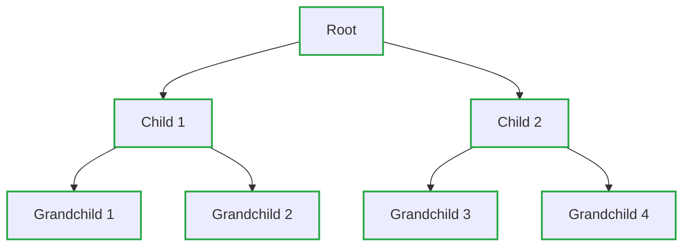

---

Leg de volgende 'tree' termen uit:

- root node
- parent node
- sibling nodes
- descendant nodes
- ancestor nodes
- leaf nodes
- goal node
- path
- cost
- depth
- degree

| Term                | Uitleg                                                                                 |
|---------------------|----------------------------------------------------------------------------------------|
| Root Node           | Het bovenste knooppunt van de boom; het startpunt van de hiërarchie.                   |
| Parent Node         | Een knooppunt dat één of meerdere kinderen heeft.                                      |
| Sibling Nodes       | Knooppunten die dezelfde ouder hebben; “broers/zussen” op hetzelfde niveau.            |
| Descendant Nodes    | Alle knooppunten die onder een bepaald knooppunt vallen.                               |
| Ancestor Nodes      | Alle knooppunten boven een bepaald knooppunt, inclusief de root.                       |
| Leaf Nodes          | Knooppunten zonder kinderen; de uiteinden van de boom.                                 |
| Goal Node           | Het knooppunt dat een specifiek doel of resultaat representeert.                       |
| Path                | Een reeks knooppunten van de root naar een bepaald knooppunt.                          |
| Cost                | De “prijs” of waarde van het volgen van een bepaald pad (bijv. bij zoekproblemen).     |
| Depth               | Het aantal niveaus vanaf de root tot een bepaald knooppunt.                            |
| Degree              | Het aantal kinderen van een knooppunt.                                                 |

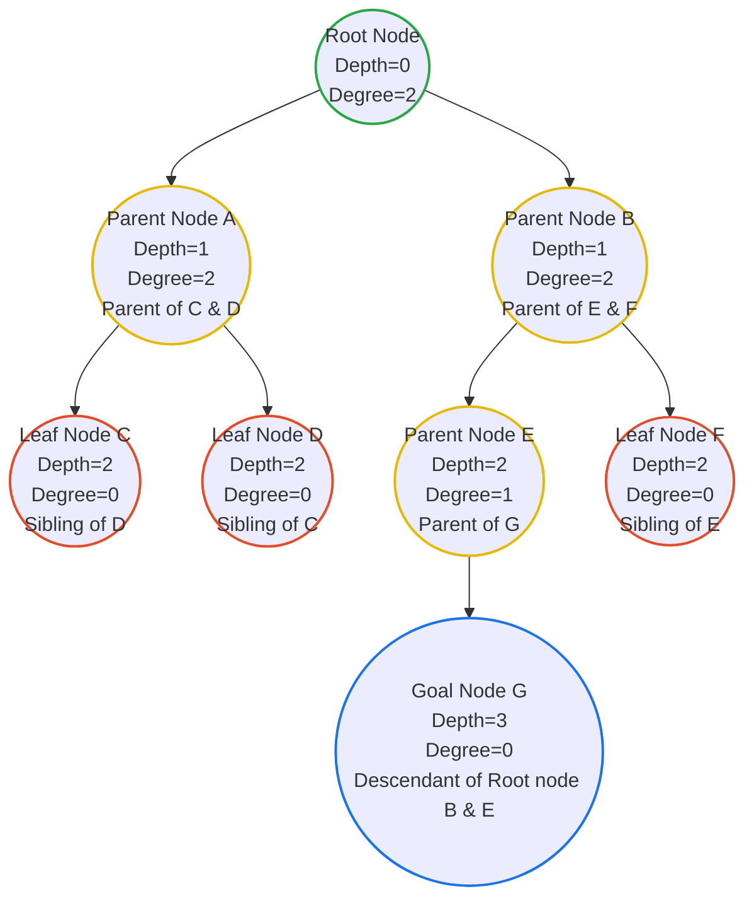

---

verklaar het Breath-First Search (BFS) algoritme en welke datastructuur wordt gebruikt om het te implementeren?

- **BFS (Breadth-First Search)**

  - Een zoekalgoritme dat een **graaf niveau voor niveau** doorloopt.

  - Start vanaf het **root node**.

  - Gebruikt een **queue (wachtrij)** om bij te houden welke knooppunten als volgende bezocht moeten worden.
  
  - Bezoekt **alle knooppunten op het huidige niveau** voordat het naar het volgende niveau gaat.  

❗ hij zal eerst in de breedte zoeken voordat hij dieper gaat van links naar rechts.

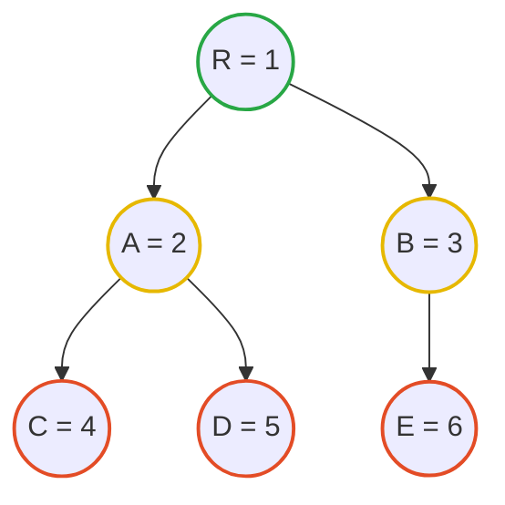

- **Datastructuur gebruikt:**  

  - **Queue (Wachtrij)**  

    - FIFO (First In, First Out) structuur  

    - Nieuwe knooppunten worden aan het einde toegevoegd  (enqueue)

    - Knooppunten worden van het begin verwijderd voor verwerking (dequeue)

```python
from collections import deque

def bfs(graph, start):
    visited = set()
    queue = deque([start])
    
    while queue:
        node = queue.popleft()  # Verwijder het eerste knooppunt uit de wachtrij
        if node not in visited:
            visited.add(node)
            print(node)  # Verwerk het knooppunt (bijv. printen)
            queue.extend(graph[node])  # Voeg alle aangrenzende knooppunten toe aan de wachtrij
    return visited
```

---

verklaar het Depth-First Search (DFS) algoritme en welke datastructuur wordt gebruikt om het te implementeren?

- **DFS (Depth-First Search)**

  - Een zoekalgoritme dat een graaf **diepgaand** doorloopt.

  - Start vanaf het **root node**.

  - Gebruikt een **stack (stapel)** om bij te houden welke knooppunten als volgende bezocht moeten worden.

  - Bezoekt een knooppunt en gaat dan zo diep mogelijk door naar de volgende knooppunten voordat het terugkeert.

❗ hij zal eerst in de diepte zoeken voordat hij naar het volgende knooppunt gaat van links naar rechts.


- **Datastructuur gebruikt:**  

  - **Stack (Stapel)**  

    - LIFO (Last In, First Out) structuur  

    - Nieuwe knooppunten worden bovenop toegevoegd (push)

    - Knooppunten worden van de top verwijderd voor verwerking (pop)

```python
from collections import deque

def dfs(graph, start, visited=None):
    if visited is None:
        visited = set() # initialiseer de set van bezochte knooppunten
    
    visited.add(start)
    print(start)  # Verwerk het knooppunt (bijv. printen)
    
    for neighbor in graph[start]:
        if neighbor not in visited:
            dfs(graph, neighbor, visited)
    
    return visited
```

---

## intelligent zoeken ( Hoofdstuk 3 )

### Heuristics

- Wat is een heuristic?

  - Een regel of een “educated guess” die wordt gebruikt om **zoekalgoritmes te sturen**.
  
  - Evalueert staten in een zoekprobleem op basis van specifieke criteria.

  - Vereenvoudigt het zoeken door **context-specifieke aanwijzingen** te geven, zodat niet alle opties hoeven te worden geëvalueerd.

- Waarom kan een heuristic de efficiëntie van een zoekalgoritme verbeteren?
  
  - Richt de zoekopdracht op **veelbelovende paden**.

  - Vermindert de tijd die nodig is om **minder waarschijnlijke oplossingen** te onderzoeken.

  - Helpt het algoritme sneller een **optimale of acceptabele oplossing** te vinden dan een uitputtende zoekmethode.

- Geef enkele concrete voorbeelden van heuristics
  
  - Een **GPS-systeem** dat de kortste route (vogelvlucht) gebruikt als heuristic om de snelste route te vinden.
  
  - Bij een **labyrintprobleem** kan een heuristic paden prioriteren met **minder obstakels of doodlopende wegen**.

---

### A* Search

- leg uit hoe het A* zoekalgoritme werkt

  - Combineert de **werkelijke padkosten vanaf het startknooppunt** met een **heuristische schatting van de resterende kosten naar het doel**.
  
  - Bezoekt knooppunten op basis van **de laagste gecombineerde kosten** (werkelijke kosten + heuristische kosten).
  
  - Hierdoor wordt efficiënt gezocht naar het **optimale pad**, door een balans te vinden tussen afstand al afgelegd en geschatte resterende afstand.

- Hoe word de cost functie van A* Search berekend?

  - De totale kosten f(n) is de som van twee componenten:

    1. **g(n)**: de werkelijke kosten van het pad vanaf het startknooppunt naar knooppunt n.

    2. **h(n)**: de heuristische schatting van de kosten van knooppunt n naar het doel.  
  - Formule:

    ```math
    f(n) = g(n) + h(n)
    ```

  - **Uitleg:**  
    - f(n) = totale kosten voor het pad dat door knooppunt n gaat  
    - g(n) = afstand al afgelegd vanaf start  
    - h(n) = geschatte resterende afstand naar doel  
  - Doel: knooppunten prioriteren die **zowel dichtbij het startpunt als het doel liggen**, zodat het algoritme efficiënt het optimale pad vindt.

- gegeven :


- vraag:

  - bepaal de volgorde van zoeken volgens het A* zoekalgoritme

```text
begin is A :

f(b) = 4 + 12 = 16

f(c) = 3 + 11 = 14


vanuit c

f(d) = c(g) + 7 + 6 = 3 + 7 + 6 = 16

f(e) = c(g) + 10 + 4 = 3 + 10 + 4 = 17


vanuit d naar e is maar 1 pad

f(e) = c(g) + 2 + 4 = 3 + 2 + 4 = 9


vanuit e

f(b) = c(g) + d(g) + e(g) + 12 + 12 = 3 + 7 + 2 + 12 + 12 = 36

f(z) = c(g) + d(g) + e(g)  + 5 + 0 = 3 + 7 + 2 + 5 + 0 = 17

```

dus beste pad is acdez

met een kost

``` math
g = 3 + 7 + 2 + 5 = 17
```

omdat het laatste punt geen h meer heeft kun je stellen dat bij het laatste punt de totale f(n) = alle g(n) + 0

de heuristiek helpt enkel om een beslissing te nemen als hij een keuze moet maken en zal dan steeds de laagste kost nemen.


### min-max adversarial search

- leg uit hoe het Min-Max zoekalgoritme werkt

- **Min-Max algoritme**

  - Wordt gebruikt bij **spellen met twee spelers** (bv. schaken, tic-tac-toe).
  
  - Het algoritme bouwt een **spelboom** met alle mogelijke zetten.

  - Elke mogelijke eindtoestand krijgt een **score** (goed of slecht voor de speler).

- **Hoe het werkt**

  - De ene laag van de boom probeert de **score te maximaliseren** (de speler zelf).
  
  - De volgende laag probeert de **score te minimaliseren** (de tegenstander).

  - Dit gaat **om en om**: max → min → max → min → ...  

  - De tegenstander wordt verondersteld **altijd de beste tegenzet** te spelen.

- **Beslissing nemen**

  - De boom wordt onderzocht tot een **bepaalde diepte**.

  - Daarna worden de scores **terug omhoog doorgegeven** in de boom.

  - Uiteindelijk kiest het algoritme de zet die leidt tot het **beste gegarandeerde resultaat** voor de speler.

---

gegeven :

- een zoekboom met de kost voor elke leaf node:

gevraagd:

- bepaal de min max waardes voor elke node in de boom.


---

### Alpha-Beta Pruning

- leg uit hoe het Alpha-Beta Pruning zoekalgoritme werkt

  - **Alpha-Beta Pruning**  
    - Is een **optimalisatie** van het **Min-Max algoritme**.  
    - Doel: **minder knooppunten evalueren** zonder het eindresultaat te veranderen.

  - **Twee waarden**  
    - **Alpha (α)** = de **beste score die de MAX-speler tot nu toe kan garanderen**.  
    - **Beta (β)** = de **beste score die de MIN-speler tot nu toe kan garanderen**.

  - **Hoe pruning werkt**  
    - Tijdens het doorzoeken van de spelboom worden α en β voortdurend bijgewerkt.  
    - **Als blijkt dat een tak nooit beter kan zijn dan wat al gevonden is**, wordt die tak **niet verder onderzocht** (pruned).

  - **Waarom dit werkt**  
    - De gesnoeide (pruned) takken **kunnen de uiteindelijke beslissing toch niet meer beïnvloeden**.  
    - Resultaat: **zelfde uitkomst als Min-Max**, maar **veel sneller**.

- wat is alpha?

  - de beste score die de MAX-speler tot nu toe kan garanderen.

- wat is beta?

  - de beste score die de MIN-speler tot nu toe kan garanderen.

- waarom is Alpha-Beta Pruning een efficiëntere versie van het Min-Max algoritme?

  - Het algoritme **evalueert geen knooppunten** die **toch geen invloed** meer kunnen hebben op de uiteindelijke beslissing.

  - Met de waarden **alpha (α)** en **beta (β)** wordt bijgehouden wat momenteel **de beste opties** zijn voor respectievelijk MAX en MIN.

  - **Takken die sowieso slechter zijn dan de huidige beste keuze worden afgesneden (pruned)**.

  - Hierdoor wordt de **zoekruimte sterk verkleind** en daalt de **rekentijd aanzienlijk**, terwijl het resultaat **exact hetzelfde blijft** als bij het gewone Min-Max algoritme.

