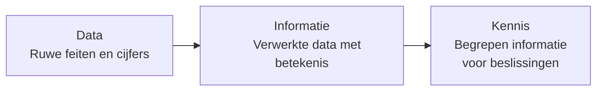
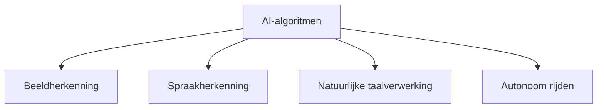
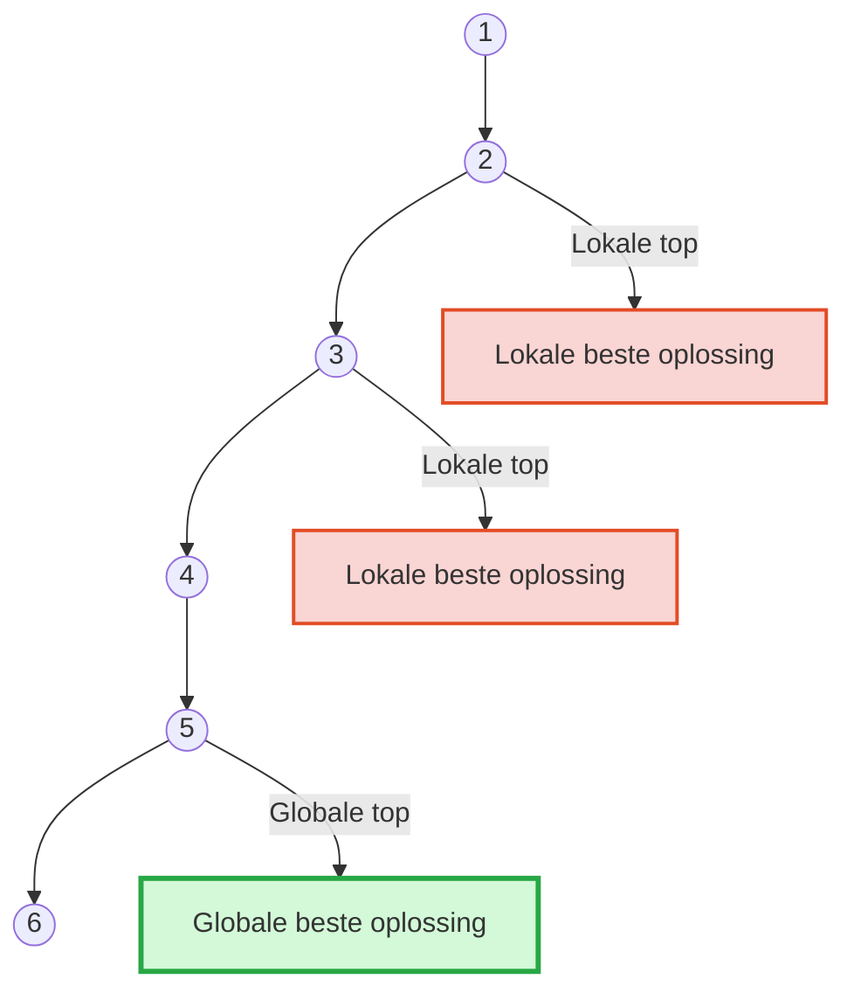
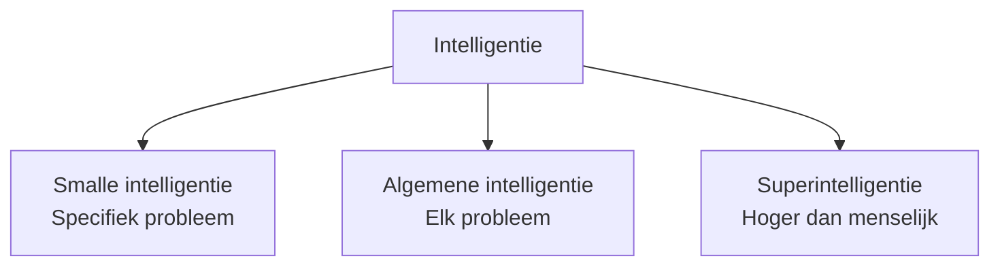
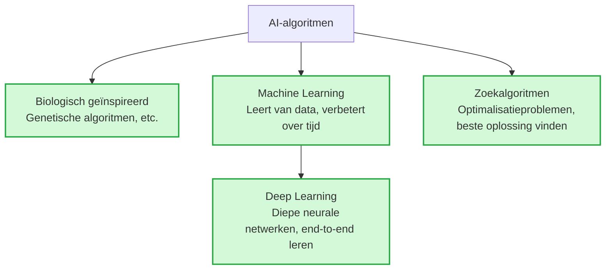
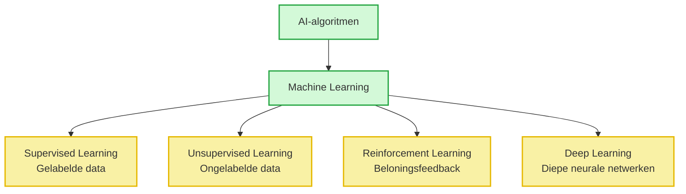

# sammenvating AI Programming

## Intuïtie van kunstmatige intelligentie ( Hoofdstuk 1 )

Waarom bestaat er geen eensluidende definitie van kunstmatige intelligentie?

Er bestaat geen vaste of eenvoudige definitie van intelligentie.

Wat men onder “intelligentie” verstaat, verschilt van persoon tot persoon en hangt af van de context.

Daarom bestaat er ook geen eenduidige definitie van kunstmatige intelligentie.

De betekenis van AI is dus subjectief en afhankelijk van hoe men intelligentie zelf bekijkt.

---

Wat is het verschil tussen kwantitatieve en kwalitatieve data? Geef enkele concrete voorbeelden van beide soorten data.

**Soorten gegevens**

- Kwantitatieve gegevens

  - Kwantitatieve gegevens zijn **meetbaar** en kunnen in **getallen** worden uitgedrukt.

    **Voorbeelden:**

    - Aantal mensen in een ruimte
    - Temperatuur van een ruimte
    - Gewicht van een persoon

- Kwalitatieve gegevens

  - Kwalitatieve gegevens zijn **niet meetbaar met getallen** en beschrijven een **eigenschap of kenmerk**.

    **Voorbeelden:**

    - Kleur van een ruimte
    - Geur van een ruimte
    - Smaak van een gerecht

---

Wat is het verschil tussen data, informatie en kennis?

- Data, Informatie en Kennis

  - **Data** = ruwe feiten en cijfers zonder betekenis.
  - **Informatie** = verwerkte data die **betekenis** heeft gekregen.
  - **Kennis** = informatie die **begrepen** is en kan worden gebruikt om **beslissingen te nemen**.

---

Wat is een algoritme? Wat is een AI-algoritme? Wat zijn de componenten van een algoritme?

- **Algoritme**

  - een reeks duidelijke instructies om een probleem op te lossen.

- **AI-algoritme**

  - een algoritme dat gebruikt wordt voor problemen waarvoor menselijke intelligentie nodig is.

    - Het kan leren uit data
    - Het wordt beter naarmate het meer gebruikt wordt

- Elk algoritme bestaat uit:

  - **Input**

    - de gegevens die je erin stopt

  - **Verwerking**

    - de stappen/instructies die worden uitgevoerd

  - **Output**

    - het resultaat

---

Noem een ​​paar categorieën problemen die mensen proberen op te lossen met behulp van (AI) algoritmen.

- Enkele problemen die met AI-algoritmen worden opgelost:

  - Beeldherkenning (bv. gezichten of objecten herkennen)

  - Spraakherkenning (bv. spraak omzetten naar tekst)

  - Natuurlijke taalverwerking (bv. tekst begrijpen en genereren)

  - Autonoom rijden (bv. zelfrijdende auto’s)

---

Wat is het verschil tussen een lokale beste oplossing en een globale beste oplossing?

- Lokale beste oplossing:

  - De beste oplossing binnen een **beperkt deel** van de oplossingsruimte
  
  - Niet noodzakelijk de allerbeste oplossing

- Globale beste oplossing:

  - De beste oplossing binnen de **volledige** oplossingsruimte

  - Dit is de **echte optimale** oplossing

---

Wat is het verschil tussen superintelligentie, algemene intelligentie en smalle intelligentie?

- Superintelligentie:

  - Intelligentie die **hoger is dan menselijke intelligentie**

- Algemene intelligentie:

  - Intelligentie die **op elk probleem** kan worden toegepast

- Smalle intelligentie:

  - Intelligentie die **slechts op één specifiek probleem** kan worden toegepast

---

Wat is het verband tussen op biologie geïnspireerde algoritmen, machine learning, deep learning en zoekalgoritmen?

- Biologisch geïnspireerde algoritmen:

  - Geïnspireerd door biologische processen

  - Voorbeelden:

    - genetische algoritmen
    - genetisch programmeren
    - mierenkolonie-optimalisatie
    - deeltjeszwermoptimalisatie

  - Vaak onderdeel van evolutionaire computationele methoden

- Machine learning:

  - AI-type dat **leert van data** en **in de loop van de tijd verbetert**

  - Maakt voorspellingen en beslissingen op basis van geleerde data

- Deep learning:

  - Richt zich op **diepe neurale netwerken** met veel lagen

  - Kan hoogwaardige kenmerken en representaties uit data leren

  - Kenmerken: meerlaagse architectuur, end-to-end leren

- Zoekalgoritmen:

  - Worden gebruikt om een oplossing voor een probleem te **vinden**

  - Vaak toegepast bij **optimalisatieproblemen** om de beste oplossing te vinden

- Relatie tussen deze algoritmen:

  - Allemaal typen **AI-algoritmen**

  - Gebruikt om problemen op te lossen die **intelligentie vereisen**

  - Ontworpen om **menselijke intelligentie na te bootsen** en te **leren van data**

---

Welke drie soorten 'leren' vallen onder machine leren en kunt u elk type 'leren' kort toelichten?

- **Machine learning types**

  - **Supervised learning**
  
    - Leert van **gelabelde data**  

    - Algoritme wordt getraind om **voorspellingen** te doen op basis van geleerde data

  - **Unsupervised learning**  

    - Leert van **ongelabelde data**  

    - Algoritme ontdekt **patronen en verbanden** in de data

  - **Reinforcement learning**  

    - Leert van **feedback/beloningssysteem**

    - Algoritme leert **beslissingen nemen** op basis van ontvangen feedback

---