# sammenvating AI Programming

## Intuïtie van kunstmatige intelligentie ( Hoofdstuk 1 )

### Waarom bestaat er geen eensluidende definitie van kunstmatige intelligentie?

<details><summary>Antwoord</summary>
Er bestaat geen vaste of eenvoudige definitie van intelligentie.

Wat men onder “intelligentie” verstaat, verschilt van persoon tot persoon en hangt af van de context.

Daarom bestaat er ook geen eenduidige definitie van kunstmatige intelligentie.

De betekenis van AI is dus subjectief en afhankelijk van hoe men intelligentie zelf bekijkt.

---

</details>

### Wat is het verschil tussen kwantitatieve en kwalitatieve data? Geef enkele concrete voorbeelden van beide soorten data

<details><summary>Antwoord</summary>
**Soorten gegevens**

- Kwantitatieve gegevens

  - Kwantitatieve gegevens zijn **meetbaar** en kunnen in **getallen** worden uitgedrukt.

    **Voorbeelden:**

    - Aantal mensen in een ruimte
    - Temperatuur van een ruimte
    - Gewicht van een persoon

- Kwalitatieve gegevens

  - Kwalitatieve gegevens zijn **niet meetbaar met getallen** en beschrijven een **eigenschap of kenmerk**.

    **Voorbeelden:**

    - Kleur van een ruimte
    - Geur van een ruimte
    - Smaak van een gerecht

---

</details>

### Wat is het verschil tussen data, informatie en kennis?

<details><summary>Antwoord</summary>

- Data, Informatie en Kennis

  - **Data** = ruwe feiten en cijfers zonder betekenis.
  - **Informatie** = verwerkte data die **betekenis** heeft gekregen.
  - **Kennis** = informatie die **begrepen** is en kan worden gebruikt om **beslissingen te nemen**.

  ```mermaid
  ---
  config:
    layout: elk
  ---
  flowchart LR
      A[Data
      Ruwe feiten en cijfers] --> B[Informatie
      Verwerkte data met betekenis]
      B --> C[Kennis
      Begrepen informatie
      voor beslissingen]
  ```

---

</details>

### Wat is een algoritme? Wat is een AI-algoritme? Wat zijn de componenten van een algoritme?

<details><summary>Antwoord</summary>

- **Algoritme**

  - een reeks duidelijke instructies om een probleem op te lossen.

- **AI-algoritme**

  - een algoritme dat gebruikt wordt voor problemen waarvoor menselijke intelligentie nodig is.

    - Het kan leren uit data
    - Het wordt beter naarmate het meer gebruikt wordt

- Elk algoritme bestaat uit:

  - **Input**

    - de gegevens die je erin stopt

  - **Verwerking**

    - de stappen/instructies die worden uitgevoerd

  - **Output**

    - het resultaat

---

</details>

### Noem een ​​paar categorieën problemen die mensen proberen op te lossen met behulp van (AI) algoritmen

<details><summary>Antwoord</summary>

- Enkele problemen die met AI-algoritmen worden opgelost:

  - Beeldherkenning (bv. gezichten of objecten herkennen)

  - Spraakherkenning (bv. spraak omzetten naar tekst)

  - Natuurlijke taalverwerking (bv. tekst begrijpen en genereren)

  - Autonoom rijden (bv. zelfrijdende auto’s)

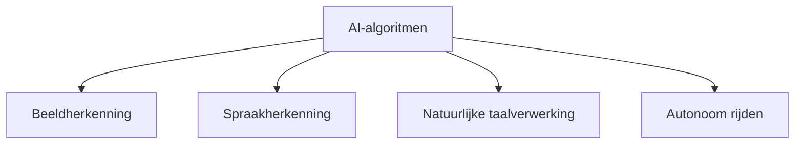

---

</details>

### Wat is het verschil tussen een lokale beste oplossing en een globale beste oplossing?

<details><summary>Antwoord</summary>

- Lokale beste oplossing:

  - De beste oplossing binnen een **beperkt deel** van de oplossingsruimte
  
  - Niet noodzakelijk de allerbeste oplossing

- Globale beste oplossing:

  - De beste oplossing binnen de **volledige** oplossingsruimte

  - Dit is de **echte optimale** oplossing

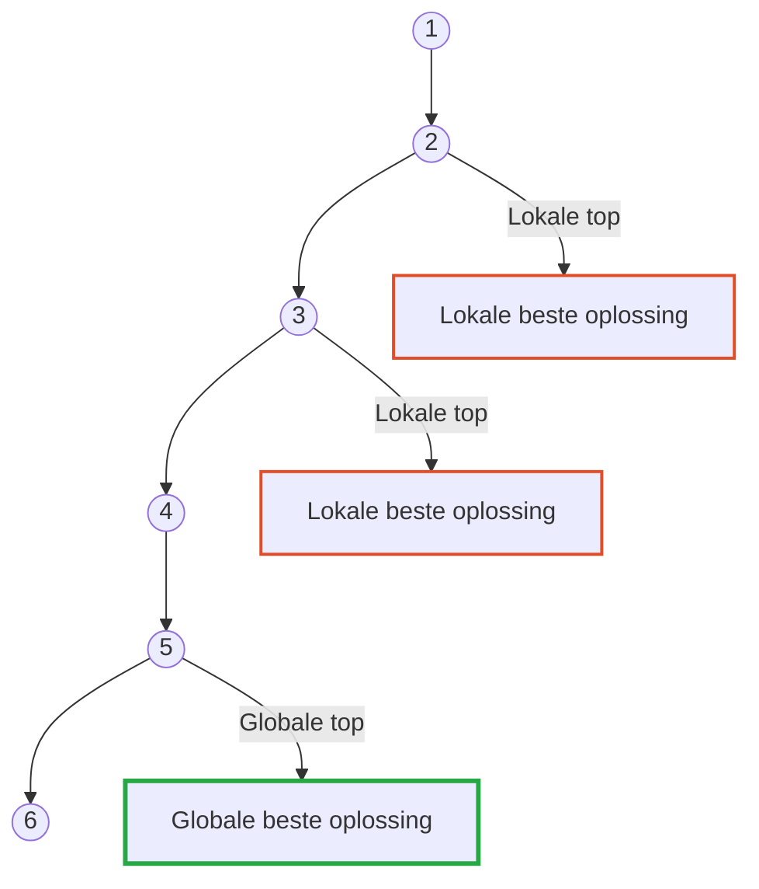

---

</details>

### Wat is het verschil tussen superintelligentie, algemene intelligentie en smalle intelligentie?

<details><summary>Antwoord</summary>

- Superintelligentie:

  - Intelligentie die **hoger is dan menselijke intelligentie**

- Algemene intelligentie:

  - Intelligentie die **op elk probleem** kan worden toegepast

- Smalle intelligentie:

  - Intelligentie die **slechts op één specifiek probleem** kan worden toegepast

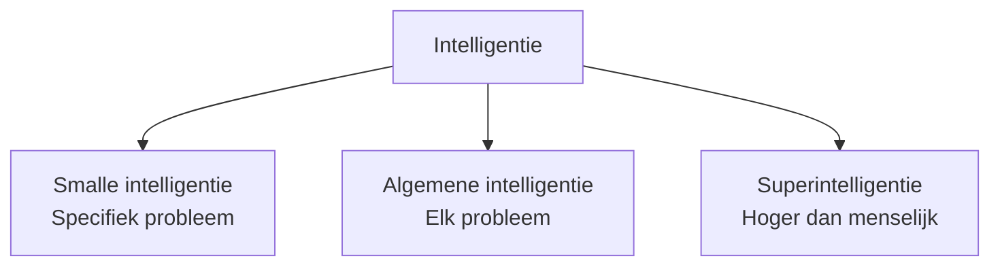

---

</details>

### Wat is het verband tussen op biologie geïnspireerde algoritmen, machine learning, deep learning en zoekalgoritmen?

<details><summary>Antwoord</summary>

- Biologisch geïnspireerde algoritmen:

  - Geïnspireerd door biologische processen

  - Voorbeelden:

    - genetische algoritmen
    - genetisch programmeren
    - mierenkolonie-optimalisatie
    - deeltjeszwermoptimalisatie

  - Vaak onderdeel van evolutionaire computationele methoden

- Machine learning:

  - AI-type dat **leert van data** en **in de loop van de tijd verbetert**

  - Maakt voorspellingen en beslissingen op basis van geleerde data

- Deep learning:

  - Richt zich op **diepe neurale netwerken** met veel lagen

  - Kan hoogwaardige kenmerken en representaties uit data leren

  - Kenmerken: meerlaagse architectuur, end-to-end leren

- Zoekalgoritmen:

  - Worden gebruikt om een oplossing voor een probleem te **vinden**

  - Vaak toegepast bij **optimalisatieproblemen** om de beste oplossing te vinden

- Relatie tussen deze algoritmen:

  - Allemaal typen **AI-algoritmen**

  - Gebruikt om problemen op te lossen die **intelligentie vereisen**

  - Ontworpen om **menselijke intelligentie na te bootsen** en te **leren van data**

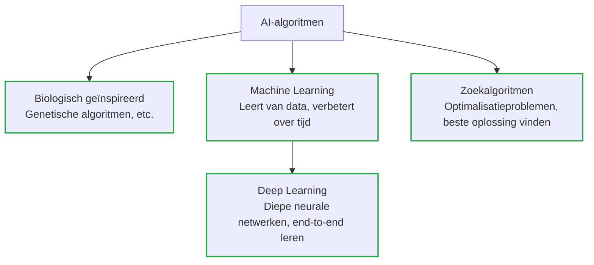

---

</details>

### Welke drie soorten 'leren' vallen onder machine leren en kunt u elk type 'leren' kort toelichten?

<details><summary>Antwoord</summary>

- **Machine learning types**

  - **Supervised learning**
  
    - Leert van **gelabelde data**  

    - Algoritme wordt getraind om **voorspellingen** te doen op basis van geleerde data

  - **Unsupervised learning**  

    - Leert van **ongelabelde data**  

    - Algoritme ontdekt **patronen en verbanden** in de data

  - **Reinforcement learning**  

    - Leert van **feedback/beloningssysteem**

    - Algoritme leert **beslissingen nemen** op basis van ontvangen feedback

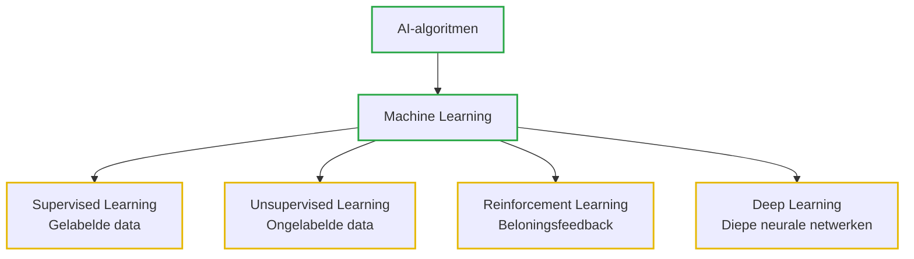

---

</details>

## Basisprincipes van zoeken ( Hoofdstuk 2 )

### Wat is een datastructuur en geef enkele concrete voorbeelden van datastructuren?

<details><summary>Antwoord</summary>

- **Datastructuur**  

  - Manier om **gegevens te organiseren en op te slaan** 

  - Zorgt voor **efficiënte toegang en bewerking** van data  

- **Voorbeelden van datastructuren:**  

  - Arrays  
  - Gekoppelde lijsten  
  - Stacks  
  - Queues  
  - Bomen  
  - Grafieken  
  - Hashtabellen

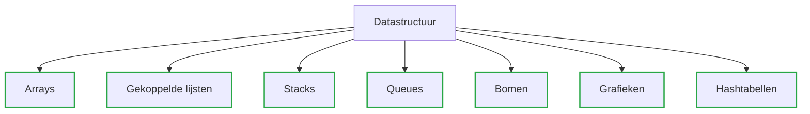

---

</details>

### Leg de volgende termen uit

- **graph**
- **vertex**
- **node**
- **edge**

<details><summary>Antwoord</summary>

- **Graaf (Graph)**

  - Datastructuur bestaande uit

    - **knooppunten (vertices)**
  
    - **verbindingen (edges)**
  
- **Vertex**
  
  - vertegenwoordigt een toestand of entiteit  

- **Node**

  - synoniem voor vertex; vertegenwoordigt een toestand of entiteit

- **Edge**

  - vertegenwoordigt een relatie tussen twee knooppunten

---

</details>

### Gegeven een graaf, bepaal de array of edges, de incidence matrix en de adjacency matrix

<details><summary>Antwoord</summary>

| Structuur        | Wat het laat zien                       | Rijen/Kolommen                              |
| ---------------- | --------------------------------------- | ------------------------------------------- |
| Array of edges   | Lijst van alle verbindingen             | (lijst, geen matrix)                      |
| Incidence matrix | Welke knooppunten horen bij welke edges | Rijen = knooppunten, Kolommen = edges       |
| Adjacency matrix | Welke knooppunten zijn direct verbonden | Rijen = knooppunten, Kolommen = knooppunten |

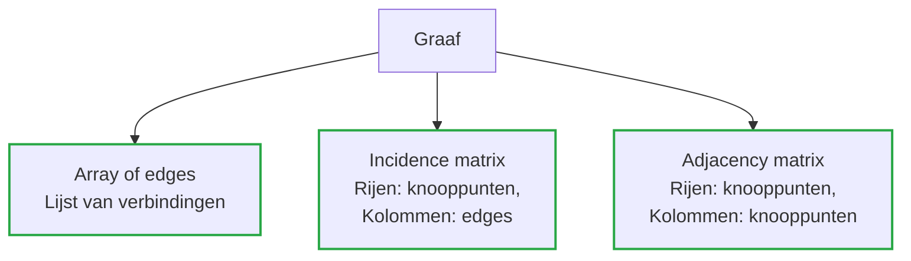

graf voorbeeld:

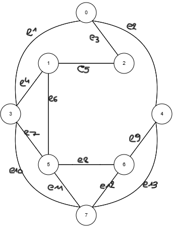

- **Array of edges:**

```python
[
  # Node 0
  [0, 2], [0, 3], [0, 4],

  # Node 1
  [1, 2], [1, 3], [1, 5],

  # Node 2
  [2, 0], [2, 1],

  # Node 3
  [3, 0], [3, 1], [3, 5], [3, 7],

  # Node 4
  [4, 0], [4, 6], [4, 7],

  # Node 5
  [5, 1], [5, 3], [5, 6], [5, 7],

  # Node 6
  [6, 4], [6, 5], [6, 7],

  # Node 7
  [7, 3], [7, 5], [7, 4], [7, 6]
]

```

- **Incidence matrix: (verbandenmatrix)**

|   | e1 | e2 | e3 | e4 | e5 | e6 | e7 | e8 | e9 | e10 | e11 | e12 | e13 |
|---|----|----|----|----|----|----|----|----|----|-----|-----|-----|-----|
| 0 | 1  | 1  | 1  | 0  | 0  | 0  | 0  | 0  | 0  | 0   | 0   | 0   | 0   |
| 1 | 0  | 0  | 0  | 1  | 1  | 1  | 0  | 0  | 0  | 0   | 0   | 0   | 0   |
| 2 | 0  | 1  | 1  | 0  | 1  | 0  | 0  | 0  | 0  | 0   | 0   | 0   | 0   |
| 3 | 1  | 0  | 0  | 1  | 0  | 0  | 1  | 0  | 0  | 1   | 0   | 0   | 0   |
| 4 | 0  | 1  | 0  | 0  | 0  | 0  | 0  | 0  | 1  | 0   | 0   | 0   | 1   |
| 5 | 0  | 0  | 0  | 0  | 0  | 1  | 1  | 1  | 0  | 0   | 1   | 0   | 0   |
| 6 | 0  | 0  | 0  | 0  | 0  | 0  | 0  | 1  | 1  | 0   | 0   | 1   | 0   |
| 7 | 0  | 0  | 0  | 0  | 0  | 0  | 0  | 0  | 0  | 1   | 1   | 1   | 1   |

- **Adjacency matrix: (aangrenzen matrix)**

|   | 0 | 1 | 2 | 3 | 4 | 5 | 6 | 7 |
|---|---|---|---|---|---|---|---|---|
| 0 | 0 | 0 | 1 | 1 | 1 | 0 | 0 | 0 |
| 1 | 0 | 0 | 1 | 1 | 0 | 1 | 0 | 0 |
| 2 | 1 | 1 | 0 | 0 | 0 | 0 | 0 | 0 |
| 3 | 1 | 1 | 0 | 0 | 0 | 1 | 0 | 1 |
| 4 | 1 | 0 | 0 | 0 | 0 | 0 | 1 | 1 |
| 5 | 0 | 1 | 0 | 1 | 0 | 0 | 1 | 1 |
| 6 | 0 | 0 | 0 | 0 | 1 | 1 | 0 | 1 |
| 7 | 0 | 0 | 0 | 1 | 1 | 1 | 1 | 0 |

---

Leg uit : een boom is een verbonden acyclische graaf.

- **Boom (Tree)**
  
  - Een type **graaf**
  - bv familie-stamboom  

  - Kenmerken:  

    - Elk knooppunt is verbonden

    - **Geen cycli** (geen rondjes)  

    - Lijkt op een **hiërarchie**

      - Eén **wortelknooppunt** (root)  

      - Verbonden **kindknooppunten** (children)

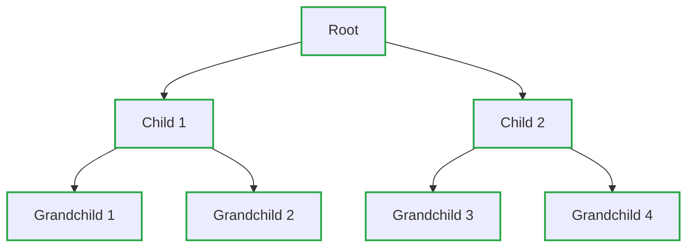

---

</details>

### Leg de volgende 'tree' termen uit

<details><summary>Antwoord</summary>

- root node
- parent node
- sibling nodes
- descendant nodes
- ancestor nodes
- leaf nodes
- goal node
- path
- cost
- depth
- degree

| Term                | Uitleg                                                                                 |
|---------------------|----------------------------------------------------------------------------------------|
| Root Node           | Het bovenste knooppunt van de boom; het startpunt van de hiërarchie.                   |
| Parent Node         | Een knooppunt dat één of meerdere kinderen heeft.                                      |
| Sibling Nodes       | Knooppunten die dezelfde ouder hebben; “broers/zussen” op hetzelfde niveau.            |
| Descendant Nodes    | Alle knooppunten die onder een bepaald knooppunt vallen.                               |
| Ancestor Nodes      | Alle knooppunten boven een bepaald knooppunt, inclusief de root.                       |
| Leaf Nodes          | Knooppunten zonder kinderen; de uiteinden van de boom.                                 |
| Goal Node           | Het knooppunt dat een specifiek doel of resultaat representeert.                       |
| Path                | Een reeks knooppunten van de root naar een bepaald knooppunt.                          |
| Cost                | De “prijs” of waarde van het volgen van een bepaald pad (bijv. bij zoekproblemen).     |
| Depth               | Het aantal niveaus vanaf de root tot een bepaald knooppunt.                            |
| Degree              | Het aantal kinderen van een knooppunt.                                                 |

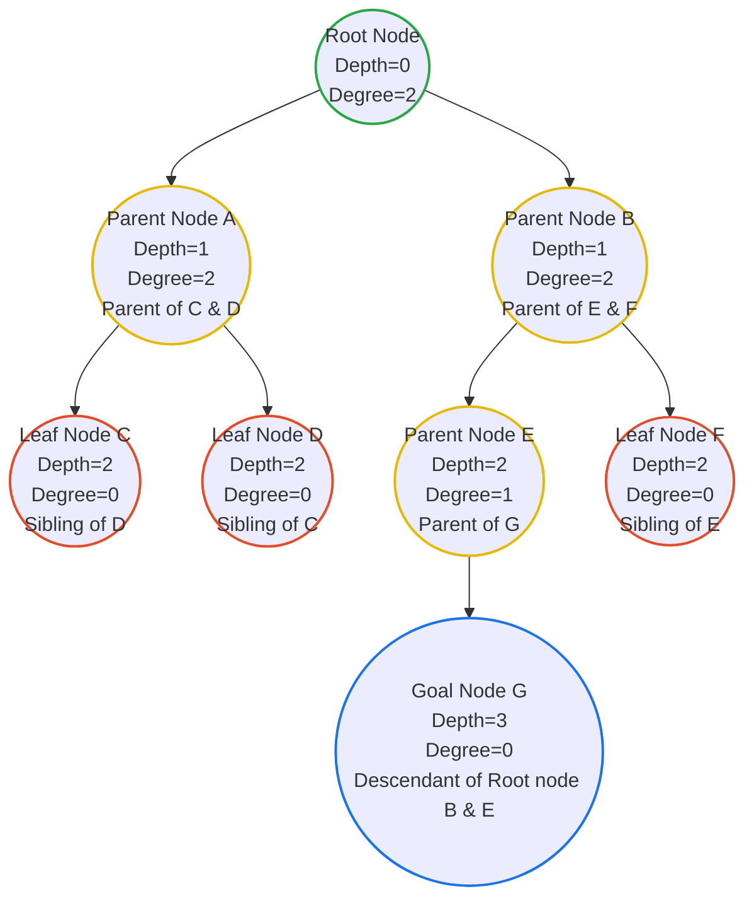

---

</details>

### Verklaar het Breath-First Search (BFS) algoritme en welke datastructuur wordt gebruikt om het te implementeren?

<details><summary>Antwoord</summary>

- **BFS (Breadth-First Search)**

  - Een zoekalgoritme dat een **graaf niveau voor niveau** doorloopt.

  - Start vanaf het **root node**.

  - Gebruikt een **queue (wachtrij)** om bij te houden welke knooppunten als volgende bezocht moeten worden.
  
  - Bezoekt **alle knooppunten op het huidige niveau** voordat het naar het volgende niveau gaat.  

❗ hij zal eerst in de breedte zoeken voordat hij dieper gaat van links naar rechts.

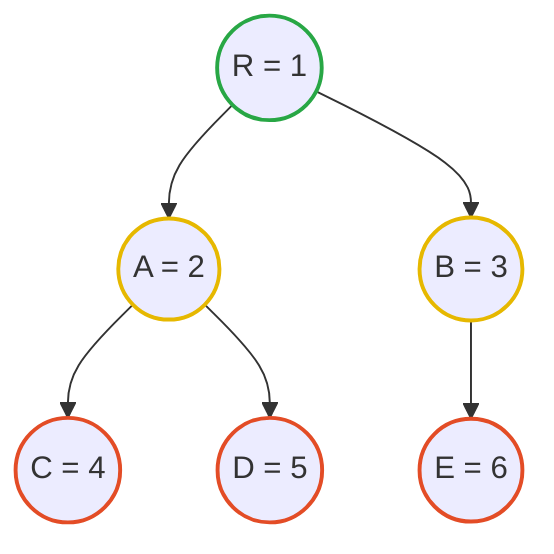

- **Datastructuur gebruikt:**  

  - **Queue (Wachtrij)**  

    - FIFO (First In, First Out) structuur  

    - Nieuwe knooppunten worden aan het einde toegevoegd  (enqueue)

    - Knooppunten worden van het begin verwijderd voor verwerking (dequeue)

```python
from collections import deque

def bfs(graph, start):
    visited = set()
    queue = deque([start])
    
    while queue:
        node = queue.popleft()  # Verwijder het eerste knooppunt uit de wachtrij
        if node not in visited:
            visited.add(node)
            print(node)  # Verwerk het knooppunt (bijv. printen)
            queue.extend(graph[node])  # Voeg alle aangrenzende knooppunten toe aan de wachtrij
    return visited
```

---

</details>

### Verklaar het Depth-First Search (DFS) algoritme en welke datastructuur wordt gebruikt om het te implementeren?

<details><summary>Antwoord</summary>

- **DFS (Depth-First Search)**

  - Een zoekalgoritme dat een graaf **diepgaand** doorloopt.

  - Start vanaf het **root node**.

  - Gebruikt een **stack (stapel)** om bij te houden welke knooppunten als volgende bezocht moeten worden.

  - Bezoekt een knooppunt en gaat dan zo diep mogelijk door naar de volgende knooppunten voordat het terugkeert.

❗ hij zal eerst in de diepte zoeken voordat hij naar het volgende knooppunt gaat van links naar rechts.


- **Datastructuur gebruikt:**  

  - **Stack (Stapel)**  

    - LIFO (Last In, First Out) structuur  

    - Nieuwe knooppunten worden bovenop toegevoegd (push)

    - Knooppunten worden van de top verwijderd voor verwerking (pop)

```python
from collections import deque

def dfs(graph, start, visited=None):
    if visited is None:
        visited = set() # initialiseer de set van bezochte knooppunten
    
    visited.add(start)
    print(start)  # Verwerk het knooppunt (bijv. printen)
    
    for neighbor in graph[start]:
        if neighbor not in visited:
            dfs(graph, neighbor, visited)
    
    return visited
```

---

</details>

## intelligent zoeken ( Hoofdstuk 3 )

### Heuristics

#### Wat is een heuristic?

<details><summary>Antwoord</summary>

- Een regel of een “educated guess” die wordt gebruikt om **zoekalgoritmes te sturen**.

- Evalueert staten in een zoekprobleem op basis van specifieke criteria.

- Vereenvoudigt het zoeken door **context-specifieke aanwijzingen** te geven, zodat niet alle opties hoeven te worden geëvalueerd.

---

</details>

#### Waarom kan een heuristic de efficiëntie van een zoekalgoritme verbeteren?

<details><summary>Antwoord</summary>

- Richt de zoekopdracht op **veelbelovende paden**.

- Vermindert de tijd die nodig is om **minder waarschijnlijke oplossingen** te onderzoeken.

- Helpt het algoritme sneller een **optimale of acceptabele oplossing** te vinden dan een uitputtende zoekmethode.

---

</details>

#### Geef enkele concrete voorbeelden van heuristics

<details><summary>Antwoord</summary>

- Een **GPS-systeem** dat de kortste route (vogelvlucht) gebruikt als heuristic om de snelste route te vinden.

- Bij een **labyrintprobleem** kan een heuristic paden prioriteren met **minder obstakels of doodlopende wegen**.

---

</details>

### A* Search

#### leg uit hoe het A* zoekalgoritme werkt

<details><summary>Antwoord</summary>

- Combineert de **werkelijke padkosten vanaf het startknooppunt** met een **heuristische schatting van de resterende kosten naar het doel**.

- Bezoekt knooppunten op basis van **de laagste gecombineerde kosten** (werkelijke kosten + heuristische kosten).

- Hierdoor wordt efficiënt gezocht naar het **optimale pad**, door een balans te vinden tussen afstand al afgelegd en geschatte resterende afstand.

---

</details>

#### Hoe word de cost functie van A* Search berekend?

<details><summary>Antwoord</summary>

- De totale kosten f(n) is de som van twee componenten:

  1. **g(n)**: de werkelijke kosten van het pad vanaf het startknooppunt naar knooppunt n.

  2. **h(n)**: de heuristische schatting van de kosten van knooppunt n naar het doel.  

- Formule:

    ```math
    f(n) = g(n) + h(n)
    ```

  - **Uitleg:**  
    - f(n) = totale kosten voor het pad dat door knooppunt n gaat  
    - g(n) = afstand al afgelegd vanaf start  
    - h(n) = geschatte resterende afstand naar doel  
  - Doel: knooppunten prioriteren die **zowel dichtbij het startpunt als het doel liggen**, zodat het algoritme efficiënt het optimale pad vindt.

---

</details>

#### gegeven een graaf, bepaal de volgorde van zoeken volgens het A* zoekalgoritme

<details><summary>Antwoord</summary>


```text
begin is A :

f(b) = 4 + 12 = 16

f(c) = 3 + 11 = 14


vanuit c

f(d) = c(g) + 7 + 6 = 3 + 7 + 6 = 16

f(e) = c(g) + 10 + 4 = 3 + 10 + 4 = 17


vanuit d naar e is maar 1 pad

f(e) = c(g) + d(g) + 2 + 4 = 3 + 7 + 2 + 4 = 16


vanuit e

f(b) = c(g) + d(g) + e(g) + 12 + 12 = 3 + 7 + 2 + 12 + 12 = 36

f(z) = c(g) + d(g) + e(g)  + 5 + 0 = 3 + 7 + 2 + 5 + 0 = 17

```

dus beste pad is acdez

met een kost

``` math
g = 3 + 7 + 2 + 5 = 17
```

omdat het laatste punt geen h meer heeft kun je stellen dat bij het laatste punt de totale f(n) = alle g(n) + 0

de heuristiek helpt enkel om een beslissing te nemen als hij een keuze moet maken en zal dan steeds de laagste kost nemen.

---

</details>

### min-max adversarial search

#### leg uit hoe het Min-Max zoekalgoritme werkt

<details><summary>Antwoord</summary>

- Wordt gebruikt bij **spellen met twee spelers** (bv. schaken, tic-tac-toe).
  
  - Het algoritme bouwt een **spelboom** met alle mogelijke zetten.

  - Elke mogelijke eindtoestand krijgt een **score** (goed of slecht voor de speler).

- **Hoe het werkt**

  - De ene laag van de boom probeert de **score te maximaliseren** (de speler zelf).
  
  - De volgende laag probeert de **score te minimaliseren** (de tegenstander).

  - Dit gaat **om en om**: max → min → max → min → ...  

  - De tegenstander wordt verondersteld **altijd de beste tegenzet** te spelen.

- **Beslissing nemen**

  - De boom wordt onderzocht tot een **bepaalde diepte**.

  - Daarna worden de scores **terug omhoog doorgegeven** in de boom.

  - Uiteindelijk kiest het algoritme de zet die leidt tot het **beste gegarandeerde resultaat** voor de speler.

---

</details>

#### gegeven een zoekboom, bepaal de min max waardes voor elke node in de boom.

<details><summary>Antwoord</summary>


---

</details>

### Alpha-Beta Pruning

#### leg uit hoe het Alpha-Beta Pruning zoekalgoritme werkt

<details><summary>Antwoord</summary>

- Is een **optimalisatie** van het **Min-Max algoritme**.  
- Doel: **minder knooppunten evalueren** zonder het eindresultaat te veranderen.

- **Twee waarden**  
  - **Alpha (α)** = de **beste score die de MAX-speler tot nu toe kan garanderen**.  
  - **Beta (β)** = de **beste score die de MIN-speler tot nu toe kan garanderen**.

- **Hoe pruning werkt**  
  - Tijdens het doorzoeken van de spelboom worden α en β voortdurend bijgewerkt.  
  - **Als blijkt dat een tak nooit beter kan zijn dan wat al gevonden is**, wordt die tak **niet verder onderzocht** (pruned).

- **Waarom dit werkt**  
  - De gesnoeide (pruned) takken **kunnen de uiteindelijke beslissing toch niet meer beïnvloeden**.  
  - Resultaat: **zelfde uitkomst als Min-Max**, maar **veel sneller**.

#### wat is alpha?

<details><summary>Antwoord</summary>

- de beste score die de MAX-speler tot nu toe kan garanderen.

</details>

#### wat is beta?

<details><summary>Antwoord</summary>

- de beste score die de MIN-speler tot nu toe kan garanderen.

</details>

#### waarom is Alpha-Beta Pruning een efficiëntere versie van het Min-Max algoritme?

<details><summary>Antwoord</summary>

- Het algoritme **evalueert geen knooppunten** die **toch geen invloed** meer kunnen hebben op de uiteindelijke beslissing.

- Met de waarden **alpha (α)** en **beta (β)** wordt bijgehouden wat momenteel **de beste opties** zijn voor respectievelijk MAX en MIN.

- **Takken die sowieso slechter zijn dan de huidige beste keuze worden afgesneden (pruned)**.

- Hierdoor wordt de **zoekruimte sterk verkleind** en daalt de **rekentijd aanzienlijk**, terwijl het resultaat **exact hetzelfde blijft** als bij het gewone Min-Max algoritme.

---

</details>

#### gegen een zoekboom, bepaal de min max waardes voor elke node in de boom met alpha beta pruning en geef ook aan welke knopen worden gesnoeid (pruned).

<details><summary>Antwoord</summary>

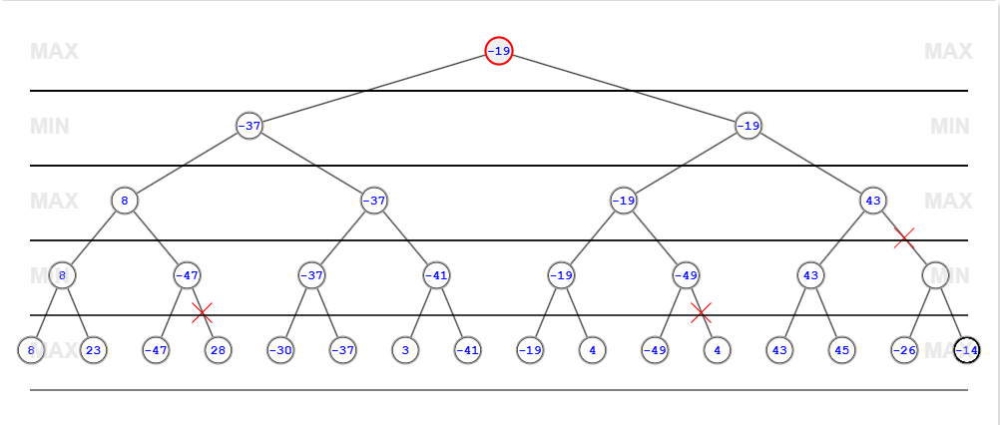

waar het eigenlijk op neerkomt is dat je bij elke max node de alpha waarde bijhoudt en bij elke min node de beta waarde.
en zodra je bij een min node komt en je ziet dat de beta waarde kleiner is dan de alpha waarde van de bovenliggende max node dan kan je stoppen met verder zoeken in die tak omdat die tak nooit beter kan zijn dan wat al gevonden is.

```math
\alpha \geq \beta \quad \text{bij max laag}
```

```math
\beta \leq \alpha \quad \text{bij min laag}
```

dus als hij telkens in de max laag de alpha aanpast en in de min laag de beta waarde aanpast

⚠️ men start bij de root node met alpha = -∞ en beta = +∞

dit omdat alpha van oneindig klein alleen maar groter kan worden en beta van oneindig groot alleen maar kleiner kan worden.

⚠️ als men naar een hogere node gaat (van kind naar ouder) moet men de alpha en beta waarden van de ouder node overnemen !!!!!

---

</details>

## evolutionaire algoritmen ( Hoofdstuk 4 )

### Genetic Algorithms life cycle

#### leg kort de levenscyclus van een genetisch algoritme uit

<details><summary>Antwoord</summary>

- Populatie maken:
  - Start met een willekeurige groep mogelijke oplossingen.

- Fitness berekenen:
  - Voor elke oplossing wordt berekend hoe goed ze is met een fitnessfunctie.

- Ouders selecteren:
  - De beste oplossingen hebben de meeste kans om gekozen te worden om zich voort te planten.

- Reproductie (kruising + mutatie):
  - Nieuwe oplossingen worden gemaakt door ouders te combineren.
  - Soms gebeurt er een kleine willekeurige verandering (mutatie).

- Nieuwe generatie maken:
  - De beste oude oplossingen en de nieuwe oplossingen vormen samen de volgende generatie.

- Herhalen:
  - Dit proces wordt herhaald tot er een voldoende goede oplossing gevonden is.

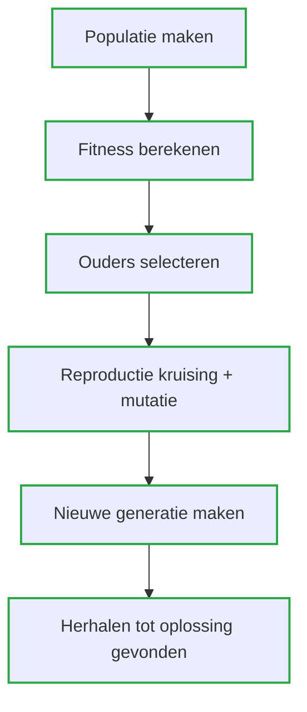

---

</details>

### enter diversity

#### leg het belang van crossover en mutatie in genetische algoritmen uit en geef een kort overzicht van enkele veelgebruikte methoden voor zowel crossover als mutatie.

- Genetische algoritmen gebruiken **crossover** en **mutatie** om **variatie** in de populatie te behouden.
  - Dit is nodig om te voorkomen dat het algoritme vast komt te zitten in een slechte (lokale) oplossing.
  - Door nieuwe combinaties en kleine willekeurige veranderingen blijft het algoritme nieuwe oplossingen verkennen.

- Crossover (kruising):
  - Crossover combineert genetisch materiaal van **twee ouders** om een **nieuw kind (offspring)** te maken.

  - Single-point crossover:
    - Er wordt één punt in het chromosoom gekozen.
    - Het eerste deel komt van ouder 1, het tweede deel van ouder 2.
    - Deze twee delen vormen samen het nieuwe kind.

  - Two-point crossover:
    - Er worden twee punten in het chromosoom gekozen.
    - De stukken tussen de ouders worden afgewisseld om een nieuw kind te maken.

  - Uniform crossover:
    - Er wordt een willekeurig masker gemaakt.
    - Voor elk gen bepaalt het masker van welke ouder het gen wordt overgenomen.

- Mutatie:
  - Mutatie zorgt voor **kleine willekeurige veranderingen** in een oplossing.
  - Dit helpt om nieuwe oplossingen te blijven ontdekken en niet vast te zitten in lokale minima.

  - Bit-string mutation:
    - Eén willekeurig gen wordt gekozen en zijn waarde wordt omgedraaid (0 → 1 of 1 → 0).

  - Flip-bit mutation:
    - Alle genen in het chromosoom worden omgekeerd (0 wordt 1, 1 wordt 0).

---

</details>

### Genetic Algorithm parameters

#### Vijf belangrijke parameters van een genetisch algoritme en hun invloed:

<details><summary>Antwoord</summary>

- Chromosoom-encoding:
  - Bepaalt **hoe een oplossing wordt voorgesteld** (bv. bits, getallen, lijsten, …).
  - Een goede encoding is cruciaal: ze bepaalt of het probleem **goed en efficiënt** kan worden opgelost.

- Initialisatie van de populatie:
  - Bepaalt **hoe de eerste oplossingen worden gegenereerd**.
  - Meestal willekeurig, maar ze moeten **geldig** zijn.
  - Een goede startpopulatie kan het algoritme **sneller** naar goede oplossingen leiden.

- Aantal nakomelingen (offspring):
  - Bepaalt **hoeveel nieuwe oplossingen** er per generatie worden gemaakt.
  - Meer nakomelingen = **meer variatie**, maar ook meer kans dat goede oplossingen verdwijnen.

- Selectiemethode van ouders:
  - Bepaalt **welke oplossingen mogen voortplanten**.
  - Sterke selectie = sneller beter, maar risico op **lokale optimum**.
  - Zwakkere selectie = meer exploratie, maar trager.

- Stopconditie:
  - Bepaalt **wanneer het algoritme stopt**.
  - Bijvoorbeeld: maximaal aantal generaties, voldoende goede oplossing, of tijdslimiet.
  - Beïnvloedt **rekentijd en kwaliteit** van de oplossing.

---

</details>

### Fitness function

#### wat is een fitness fuctie in een genetische algoritme?

<details><summary>Antwoord</summary>

- Een fitnessfunctie bepaalt **hoe goed een oplossing is**.

- Ze geeft **elke oplossing een score** op basis van hoe goed ze het doel bereikt.

- Die score wordt gebruikt om te beslissen:

  - Welke oplossingen **mogen voortplanten**

  - Welke oplossingen **mogen overleven** naar de volgende generatie

- De fitnessfunctie werkt een beetje zoals een **heuristiek**: ze stuurt het algoritme in de juiste richting.

---

</details>

#### waarom is de keuze van een fitness functie cruciaal voor het succes van een genetisch algoritme?

<details><summary>Antwoord</summary>

- De fitnessfunctie bepaalt **wat "goed" betekent** voor het probleem.

- Een slechte fitnessfunctie kan leiden tot:

  - Het algoritme dat **niet de juiste oplossingen** vindt.

  - Het algoritme dat **vastloopt in lokale optima**.

  - Het algoritme dat **te langzaam convergeert** naar een oplossing.

- Een goede fitnessfunctie moet:

  - **Relevante aspecten** van het probleem meten.

  - **Duidelijke verschillen** maken tussen goede en slechte oplossingen.

  - **Efficiënt** te berekenen zijn, zodat het algoritme snel kan werken.

---

</details>

## Advanced evolutionare benaderingen ( Hoofdstuk 5 )

### Selection mechanisms

#### bespreek kort het principe van de volgende selectiemechanismen en bespreek kort de voor en nadelen

##### Roulette wheel selection

<details><summary>Antwoord</summary>

- Elke oplossing krijgt een **kans om gekozen te worden** die **evenredig is met zijn fitness**.
  - Hoe beter de fitness, hoe groter de kans.
- Je kan het vergelijken met een **draaiend rad**:
  - Elke oplossing krijgt een stuk van het rad.
  - Hoe beter de fitness, hoe groter dat stuk.

- Voordelen:
  - Makkelijk te implementeren.
  - Ook **zwakkere oplossingen** maken nog kans om gekozen te worden → zorgt voor variatie.

- Nadelen:
  - Sterk **voordeel voor oplossingen met hoge fitness**.
  - Daardoor kan de **diversiteit in de populatie verminderen**.

</details>

##### rank selection

<details><summary>Antwoord</summary>

- De oplossingen worden eerst **gesorteerd op fitness**.
- Daarna krijgt elke oplossing een **rang (positie)** in plaats van haar echte fitnesswaarde.
- De **kans om gekozen te worden** hangt af van die rang, niet van de absolute fitness.

- Voordelen:
  - **Minder bevooroordeeld** naar oplossingen met heel hoge fitness.
  - Zorgt voor **meer diversiteit** in de populatie.

- Nadelen:
  - **Tragere convergentie**, omdat zeer goede oplossingen minder vaak gekozen worden.

</details>

##### Tournament selection

<details><summary>Antwoord</summary>

- Er wordt telkens een **willekeurige groep oplossingen** gekozen uit de populatie.
- Uit die groep wordt **de beste (hoogste fitness)** geselecteerd als ouder.

- Voordelen:
  - Goede **balans tussen exploratie en exploitatie**.
  - Werkt goed, zelfs als er maar **weinig heel goede oplossingen** in de populatie zitten.

- Nadelen:
  - Je moet een **toernooigrootte** kiezen (hoeveel oplossingen per wedstrijd).
  - Die parameter is soms **moeilijk juist in te stellen**.

</details>

##### Elitism (elitisme)

<details><summary>Antwoord</summary>

- De **beste oplossingen** uit de populatie worden **automatisch overgenomen** naar de volgende generatie.
- Zo gaan de **beste gevonden oplossingen niet verloren**.

- Voordelen:
  - De **kwaliteit van de populatie kan niet achteruitgaan**.
  - De beste oplossingen blijven altijd bewaard.

- Nadelen:
  - Risico op **te snelle convergentie**.
  - De populatie kan vast komen te zitten in een **lokaal optimum** door te weinig variatie.

---

</details>

### Mutation mechanisms

#### bespreek kort het principe van de volgende mutatiemechanismen in de evolutionaire algoritme

##### Boundary mutation

<details><summary>Antwoord</summary>

- Boundary mutation is een **mutatiemethode** voor chromosomen met **reële (numerieke) waarden**.
- Er wordt **één willekeurig gen** gekozen uit het chromosoom.
- Dit gen wordt dan **vervangen door de minimum- of maximumwaarde** die is toegestaan.

- Belangrijk:
  - De **onder- en bovengrens** kunnen:
    - Voor alle genen hetzelfde zijn, of
    - Voor elk gen apart ingesteld worden.

- Doel:
  - Zorgt ervoor dat oplossingen soms **extreme waarden** kunnen aannemen.
  - Helpt om ook de **randen van de zoekruimte** te verkennen.

</details>

##### Arithmetic mutation

<details><summary>Antwoord</summary>

- Arithmetic mutation is een **mutatiemethode** in genetische algoritmen.
- Er wordt **één willekeurig gen** gekozen uit een oplossing (chromosoom).
- Het gen wordt aangepast door **een kleine waarde erbij op te tellen of af te trekken**.

- Doel:
  - Creëert **kleine variaties** in de oplossing.
  - Helpt om de oplossing **fijn bij te stellen** en beter te maken zonder grote sprongen.

---

</details>

### Tree encoding en tree crossover

#### bespreek kort het principe van

##### Tree encoding (Boom-encoding)

<details><summary>Antwoord</summary>

- Tree encoding stelt een **chromosoom voor als een boomstructuur**.
- Elke **node** in de boom is:
  - Of een **functie**
  - Of een **terminale waarde** (gegeven of constante)
- De boom wordt **recursief geëvalueerd** om de uiteindelijke oplossing te berekenen.

- Voordelen:
  - Zeer **flexibel** voor complexe oplossingen.
  - Vooral nuttig als de **hiërarchische structuur** belangrijk is voor het probleem.

</details>

##### Tree crossover

<details><summary>Antwoord</summary>

- Tree crossover lijkt op **single-point crossover**, maar dan voor boomstructuren.
- Er wordt **één knooppunt (point) in de boom** gekozen.
- De takken **boven en onder dat punt** worden uitgewisseld tussen twee ouders.
- Zo ontstaat een **nieuw kind (offspring)**.
- Belangrijk:
  - Het kind moet **gecontroleerd worden** om te verzekeren dat het een **geldige oplossing** is die aan de probleemconstraints voldoet.

---

</details>

## Swarm Intelligence ( Hoofdstuk 6 )

### swarm intelligence

#### verklaar wat swarm intelligence is en op welke principes is deze vorm van intelligentie gebaseerd?

<details><summary>Antwoord</summary>

- Swarm intelligence is een **vorm van collectieve intelligentie**.
  - Het is gebaseerd op het **gezamenlijke gedrag** van gedecentraliseerde en zelfgeorganiseerde systemen.
  - Belangrijke principes:
    - **Zelforganisatie**: individuen organiseren zichzelf zonder centrale controle.
    - **Decentralisatie**: er is geen centrale leider.
    - **Indirecte communicatie**: individuen beïnvloeden elkaar bijvoorbeeld via signalen of markeringen (zoals feromonen bij dieren).
  - Effect:
    - Individuen kunnen **complexe problemen samen oplossen** door eenvoudige regels te volgen.

---

</details>

#### waarom is de vergelijken met mieren gekozen in de ant optimization algoritme?

<details><summary>Antwoord</summary>

- Ant Colony Optimization (ACO):

  - ACO is geïnspireerd op het **zoekgedrag van mieren**.
  - Mieren gebruiken **feromonen** om paden tussen hun nest en voedsel te markeren.
  - Door deze signalen te volgen, **vinden de mieren gezamenlijk het kortste pad**.
  - Het algoritme bootst dit na door **virtuele "feromoonpaden"** te gebruiken.
  - Kunstmatige agenten volgen deze paden en **versterken goede routes**, waardoor ze geleidelijk **optimale oplossingen** ontdekken.

</details>

### Ant Colony Optimization (ACO) algorithm

#### bespreek de verschillende stappen in het ACO algoritme

<details><summary>Antwoord</summary>

- **Initialize pheromone trails**:
  - Stel alle feromoonpaden tussen knooppunten in.
  - Initialiseer de intensiteit van de feromonen.

- **Set up population of ants**:
  - Creëer een populatie mieren.
  - Plaats elke mier op een **willekeurig startknooppunt**.

- **Choose the next destination**:
  - Mieren kiezen hun volgende knooppunt op basis van:
    - Feromoonintensiteit
    - Afstandsheuristieken
  - Dit herhaalt zich totdat **alle knooppunten bezocht zijn**.

- **Update the pheromone trails**:
  - Pas de feromoonintensiteit aan op de paden waarover de mieren gelopen hebben.
  - Houd rekening met **verdamping** van feromonen.

- **Update the best solution**:
  - Controleer het **kortste pad** of de beste oplossing tot nu toe, gebaseerd op de totale afstand van de mieren.

- **Stop criteria**:
  - Bepaal wanneer het algoritme stopt, bijvoorbeeld:
    - Na een bepaald aantal iteraties
    - Of bij convergentie van de oplossing

</details>

#### bespreek de wiskundige formule voor bestemmings selctie gebaseerd op feromoon sterkte en afstands heuristieken

<details><summary>Antwoord</summary>

- Berekening van de selectie van een pad in ACO:

  ```math
  P_x = \frac{(\text{feromoon}_x)^\alpha \cdot (\text{heuristiek}_x)^\beta}{\sum (\text{feromoon}_n)^\alpha \cdot (\text{heuristiek}_n)^\beta}
  ```

  Waarbij:

    feromoon_x = feromoonintensiteit op pad x

    heuristiek_x = heuristiek van pad x (bijv. 1 / afstand)

    α = invloed van de feromonen

    β = invloed van de heuristiek

    Σ = som over alle beschikbare volgende knooppunten

  Uitleg:

    α groter → mieren volgen vooral sterke feromoonsporen

    β groter → mieren volgen vooral korte/optimale paden

    Zo ontstaat een balans tussen exploratie en exploitatie

</details>

#### Hoe is de beste oplossing uiteindelijk bepaald?

<details><summary>Antwoord</summary>

- De beste oplossing wordt bepaald door het **kortste pad** of de meest optimale route die door de mieren is gevonden tijdens hun zoektocht.

- Na elke iteratie worden de paden geëvalueerd op basis van hun totale afstand of kosten.

- Het pad met de **laagste totale kosten** wordt opgeslagen als de beste oplossing tot nu toe.

- Deze oplossing kan worden bijgewerkt als een mier een nog betere route vindt in latere iteraties.

</details>

#### wat is de criteria voor het stoppen van het algoritme?

<details><summary>Antwoord</summary>

- Na een vooraf bepaald aantal iteraties.
- Wanneer de beste oplossing niet meer verbetert (stagnatie).
- Wanneer een oplossing voldoet aan een vooraf gedefinieerde drempelwaarde (bijv. een minimale afstand).
- Na een bepaalde tijdslimiet.

---

</details>

### Ant Colony Optimization algoritme - selectie van de bestemming

#### gegeven de volgende graaf


- gevraagd:

  bespreek hoe de bestemming met de hoogste probabiliteit wordt gekozen.

  gebruik de wiskundige formule voor bestemmings selectie.

  kies zelf waarden voor alpha en beta.

<details><summary>Antwoord</summary>

om de bestemming met de hoogste probabiliteit te kiezen, gebruiken we de formule voor de selectie van een pad in het Ant Colony Optimization (ACO) algoritme:

```math
P_x = \frac{(\text{feromoon}_x)^\alpha \cdot (\text{heuristiek}_x)^\beta}{\sum (\text{feromoon}_n)^\alpha \cdot (\text{heuristiek}_n)^\beta}
```

Laten we aannemen dat we de volgende waarden kiezen voor α en β:

- α = 2 (invloed van de feromonen)
- β = 3 (invloed van de heuristiek)

voor het pad van Carrousel naar schommels:

```math
P_{schommels} = (7)^2 \cdot \left(\frac{1}{9}\right)^3 \approx  0.067
```

voor het pad van Carrousel naar Luchtballon:

```math
P_{Luchtballon} = (11)^2 \cdot \left(\frac{1}{14}\right)^3 \approx  0.044
```

voor het pad van Carrousel naar Rollercoaster:

```math
P_{Rollercoaster} = (9)^2 \cdot \left(\frac{1}{11}\right)^3 \approx  0.061
```

de som van alle paden is:

```math
\sum P_n = 0.067 + 0.044 + 0.061 = 0.172
```

nu kunnen we de probabiliteit voor elk pad berekenen:

voor het pad van Carrousel naar schommels:

```math
P_{schommels} = \frac{0.067}{0.172} \approx 0.389
```

voor het pad van Carrousel naar Luchtballon:

```math
P_{Luchtballon} = \frac{0.044}{0.172} \approx 0.256
```

voor het pad van Carrousel naar Rollercoaster:

```math
P_{Rollercoaster} = \frac{0.061}{0.172} \approx 0.355
```

---

</details>

## Swarm intelligence : Particles ( Hoofdstuk 7 )

### Particle swarm intelligence : Bird flocks

#### wat betekenen de volgden termen in functie van vogel bewegingen in verhouding tot vogel zwermen

<details><summary>Antwoord</summary>

- Alignment:
  
  - een individu moet in ongeveer dezelfde richting bewegen als zijn buren om ervoor te zorgen dat de groep als geheel in dezelfde richting beweegt.

- Cohesion:

  - een individu moet naar het gemiddelde positie van zijn buren bewegen om de groep bij elkaar te houden.

- Separation:

  - een individu moet uit de buurt blijven van zijn buren om botsingen te voorkomen en voldoende ruimte te behouden.


</details>

### Particle Swarm Optimization (PSO) algorithm

#### bespreek kort het PSO algoritme

<details><summary>Antwoord</summary>

- **Initialize the population of particles**:
  - Bepaal het aantal deeltjes (particles) in de populatie.
  - Plaats elk deeltje op een **willekeurige positie** in de zoekruimte.

- **Calculate the fitness of each particle**:
  - Bepaal voor elk deeltje hoe goed het presteert op zijn huidige positie.
  - Dit wordt gedaan met een **fitnessfunctie**.

- **Update the position of each particle**:
  - Herhaaldelijk worden de posities van de deeltjes aangepast.
  - De bewegingen volgen de principes van **swarm intelligence**:
    - Deeltjes verkennen de zoekruimte.
    - Ze convergeren naar **goede oplossingen** door samen te leren van elkaar.

- **Determine the stopping criteria**:
  - Bepaal wanneer het algoritme stopt, bijvoorbeeld:
    - Na een bepaald aantal iteraties.
    - Of wanneer de oplossing **niet verder verbetert**.

</details>

#### bespreek hoe de positie van de partikels wordt upgedate

<details><summary>Antwoord</summary>

- De positie van een deeltje wordt aangepast op basis van **snelheid (velocity)**.
- De snelheid van een deeltje wordt beïnvloed door drie componenten:
  - **Inertia (traagheid):** de neiging om de huidige snelheid te behouden.
  - **Cognitive component (cognitief):** de neiging om terug te keren naar de **beste positie** die het deeltje zelf tot nu toe heeft gevonden.
  - **Social component (sociaal):** de neiging om naar de **beste positie van de hele zwerm** te bewegen.

- De **nieuwe snelheid** wordt berekend door de huidige snelheid, de cognitieve factor en de sociale factor te combineren.
- De **nieuwe positie** wordt vervolgens berekend met:

```math
\text{new position} = \text{current position} + \text{new velocity}
```


---

</details>

#### hoe word de beste oplossing uiteindelijk bepaald?

<details><summary>Antwoord</summary>

- De **beste oplossing** wordt bepaald door de **fitnessfunctie**.
- Voor elk deeltje wordt de fitness berekend op basis van zijn huidige positie.
- De deeltjes met de **beste fitness** worden bijgehouden:

  - Bij **minimalisatie** → de laagste waarde.  
  - Bij **maximalisatie** → de hoogste waarde.

- In elke iteratie wordt de **beste fitness van de deeltjes** bijgewerkt.
- De **beste positie gevonden door de hele zwerm** wordt beschouwd als de **eindoplossing**.
- Aan het einde kan het deeltje met de **beste positie en bijbehorende waarde** gekozen worden als resultaat.

</details>

#### wat is de criteria voor het stoppen van het algoritme?

<details><summary>Antwoord</summary>

- **Maximum aantal iteraties**:  
  Het algoritme stopt na een vooraf bepaald aantal iteraties.

- **Stagnatie**:  
  Het algoritme stopt als de beste oplossing in de zwerm **niet meer significant verbetert**.  
  Dit betekent dat de zwerm mogelijk een **lokaal optimum** heeft bereikt of dat verdere iteraties **geen betere resultaten** zullen opleveren.

</details>

#### verklaar de volgende relatie

<details><summary>Antwoord</summary>

- **Inertia component (traagheid)**:  
  - Vertegenwoordigt de **weerstand van een deeltje tegen verandering van snelheid of richting**.  
  - Bestaat uit twee waarden: de **inertia magnitude** en de **huidige snelheid** van het deeltje.  
  - De waarde ligt tussen **0 en 1**.  

- **Cognitive component (cognitief)**:  
  - Vertegenwoordigt het **interne vermogen van een deeltje** om zijn **beste eigen positie** te kennen en deze te gebruiken om beweging te beïnvloeden.  
  - De **cognitive constant** ligt tussen **0 en 2**.  
  - Een hogere waarde betekent dat het deeltje **meer zijn eigen beste positie volgt** (meer exploitatie).  

- **Social component (sociaal)**:  
  - Vertegenwoordigt het vermogen van een deeltje om **informatie van de hele zwerm** te gebruiken.  
  - Het deeltje kent de **beste positie in de zwerm** en gebruikt deze om zijn beweging te sturen.  
  - De **social constant** wordt gebruikt samen met een **willekeurig getal** om diversiteit te behouden.  
  - De social constant blijft **gelijk tijdens het algoritme**, terwijl de random factor zorgt voor **variatie in de invloed van de zwerm**.

</details>