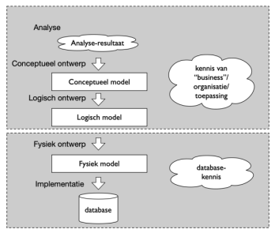

# samenvatting Databases

## Inhoudsopgave


# Hoofdstuk 1: Inleiding tot Databases

**1.1. Wat is data en in welke vormen komt het voor?**
<details><summary>Antwoord</summary>

- **Ruwe data**: Onbewerkte feiten en cijfers zonder context.
- **Dataverwerking**: Het proces van het organiseren, structureren en analyseren van data om nuttige informatie te verkrijgen.
- **Informatie**: Georganiseerde en verwerkte data die betekenisvol is.
- **Kennis**: Informatie die is geïnterpreteerd en begrepen, vaak gebruikt voor besluitvorming.

- **Vormen van data**:
  - Gestructureerde data: Georganiseerd in tabellen (bijv. databases).
  - Ongestructureerde data: Niet georganiseerd (bijv. tekstbestanden, afbeeldingen).
  - Semi-gestructureerde data: Gedeeltelijk georganiseerd (bijv. XML, JSON).


</details>

**1.2. Wat is een database en welke voordelen biedt het gebruik ervan?**
<details><summary>Antwoord</summary>

- **Database**: Een georganiseerde verzameling van gegevens die elektronisch wordt opgeslagen en beheerd.
- **Voordelen van databases**:
  - Efficiënte opslag en beheer van grote hoeveelheden data.
  - Snelle toegang tot gegevens via query's.
  - Gegevensintegriteit en consistentie door regels en beperkingen.
  - Meerdere gebruikers kunnen gelijktijdig toegang krijgen tot dezelfde data.
  - Beveiliging van gegevens door toegangscontrole en autorisatie.
  - Back-up en herstelmogelijkheden om gegevensverlies te voorkomen.
  - Schaalbaarheid om te groeien met de behoeften van een organisatie.

</details>

**1.3. geef een paar toepassingen van databases?**
<details><summary>Antwoord</summary>

- **Toepassingen van databases**:
  - Klantrelatiebeheer (CRM) systemen.
  - E-commerce platforms.
  - Financiële systemen (bankieren, boekhouding).
  - Gezondheidszorgsystemen (patiëntendossiers).
  - Voorraadbeheer en logistiek.
  - Sociale media platforms.
  - Onderzoeksdatabases voor wetenschappelijke studies.
  - Contentmanagementsystemen (CMS) voor websites.
  - Educatieve platforms voor studenten- en cursusbeheer.

</details>

**1.4. welke 2 soorten data worden er onderscheiden en wat zijn de voor en nadelen?**
<details><summary>Antwoord</summary>

- **Vluchtige data**:
  - dat wordt geladen in het geheugen (RAM).
  - in code: gebruik maken van variabelen.

  - **Voordelen**:
    - Snelle toegang en verwerking.
    - Geschikt voor tijdelijke opslag (bijv. RAM).
  - **Nadelen**:
    - Verliest gegevens bij stroomuitval.
    - Beperkte opslagcapaciteit.

- **Niet-vluchtige data**:
  - Data wordt opgeslagen naar een bestand of schijf.
  - in code: gebruik maken van bestanden of databases.

  - **Voordelen**:
    - Permanente opslag van gegevens (bijv. harde schijven, SSD's).
    - Behoudt gegevens bij stroomuitval.
  - **Nadelen**:
    - Langzamere toegang in vergelijking met vluchtige data.
    - Kan duurder zijn in termen van opslagmedia.

</details>

**1.5. Geef een overzicht van de verschillende bestandstypen**
<details><summary>Antwoord</summary>

1. Ecxel-bestanden (.xls, .xlsx)

    

2. CSV-bestanden (.csv)

    

3. XML-bestanden (.xml)

    

4. JSON-bestanden (.json)

    

5. Binaire bestanden (.bin, .dat)

    

6. Access-bestanden (.mdb, .accdb)

    


</details>

**1.6. Welke van de bovenstaande bestandstypen behoren tot de vlakke datastructuren en wat zijn de mogelijke nadelen?**
<details><summary>Antwoord</summary>

- Excel-bestanden (.xls, .xlsx)
- CSV-bestanden (.csv)

**Nadelen van vlakke datastructuren**:
- men kan hier moeilijk relaties tussen data leggen.

- is ok voor kleine datasets, maar niet voor grote datasets.

</details>

**1.7. welke van de bovenstaande bestandstypen zijn geneste datastructuren en wat zijn de mogelijke voordelen?**
<details><summary>Antwoord</summary>

- XML-bestanden (.xml)


- JSON-bestanden (.json)


**Voordelen van geneste datastructuren**:
- kunnen complexe gegevensmodellen weergeven.
- maken hiërarchische relaties tussen gegevens mogelijk.
- flexibel en uitbreidbaar voor verschillende soorten gegevens.
- geschikt voor webtoepassingen en API's.
- makkelijk te lezen en te begrijpen door zowel mensen als machines.
- ondersteunen meerdere niveaus van gegevensorganisatie.

</details>

**1.8. Wat zijn mogelijke nadelen van bovenstaande datastructuren en wat is de oplossing?**
<details><summary>Antwoord</summary>

- **problemen :
  - kunnen maar door 1 proces of applicatie tegelijk geschreven worden.
  - zeer traag om data te zoeken.
  - traag bij het toevegen, verwijderen of bijwerken van data.

- **Oplossing**:
  - gebruik maken van databasesystemen die gelijktijdige toegang, snelle zoekmogelijkheden en efficiënte gegevensmanipulatie bieden.


</details>

**1.9. Wat is het doel van een databank (database management system - DBMS)?**
<details><summary>Antwoord</summary>

- digitale opslagplaats voor gegevens.
- kan flexibel geraadpleegd, beheerd en bijgewerkt worden door meerdere gebruikers tegelijk.
  - doorzoeen van gegevens
  - toevoegen van gegevens
  - verwijderen van gegevens
- speelt dus een cruciale rol voor het `archiveren` en het `actueel houden` van data.

</details>

**1.10. uit hoeveel componenten bestaat een DBMS en welke zijn dat?**
<details><summary>Antwoord</summary>

Een DBMS bestaat uit vier hoofdcomponenten:

1. gebruikers : 
   - mensen die de database gebruiken en beheren.
   - kunnen verschillende rollen hebben, zoals databasebeheerders, ontwikkelaars en eindgebruikers.

2. Databankapplicaties :

   - Gewone gebruikers :
        - kant en klaarapplicaties die interactie hebben met de database.
        - bijv:

          - Boekhoudsoftware
          - CRM-systemen.

    - Administrators :
        - gebruiken programma's om de database te beheren.
        - bijv:

          - MySQL Workbench
          - SQL Server Management Studio.

3. DBMS-software :
   - draait op de achtergrond en dient om de databanken te creëren, beheren en onderhouden.
   - belangerijkste taak is het handhaven van de integriteit van de gegevens :

     - voldoen aan regels
     - consistentie van de gegevens

4. Databank zelf :
   - bevat bij elkaar horende data/gegevens die opgeslagen zin in sets van onderlinge gerelateerde tabellen.


</details>

**1.10. wat zijn de 2 types van DBMS systemen?**
<details><summary>Antwoord</summary>

1. Relationele DBMS (RDBMS : Relational Database Management System) :

   - Gebaseerd op het relationele model.
   - Data wordt opgeslagen in tabellen met rijen en kolommen.
   - Voorbeelden: MySQL, PostgreSQL, Oracle Database.

2. Niet-relationele DBMS (NoSQL DBMS) :
 
   - Gebaseerd op verschillende datamodellen zoals document-gebaseerd, key-value, grafen, kolom-gebaseerd.
   - Geschikt voor ongestructureerde of semi-gestructureerde data.
   - Voorbeelden: MongoDB, Cassandra, Redis.


</details>

**1.11. Wat zijn de belangrijkste taken van een RDBMS?**
<details><summary>Antwoord</summary>

- aanmaken van databanken
- aanmaken van tabellen
- aanmaken van extra structuren (indexen, views, procedures)
- Bevat mogelijkheden tot GRUD-operaties (Create, Read, Update, Delete)
- onderhouden van de integriteit van de gegevens
- regels instellen (constraints)
- regelt de toegangsrechten van gebruikers
- back-up en herstel van gegevens
- laat beveiliging van gegevens toe (permissies, encryptie)

</details>

**1.12. wat is de inhoud van een RDBMS?**
<details><summary>Antwoord</summary>

- tabellen met data
- Meta-data (data over data) :

  - beschrijft de structuur van de tabellen
  - beschrijft de relaties tussen tabellen
  - bevat informatie over toegangsrechten en gebruikers

- Indexen :

  - versnellen het zoeken en ophalen van gegevens
  - verbeteren de prestaties van query's

- stored procedures :

  - vooraf gedefinieerde SQL-code die herhaaldelijk kan worden uitgevoerd
  - verbeteren de efficiëntie en consistentie van databasebewerkingen

- Triggers :

  - automatische acties die worden uitgevoerd als reactie op bepaalde gebeurtenissen in de database
  - zorgen voor gegevensintegriteit en automatisering van taken

- Views :

  - virtuele tabellen die zijn gebaseerd op de resultaten van een query
  - bieden een vereenvoudigde weergave van complexe gegevens

- beveiligen van data :

  - gebruikersauthenticatie en autorisatie
  - gegevensversleuteling

- back-up en herstel data :

  - zorgen voor gegevensbescherming en beschikbaarheid

</details>

---

# Hoofdstuk 2: Databankontwerp

**2.1. Wat zijn de 4 fasen voor het ontwikkelen van een informatiesysteem?**
<details><summary>Antwoord</summary>

1. **Analyse**: Gesprekken voeren met de klant. Klant zoekt zijn/haar wensen. De consultant vertaalt de wensen naar degene die het uiteindelijk zal moeten gaan maken.

2. **Logisch ontwerp**:

    Ontwerp relationele databank, relationele databank wordt ontworpen, gebaseerd op huide behoeften en rekening houdend met toekomstige behoeften.

   - We doen dit via een Entity Relationship Model (ERM) en dit wordt getoond met een Entity Relationship Diagram (ERD) en is een uitstekende basis voor een fysiek databankontwerp.

3. **Fysiek ontwerp**:

Mapping. Omzetten van het logische model naar een fysiek model dat zich niet op 1 van de belangerijkste DBMS-typen: relationeel, hiërarchisch, network of object-georienteerd.
Het bevat de structuur van de tabellen, alle kenmerken van de gegevens en richt zich op de details van de implementatie.

1. **Bouw**: Bouwen van de databank.



</details>

**2.2. Wat is het Entity Relationship Model (ERM)?**
<details><summary>Antwoord</summary>

- Een model om databanken te ontwerpen.
- Bevat entiteiten (objecten), attributen (eigenschappen) en relaties (verbindingen tussen entiteiten).
- Wordt visueel weergegeven in een Entity Relationship Diagram (ERD).

erd diagram


erd symbolen ( kraaiepoten notatie )


erm schema


</details>

**2.3. Wat zijn mogelijke voordelen van een goed databankontwerp?**
<details><summary>Antwoord</summary>

- Efficiënte opslag en retrieval van data.
- Vermindering van redundantie en inconsistenties.
- Betere prestaties en schaalbaarheid.
- Gemakkelijker onderhoud en updates.

</details>

---

# Hoofdstuk 3: Databankontwerp in SQL

**3.1. Wat is SQL en waarom wordt het gebruikt?**
<details><summary>Antwoord</summary>

- SQL (Structured Query Language): Meestgebruikte taal voor relationele databanken.
- ANSI-standaard sinds 1986, ISO-standaard sinds 1987.
- Datasubtaal: Definieert en verwerkt databankgegevens en metagegevens.
- Gebruikt in applicaties zoals rapportagesystemen, webapplicaties, Python, C#.
- Vereist vaardigheid om te programmeren.


</details>

**3.2. Wat zijn de twee categorieën van SQL-queries?**
<details><summary>Antwoord</summary>

**DDL (Data Definition Language)**:

Aanmaken, verwijderen of aanpassen van databanken, tabellen en relaties.

**Voorbeelden:**

```sql
- CREATE DATABASE
- DROP DATABASE
- CREATE TABLE
- DROP TABLE
- ALTER TABLE
- TRUNCATE TABLE.
```

**DML (Data Manipulation Language)**:

Opvragen, toevoegen, wissen of aanpassen van data.

**Voorbeelden:**

```sql
- SELECT
- INSERT
- DELETE
- UPDATE
```

</details>

**3.3. Hoe maak je een database en tabellen aan in SQL?**
<details><summary>Antwoord</summary>

- CREATE DATABASE: Maakt een nieuwe database.
- CREATE TABLE: Maakt een tabel met kolommen en datatypes.
- Voorbeeld: Gebruik van INSERT om data toe te voegen.

```sql
CREATE DATABASE jeugdvereniging;

CREATE TABLE leden
(
    Lidnr INT,
    Naam VARCHAR(50),
    isMeisje BOOLEAN,
    insschrijvingsdatum TIMESTAMP
);

INSERT INTO leden (Lidnr, Naam, isMeisje, insschrijvingsdatum) VALUES
(1, 'Jan Jansen', 0, '2023-01-15 10:00:00'),
(2, 'Piet Pietersen', 0, '2023-02-20 11:30:00'),
(3, 'Klaas Klaassen', 0, '2023-03-25 09:15:00'),
(4, 'Marie Maartens', 1, '2023-04-10 14:45:00'),
(5, 'Sofie Smeets', 1, '2023-05-05 16:20:00');
```


</details>

# Hoofdstuk 4: Gegevens selecteren uit een databank

**4.1. Wat is de algemene vorm van een SELECT-query?**
<details><summary>Antwoord</summary>

- Algemene vorm: SELECT DISTINCT <veldna(a)m(en)> FROM <tabelnaam> JOIN <tabelnaam> ON <id> = <id> WHERE <conditie(s)> GROUP BY <veldna(a)m(en)> HAVING <conditie(s)> ORDER BY <veldna(a)m(en)> LIMIT <offset>,<aantal>;

- Uitvoervolgorde: JOIN (1), WHERE (2), GROUP BY (3), HAVING (4), SELECT (5), DISTINCT (6), ORDER BY (7), LIMIT (8).

**Voeg hier afbeelding toe:** Een diagram van de SELECT-query structuur (bijv. uit Image ID 4; sla op als ./assets/select_query.png).

</details>

**4.2. Hoe selecteer je velden en filter je records?**
<details><summary>Antwoord</summary>

- Velden selecteren (projectie):

  - SELECT * FROM activiteiten;
  - SELECT naam, geboortedatum FROM leden;

- Records filteren (selectie):

  - SELECT ... WHERE ismeisje = 1;
  - WHERE omschrijving = "Vakantiekamp";

- Operatoren:
  - = (gelijk aan)
  - <> (niet gelijk aan)
  - > (groter dan)
  - < (kleiner dan)
  - >= (groter dan of gelijk aan)
  - <= (kleiner dan of gelijk aan)

- SQL is hoofdletterongevoelig voor strings; strings tussen:

  - enkelvoudige (' ') aanhalingstekens.
  - dubbele (" ") aanhalingstekens.

</details>

**4.3. Wat is het belang van de jeugdbeweging.sql import?**
<details><summary>Antwoord</summary>

- Importeer jeugdbeweging.sql in MySQL Workbench voor voorbeelden in dit hoofdstuk.

</details>

# Hoofdstuk 5: Berekende velden en functies

**5.1. Wat zijn berekende velden?**
<details><summary>Antwoord</summary>

- Berekend op basis van nul, één of meerdere velden per record.
- Hernoemen met AS-operator.
- Voorbeelden: prijs * (1 + btw_percentage) AS prijs_incl_btw; YEAR(geboortedatum) - 1900 AS eenvoudig_jaar.

**Voeg hier afbeelding toe:** Voorbeeld van berekende velden in query (bijv. uit Image ID 8; sla op als ./assets/berekende_velden.png).

</details>

**5.2. Wat zijn functies in SQL en welke types?**
<details><summary>Antwoord</summary>

- Functies zoals YEAR() gebruiken in queries (berekend veld, WHERE, etc.).
- Argumenten: Hardcoded waarde of veldnaam.
- Types: String-functies (LOWER, UPPER, CONCAT, RTRIM, LTRIM, LENGTH, CHAR_LENGTH), Datum/tijd-functies, Numerieke, Statistische.
- Zie https://dev.mysql.com/doc/refman/8.0/en/functions.html.

</details>

**5.3. Voorbeelden van string-functies?**
<details><summary>Antwoord</summary>

- LOWER("Brugge") → brugge
- UPPER("Brugge") → BRUGGE
- CONCAT("Hello ", "world ", 123) → Hello world 123
- Etc. (zie tabel in document).

</details>

# Hoofdstuk 6: Joins

**6.1. Wat is een INNER JOIN?**
<details><summary>Antwoord</summary>

- Records uit ene tabel met tegenhanger in andere.
- Voorbeeld: SELECT a.omschrijving, i.lidnr FROM activiteiten a JOIN inschrijvingen i ON a.activiteit_id = i.activiteit_id;

**Voeg hier afbeelding toe:** Venn-diagram van joins (bijv. uit Image ID 2; sla op als ./assets/joins_diagram.png).

</details>

**6.2. Wat zijn andere types joins?**
<details><summary>Antwoord</summary>

- LEFT JOIN: Alle records uit linker tabel, matchende uit rechter.
- RIGHT JOIN: Alle records uit rechter tabel, matchende uit linker.

</details>

**6.3. Hoe gebruik je aliassen in joins?**
<details><summary>Antwoord</summary>

- AS a voor activiteiten, AS i voor inschrijvingen.

</details>

# Hoofdstuk 7: Subqueries

**7.1. Wat zijn subqueries?**
<details><summary>Antwoord</summary>

- Eerst info opvragen om basis van nieuwe query.


</details>

**7.2. Hoe bouw je een subquery op?**
<details><summary>Antwoord</summary>

- Subquery tussen haakjes (inner query), main query erboven (outer query).


- Subquery mag slechts één veld selecteren (behalve met EXISTS).

</details>

**7.3. Wat zijn single-record subqueries?**
<details><summary>Antwoord</summary>

- Geven één record terug, gebruiken operatoren: <>, >, >=, <=.
- Voorbeeld: Bovenstaand Neymar-voorbeeld.


</details>

# Hoofdstuk 8: Schrijfqueries

**8.1. Welke queries worden behandeld?**
<details><summary>Antwoord</summary>

- DDL/DML: ALTER TABLE, TRUNCATE TABLE, UPDATE, DELETE (naast eerdere CREATE/DROP/INSERT).

**Voeg hier afbeelding toe:** Overzicht schrijfqueries (bijv. uit Image ID 5; sla op als ./assets/schrijfqueries.png).

</details>

**8.2. Hoe gebruik je ALTER TABLE?**
<details><summary>Antwoord</summary>

- Kolom toevoegen: ALTER TABLE inschrijvingen ADD COLUMN inschrijvingstijd TIMESTAMP DEFAULT CURRENT_TIMESTAMP;
- Verwijderen: DROP COLUMN;
- Naam wijzigen: CHANGE COLUMN;
- Datatype wijzigen: CHANGE COLUMN of MODIFY.

</details>

**8.3. Wat is het verschil met DROP TABLE?**
<details><summary>Antwoord</summary>

- ALTER is veiliger voor bestaande data; DROP verwijdert alles.

</details>

# Hoofdstuk 9: Views, functies en stored procedures

**9.1. Hoe hergebruik je queries?**
<details><summary>Antwoord</summary>

- Via databaseobjecten: Views, Functies, Stored procedures.
- Vind ze in MySQL Workbench categorieën.

**Voeg hier afbeelding toe:** Overzicht hergebruik (bijv. uit Image ID 6; sla op als ./assets/queries_hergebruiken.png).

</details>

**9.2. Wat is een view?**
<details><summary>Antwoord</summary>

- Opgeslagen SELECT-query als virtuele tabel.
- Aanmaak: CREATE VIEW inschrijvingen_activiteiten AS SELECT ...;
- Gebruik: SELECT * FROM view; of join met andere tabellen.

</details>

**9.3. Wat zijn de voordelen van views?**
<details><summary>Antwoord</summary>

- Maakt complexe queries herbruikbaar.
- Geen fysieke opslag.

</details>

# Hoofdstuk 10: Inleiding security

**10.1. Wat is een MySQL-connectiestring?**
<details><summary>Antwoord</summary>

- Parameters: host, gebruiker, wachtwoord, databank.
- Voorbeeld in C#: using MySql.Data.MySqlClient; connectionString = @"server=localhost;userid=root;password=www;database=jeugdvereniging";

- Vermijd root in applicatiecode (volledige rechten).

**Voeg hier afbeelding toe:** Koppeling met MySQL (bijv. uit Image ID 0; sla op als ./assets/mysql_koppeling.png).

</details>

**10.2. Hoe beheer je MySQL-gebruikers?**
<details><summary>Antwoord</summary>

- Opvragen: SELECT * FROM mysql.user;
- Bekijken/beheren in MySQL Workbench.

</details>

**10.3. Waarom security belangrijk?**
<details><summary>Antwoord</summary>

- Bescherming tegen ongeautoriseerde toegang.
- Beperk rechten tot noodzakelijk.

</details>