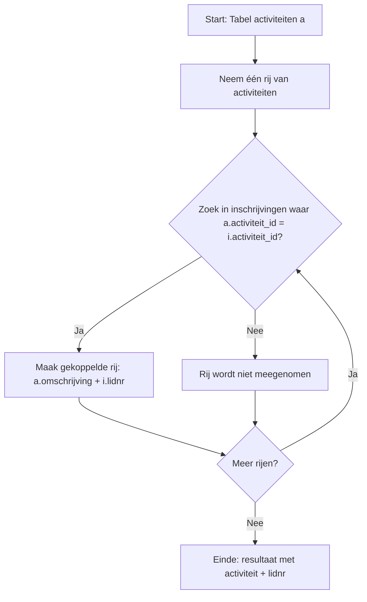

# samenvatting Databases

- handige link om te leren over databases : https://www.w3schools.com/sql/

## Inhoudsopgave


### Hoofdstuk 1: Inleiding tot Databases

**1.1. Wat is data en in welke vormen komt het voor?**
<details><summary>Antwoord</summary>

- **Ruwe data**: Onbewerkte feiten en cijfers zonder context.
- **Dataverwerking**: Het proces van het organiseren, structureren en analyseren van data om nuttige informatie te verkrijgen.
- **Informatie**: Georganiseerde en verwerkte data die betekenisvol is.
- **Kennis**: Informatie die is geïnterpreteerd en begrepen, vaak gebruikt voor besluitvorming.

- **Vormen van data**:
  - Gestructureerde data: Georganiseerd in tabellen (bijv. databases).
  - Ongestructureerde data: Niet georganiseerd (bijv. tekstbestanden, afbeeldingen).
  - Semi-gestructureerde data: Gedeeltelijk georganiseerd (bijv. XML, JSON).


</details>

**1.2. Wat is een database en welke voordelen biedt het gebruik ervan?**
<details><summary>Antwoord</summary>

- **Database**: Een georganiseerde verzameling van gegevens die elektronisch wordt opgeslagen en beheerd.
- **Voordelen van databases**:
  - Efficiënte opslag en beheer van grote hoeveelheden data.
  - Snelle toegang tot gegevens via query's.
  - Gegevensintegriteit en consistentie door regels en beperkingen.
  - Meerdere gebruikers kunnen gelijktijdig toegang krijgen tot dezelfde data.
  - Beveiliging van gegevens door toegangscontrole en autorisatie.
  - Back-up en herstelmogelijkheden om gegevensverlies te voorkomen.
  - Schaalbaarheid om te groeien met de behoeften van een organisatie.

</details>

**1.3. geef een paar toepassingen van databases?**
<details><summary>Antwoord</summary>

- **Toepassingen van databases**:
  - Klantrelatiebeheer (CRM) systemen.
  - E-commerce platforms.
  - Financiële systemen (bankieren, boekhouding).
  - Gezondheidszorgsystemen (patiëntendossiers).
  - Voorraadbeheer en logistiek.
  - Sociale media platforms.
  - Onderzoeksdatabases voor wetenschappelijke studies.
  - Contentmanagementsystemen (CMS) voor websites.
  - Educatieve platforms voor studenten- en cursusbeheer.

</details>

**1.4. welke 2 soorten data worden er onderscheiden en wat zijn de voor en nadelen?**
<details><summary>Antwoord</summary>

- **Vluchtige data**:
  - dat wordt geladen in het geheugen (RAM).
  - in code: gebruik maken van variabelen.

  - **Voordelen**:
    - Snelle toegang en verwerking.
    - Geschikt voor tijdelijke opslag (bijv. RAM).
  - **Nadelen**:
    - Verliest gegevens bij stroomuitval.
    - Beperkte opslagcapaciteit.

- **Niet-vluchtige data**:
  - Data wordt opgeslagen naar een bestand of schijf.
  - in code: gebruik maken van bestanden of databases.

  - **Voordelen**:
    - Permanente opslag van gegevens (bijv. harde schijven, SSD's).
    - Behoudt gegevens bij stroomuitval.
  - **Nadelen**:
    - Langzamere toegang in vergelijking met vluchtige data.
    - Kan duurder zijn in termen van opslagmedia.

</details>

**1.5. Geef een overzicht van de verschillende bestandstypen**
<details><summary>Antwoord</summary>

1. Ecxel-bestanden (.xls, .xlsx)

    

2. CSV-bestanden (.csv)

    

3. XML-bestanden (.xml)

    

4. JSON-bestanden (.json)

    

5. Binaire bestanden (.bin, .dat)

    

6. Access-bestanden (.mdb, .accdb)

    


</details>

**1.6. Welke van de bovenstaande bestandstypen behoren tot de vlakke datastructuren en wat zijn de mogelijke nadelen?**
<details><summary>Antwoord</summary>

- Excel-bestanden (.xls, .xlsx)
- CSV-bestanden (.csv)

**Nadelen van vlakke datastructuren**:
- men kan hier moeilijk relaties tussen data leggen.

- is ok voor kleine datasets, maar niet voor grote datasets.

</details>

**1.7. welke van de bovenstaande bestandstypen zijn geneste datastructuren en wat zijn de mogelijke voordelen?**
<details><summary>Antwoord</summary>

- XML-bestanden (.xml)


- JSON-bestanden (.json)


**Voordelen van geneste datastructuren**:
- kunnen complexe gegevensmodellen weergeven.
- maken hiërarchische relaties tussen gegevens mogelijk.
- flexibel en uitbreidbaar voor verschillende soorten gegevens.
- geschikt voor webtoepassingen en API's.
- makkelijk te lezen en te begrijpen door zowel mensen als machines.
- ondersteunen meerdere niveaus van gegevensorganisatie.

</details>

**1.8. Wat zijn mogelijke nadelen van bovenstaande datastructuren en wat is de oplossing?**
<details><summary>Antwoord</summary>

- **problemen :
  - kunnen maar door 1 proces of applicatie tegelijk geschreven worden.
  - zeer traag om data te zoeken.
  - traag bij het toevegen, verwijderen of bijwerken van data.

- **Oplossing**:
  - gebruik maken van databasesystemen die gelijktijdige toegang, snelle zoekmogelijkheden en efficiënte gegevensmanipulatie bieden.


</details>

**1.9. Wat is het doel van een databank (database management system - DBMS)?**
<details><summary>Antwoord</summary>

- digitale opslagplaats voor gegevens.
- kan flexibel geraadpleegd, beheerd en bijgewerkt worden door meerdere gebruikers tegelijk.
  - doorzoeen van gegevens
  - toevoegen van gegevens
  - verwijderen van gegevens
- speelt dus een cruciale rol voor het `archiveren` en het `actueel houden` van data.

</details>

**1.10. uit hoeveel componenten bestaat een DBMS en welke zijn dat?**
<details><summary>Antwoord</summary>

Een DBMS bestaat uit vier hoofdcomponenten:

1. gebruikers : 
   - mensen die de database gebruiken en beheren.
   - kunnen verschillende rollen hebben, zoals databasebeheerders, ontwikkelaars en eindgebruikers.

2. Databankapplicaties :

   - Gewone gebruikers :
        - kant en klaarapplicaties die interactie hebben met de database.
        - bijv:

          - Boekhoudsoftware
          - CRM-systemen.

    - Administrators :
        - gebruiken programma's om de database te beheren.
        - bijv:

          - MySQL Workbench
          - SQL Server Management Studio.

3. DBMS-software :
   - draait op de achtergrond en dient om de databanken te creëren, beheren en onderhouden.
   - belangerijkste taak is het handhaven van de integriteit van de gegevens :

     - voldoen aan regels
     - consistentie van de gegevens

4. Databank zelf :
   - bevat bij elkaar horende data/gegevens die opgeslagen zin in sets van onderlinge gerelateerde tabellen.


</details>

**1.10. wat zijn de 2 types van DBMS systemen?**
<details><summary>Antwoord</summary>

1. Relationele DBMS (RDBMS : Relational Database Management System) :

   - Gebaseerd op het relationele model.
   - Data wordt opgeslagen in tabellen met rijen en kolommen.
   - Voorbeelden: MySQL, PostgreSQL, Oracle Database.

2. Niet-relationele DBMS (NoSQL DBMS) :
 
   - Gebaseerd op verschillende datamodellen zoals document-gebaseerd, key-value, grafen, kolom-gebaseerd.
   - Geschikt voor ongestructureerde of semi-gestructureerde data.
   - Voorbeelden: MongoDB, Cassandra, Redis.


</details>

**1.11. Wat zijn de belangrijkste taken van een RDBMS?**
<details><summary>Antwoord</summary>

- aanmaken van databanken
- aanmaken van tabellen
- aanmaken van extra structuren (indexen, views, procedures)
- Bevat mogelijkheden tot GRUD-operaties (Create, Read, Update, Delete)
- onderhouden van de integriteit van de gegevens
- regels instellen (constraints)
- regelt de toegangsrechten van gebruikers
- back-up en herstel van gegevens
- laat beveiliging van gegevens toe (permissies, encryptie)

</details>

**1.12. wat is de inhoud van een RDBMS?**
<details><summary>Antwoord</summary>

- tabellen met data
- Meta-data (data over data) :

  - beschrijft de structuur van de tabellen
  - beschrijft de relaties tussen tabellen
  - bevat informatie over toegangsrechten en gebruikers

- Indexen :

  - versnellen het zoeken en ophalen van gegevens
  - verbeteren de prestaties van query's

- stored procedures :

  - vooraf gedefinieerde SQL-code die herhaaldelijk kan worden uitgevoerd
  - verbeteren de efficiëntie en consistentie van databasebewerkingen

- Triggers :

  - automatische acties die worden uitgevoerd als reactie op bepaalde gebeurtenissen in de database
  - zorgen voor gegevensintegriteit en automatisering van taken

- Views :

  - virtuele tabellen die zijn gebaseerd op de resultaten van een query
  - bieden een vereenvoudigde weergave van complexe gegevens

- beveiligen van data :

  - gebruikersauthenticatie en autorisatie
  - gegevensversleuteling

- back-up en herstel data :

  - zorgen voor gegevensbescherming en beschikbaarheid

</details>

---

### Hoofdstuk 2: Databankontwerp

**2.1. Wat zijn de 4 fasen voor het ontwikkelen van een informatiesysteem?**
<details><summary>Antwoord</summary>

1. **Analyse**: Gesprekken voeren met de klant. Klant zoekt zijn/haar wensen. De consultant vertaalt de wensen naar degene die het uiteindelijk zal moeten gaan maken.

2. **Logisch ontwerp**:

    Ontwerp relationele databank, relationele databank wordt ontworpen, gebaseerd op huide behoeften en rekening houdend met toekomstige behoeften.

   - We doen dit via een Entity Relationship Model (ERM) en dit wordt getoond met een Entity Relationship Diagram (ERD) en is een uitstekende basis voor een fysiek databankontwerp.

3. **Fysiek ontwerp**:

Mapping. Omzetten van het logische model naar een fysiek model dat zich niet op 1 van de belangerijkste DBMS-typen: relationeel, hiërarchisch, network of object-georienteerd.
Het bevat de structuur van de tabellen, alle kenmerken van de gegevens en richt zich op de details van de implementatie.

1. **Bouw**: Bouwen van de databank.


</details>

**2.2. Wat is het Entity Relationship Model (ERM)?**
<details><summary>Antwoord</summary>

- Een model om databanken te ontwerpen.
- Bevat entiteiten (objecten), attributen (eigenschappen) en relaties (verbindingen tussen entiteiten).
- Wordt visueel weergegeven in een Entity Relationship Diagram (ERD).

erd diagram


erd symbolen ( kraaiepoten notatie )


erm schema


</details>

**2.3. Wat zijn mogelijke voordelen van een goed databankontwerp?**
<details><summary>Antwoord</summary>

- Efficiënte opslag en retrieval van data.
- Vermindering van redundantie en inconsistenties.
- Betere prestaties en schaalbaarheid.
- Gemakkelijker onderhoud en updates.

</details>

---

### Hoofdstuk 3: Databankontwerp in SQL

**3.1. Wat is SQL en waarom wordt het gebruikt?**
<details><summary>Antwoord</summary>

- SQL (Structured Query Language): Meestgebruikte taal voor relationele databanken.
- ANSI-standaard sinds 1986, ISO-standaard sinds 1987.
- Datasubtaal: Definieert en verwerkt databankgegevens en metagegevens.
- Gebruikt in applicaties zoals rapportagesystemen, webapplicaties, Python, C#.
- Vereist vaardigheid om te programmeren.


</details>

**3.2. Wat zijn de twee categorieën van SQL-queries?**
<details><summary>Antwoord</summary>

**DDL (Data Definition Language)**:

Aanmaken, verwijderen of aanpassen van databanken, tabellen en relaties.

**Voorbeelden:**

```sql
- CREATE DATABASE
- DROP DATABASE
- CREATE TABLE
- DROP TABLE
- ALTER TABLE
- TRUNCATE TABLE.
```

**DML (Data Manipulation Language)**:

Opvragen, toevoegen, wissen of aanpassen van data.

**Voorbeelden:**

```sql
- SELECT
- INSERT
- DELETE
- UPDATE
```

</details>

**3.3. Hoe maak je een database en tabellen aan in SQL?**
<details><summary>Antwoord</summary>

- CREATE DATABASE: Maakt een nieuwe database.
- CREATE TABLE: Maakt een tabel met kolommen en datatypes.
- Voorbeeld: Gebruik van INSERT om data toe te voegen.

```sql
CREATE DATABASE jeugdvereniging;

CREATE TABLE leden
(
    Lidnr INT,
    Naam VARCHAR(50),
    isMeisje BOOLEAN,
    insschrijvingsdatum TIMESTAMP
);

INSERT INTO leden (Lidnr, Naam, isMeisje, insschrijvingsdatum) VALUES
(1, 'Jan Jansen', 0, '2023-01-15 10:00:00'),
(2, 'Piet Pietersen', 0, '2023-02-20 11:30:00'),
(3, 'Klaas Klaassen', 0, '2023-03-25 09:15:00'),
(4, 'Marie Maartens', 1, '2023-04-10 14:45:00'),
(5, 'Sofie Smeets', 1, '2023-05-05 16:20:00');
```


</details>

**3.4. Wat zijn de nummerieke datatypes in SQL?**
<details><summary>Antwoord</summary>

- INT: Gehele getallen.
- FLOAT(p): Kommagetallen met p precisie. (0 - 24)
- DOUBLE(M,D): Kommagetallen met M totale cijfers en D decimalen.
- DECIMAL(M,D): Exacte kommagetallen met M totale cijfers en D decimalen.
- BOOLEAN: Waarheidswaarden (0 of 1).
- bit(M): Binaire waarden met M bits (1-64) (standaard 1).
- TINYINT: Klein geheel getal (-128 tot 127).
- SMALLINT: Klein geheel getal (-32,768 tot 32,767).
- MEDIUMINT: Middelgroot geheel getal (-8,388,608 tot 8,388,607).
- BIGINT: Groot geheel getal (-9,223,372,036,854,775,808 tot 9,223,372,036,854,775,807).

</details>

**3.5. Wat zijn de string datatypes in SQL?**
<details><summary>Antwoord</summary>

- CHAR(M): Vaste lengte string met M tekens (0-255).
- VARCHAR(M): Variabele lengte string met M tekens (0-65,535).
- TEXT: Lange tekst (max 65,535 tekens).
- TINYTEXT: Korte tekst (max 255 tekens).
- MEDIUMTEXT: Middellange tekst (max 16,777,215 tekens).
- LONGTEXT: Zeer lange tekst (max 4,294,967,295 tekens).
- BLOB: Binaire grote objecten (max 65,535 bytes).
- LONG BLOB: Zeer grote binaire objecten (max 4,294,967,295 bytes).

💡 probeer steeds het kleinste datatype te gebruiken dat aan de eisen voldoet.

</details>

**3.6. Wat zijn de datum/tijd datatypes in SQL?**
<details><summary>Antwoord</summary>

- DATE: Datum in 'YYYY-MM-DD' formaat (1000-01-01 tot 9999-12-31).
- DATETIME: Datum en tijd in 'YYYY-MM-DD HH:MM:SS' formaat (1000-01-01 00:00:00 tot 9999-12-31 23:59:59).
- TIMESTAMP: Datum en tijd in 'YYYY-MM-DD HH:MM:SS' formaat (1970-01-01 00:00:01 UTC tot 2038-01-19 03:14:07 UTC).
- TIME: Tijd in 'HH:MM:SS' formaat (-838:59:59 tot 838:59:59).

💡 de notaties zijn steeds in Amerikaans formaat.

</details>

**3.7. hoe maak je een tabel aan in SQL ?**
<details><summary>Antwoord</summary>

```sql
CREATE TABLE tabelnaam
(
    kolomnaam1 DATATYPE CONSTRAINTS,
    kolomnaam2 DATATYPE CONSTRAINTS,
    ...
    kolomnaamN DATATYPE CONSTRAINTS
);
```

💡 alle velden zijn hier optioneel en mogen leeg gelaten worden.

</details>

**3.8. Hoe maak je een table met de constraint NOT NULL?**
<details><summary>Antwoord</summary>

```sql
CREATE TABLE leden
(
    Lidnr INT NOT NULL,
    Naam VARCHAR(50) NOT NULL,
    isMeisje BOOLEAN,
    insschrijvingsdatum TIMESTAMP
);
```
- NOT NULL: voorkomt dat een kolom lege waarden accepteert.
- Zorgt voor gegevensintegriteit door verplichte velden af te dwingen.
- Als een poging wordt gedaan om een record in te voegen zonder waarde voor een NOT NULL kolom, zal de database een foutmelding geven en de invoeging weigeren.

- 💡 gebruik NOT NULL voor velden die altijd een waarde moeten hebben (bijv. primaire sleutels, verplichte attributen)

</details>

**3.9. Hoe maak je een tabel met de constraint default?**
<details><summary>Antwoord</summary>

```sql
CREATE TABLE leden
(
    Lidnr INT NOT NULL,
    Naam VARCHAR(50) NOT NULL,
    isMeisje BOOLEAN DEFAULT 0,
    insschrijvingsdatum TIMESTAMP DEFAULT CURRENT_TIMESTAMP
);
```

- DEFAULT: stelt een standaardwaarde in voor een kolom als er geen waarde wordt opgegeven tijdens het invoegen van een record.
- Verbetert gegevensconsistentie door ervoor te zorgen dat kolommen altijd een geldige waarde hebben.

- 💡 gebruik DEFAULT voor velden die vaak dezelfde waarde hebben (bijv. isMeisje) of voor tijdstempels (bijv. inschrijvingsdatum).

</details>

**3.10. Hoe maak je een tabel met de constraint PRIMARY KEY?**
<details><summary>Antwoord</summary>

```sql
CREATE TABLE leden
(
    Lidnr INT NOT NULL,
    Naam VARCHAR(50) NOT NULL,
    isMeisje BOOLEAN DEFAULT 0,
    insschrijvingsdatum TIMESTAMP DEFAULT CURRENT_TIMESTAMP,
    PRIMARY KEY (Lidnr)
);
```

- PRIMARY KEY: Unieke identifier voor elke record in een tabel.
- Zorgt ervoor dat de kolomwaarden uniek en niet NULL zijn.
- Verbetert de prestaties van zoekopdrachten en relaties tussen tabellen.

- 💡 gebruik PRIMARY KEY voor kolommen die elke record uniek identificeren (bijv. Lidnr).

</details>

**3.11. Hoe maak je een tabel met de constraint samengestelde PRIMARY KEY?**
<details><summary>Antwoord</summary>

```sql
CREATE TABLE inschrijvingen
(
    Lidnr INT NOT NULL,
    ActiviteitID INT NOT NULL,
    Inschrijvingsdatum TIMESTAMP DEFAULT CURRENT_TIMESTAMP,
    PRIMARY KEY (Lidnr, ActiviteitID)
);
```

- Samengestelde PRIMARY KEY: Unieke identifier bestaande uit meerdere kolommen.
- Zorgt ervoor dat de combinatie van kolomwaarden uniek is.
- Verbetert de gegevensintegriteit bij relaties tussen tabellen.

- 💡 gebruik samengestelde PRIMARY KEY voor tabellen die relaties tussen entiteiten vertegenwoordigen (bijv. inschrijvingen).

</details>

**3.12. Hoe maak je een tabel met de constraint FOREIGN KEY?**
<details><summary>Antwoord</summary>

```sql
CREATE TABLE inschrijvingen
(
    Lidnr INT NOT NULL,
    ActiviteitID INT NOT NULL,
    Inschrijvingsdatum TIMESTAMP DEFAULT CURRENT_TIMESTAMP,
    PRIMARY KEY (Lidnr, ActiviteitID),
    FOREIGN KEY (Lidnr) REFERENCES leden(Lidnr),
    FOREIGN KEY (ActiviteitID) REFERENCES activiteiten(ActiviteitID)
);
```

- FOREIGN KEY: Verwijst naar een PRIMARY KEY in een andere tabel.
- Zorgt voor referentiële integriteit tussen tabellen.
- Voorkomt het invoegen van records met niet-bestaande verwijzingen.

- 💡 gebruik FOREIGN KEY voor kolommen die relaties tussen tabellen vertegenwoordigen (bijv. Lidnr in inschrijvingen verwijst naar Lidnr in leden).

</details>

**3.13. Hoe maak je een tabel met de constraint AUTO_INCREMENT?**
<details><summary>Antwoord</summary>

```sql
CREATE TABLE leden
(
    Lidnr INT NOT NULL AUTO_INCREMENT,
    Naam VARCHAR(50) NOT NULL,
    isMeisje BOOLEAN DEFAULT 0,
    insschrijvingsdatum TIMESTAMP DEFAULT CURRENT_TIMESTAMP,
    PRIMARY KEY (Lidnr)
);
```

- AUTO_INCREMENT: Automatisch een unieke waarde genereren voor een kolom bij het invoegen van een nieuw record.
- Handig voor PRIMARY KEY kolommen om unieke identifiers te creëren zonder handmatige invoer.
- Verhoogt de waarde automatisch met 1 voor elke nieuwe invoeging.

- 💡 gebruik AUTO_INCREMENT voor kolommen die unieke identifiers nodig hebben (bijv. Lidnr).

</details>

**3.14. Hoe maak je een tabel met de constraint FOREIGN KEY?**
<details><summary>Antwoord</summary>

```sql
CREATE TABLE inschrijvingen
(
    Lidnr INT NOT NULL,
    ActiviteitID INT NOT NULL,
    Inschrijvingsdatum TIMESTAMP DEFAULT CURRENT_TIMESTAMP,
    PRIMARY KEY (Lidnr, ActiviteitID),
    FOREIGN KEY (Lidnr) REFERENCES leden(Lidnr),
    FOREIGN KEY (ActiviteitID) REFERENCES activiteiten(ActiviteitID) 
);
```

- FOREIGN KEY: Zelfde als FOREIGN KEY, verwijst naar een PRIMARY KEY in een andere tabel.
- Zorgt voor referentiële integriteit tussen tabellen.
- Voorkomt het invoegen van records met niet-bestaande verwijzingen.

- 💡 gebruik FOREIGN KEY voor kolommen die relaties tussen tabellen vertegenwoordigen (bijv. Lidnr in inschrijvingen verwijst naar Lidnr in leden).

</details>

**3.15. Wat is de legende van de symbolen in een ERD-diagram?**
<details><summary>Antwoord</summary>

- Gele sleutel = PRIMARY KEY
- Blauwe sleutel = FOREIGN KEY
- Roze sleutel = primaire + externe sleutel

- volle blauwe ruit = verplicht veld
- holle blauwe ruit = optioneel veld

- volle roze ruit = verplicht veld + externe sleutel
- holle roze ruit = optioneel veld + externe sleutel


</details>

---

### Hoofdstuk 4: Gegevens selecteren uit een databank

**4.1. Wat is de algemene vorm van een SELECT-query?**
<details><summary>Antwoord</summary>

- Algemene vorm:

```sql
SELECT [DISTINCT] kolommen    --5, 6
FROM tabellen                 --1
JOIN tabelnaam on id = id     --1 (kan 1 of meerdere joins zijn)
WHERE voorwaarden             --2 (kan naast filtering ook nog subqueries bevatten)
GROUP BY veldnaam             --3
HAVING voorwaarden            --4
ORDER BY veldnaam [ASC|DESC]  --7
LIMIT <offset>,<aantal>;      --8
```

- Belangrijke onderdelen:

  - SELECT: Velden kiezen.
  - FROM: Tabellen specificeren.
  - JOIN: Tabellen koppelen.
  - WHERE: Records filteren.
  - GROUP BY: Groeperen van records.
  - HAVING: Filteren van gegroepeerde records.
  - ORDER BY: Sorteren van resultaten.
  - LIMIT: Aantal resultaten beperken.

- de veldnamen worden gescheiden door komma's. om alle velden te selecteren gebruik je *.


</details>

**4.2. Hoe selecteer je velden en filter je records?**
<details><summary>Antwoord</summary>

- Velden selecteren (projectie):

```sql
SELECT * 
FROM activiteiten;

SELECT naam, geboortedatum
FROM leden;
```

- Records filteren (selectie):

```sql
SELECT *
FROM leden
WHERE ismeisje = 1;
WHERE omschrijving = "Vakantiekamp";
```

- Operatoren:

```sql
= (gelijk aan)
<> (niet gelijk aan)(ook != en NOT=)
> (groter dan)
< (kleiner dan)
>= (groter dan of gelijk aan)
<= (kleiner dan of gelijk aan)
```

- 💡SQL is hoofdletterongevoelig voor strings

  - strings tussen:

    - enkelvoudige (' ') aanhalingstekens.
    - dubbele (" ") aanhalingstekens.

</details>

**4.3. wat zijn de logische operatoren waarmee je conditie kunt combineren?**
<details><summary>Antwoord</summary>

- AND: Beide voorwaarden moeten waar zijn.
- OR: Minstens één van de voorwaarden moet waar zijn.
- NOT: Keert de voorwaarde om (waar wordt onwaar en vice versa).

- Voorbeeld:

```sql
SELECT naam, geboortedatum
FROM leden
WHERE gemeente = 'Brugge' AND ismeisje = 1;

SELECT *
from leden
WHERE gemeente = 'Brugge' OR gemeente = 'Gent';

SELECT omschrijving, datumtijdstip
FROM activiteiten
WHERE NOT omschrijving = 'Vakantiekamp';
```

- BETWEEN : Tussen twee waarden (inclusief).
- IN : Waarden in een lijst (vervangt de OR operator).
- LIKE : Patronen met wildcards `%` (willekeurige tekenreeks) en `_` (willekeurig teken).

**Voorbeeld:**

```sql
SELECT naam, adres, postnummer, gemeente
FROM leden
Where postnummer BETWEEN 8000 AND 9000;

SELECT *
FROM activiteiten 
WHERE datumtijdstip BETWEEN "2015-01-01 00:00:00" AND "2015-12-31 23:59:59";
```

**voorbeeld**

- getal = 1 OR getal = 2 OR getal = 3
- getal IN (1, 2, 3)

```sql
SELECT naam, ismeisje
FROM leden
WHERE ismeisje = 1
AND gemeente IN ("Tielt", "Veurne", "Waregem");
```

**voorbeelden**

- naam LIKE "Marie%"

- K%
- %oe
- %en%
- _a%

```sql
SELECT *
FROM leden
WHERE gemeente LIKE "%Van%";

SELECT naam, adres, postnummer, gemeente
FROM leden
WHERE gemeente LIKE "_i%";

SELECT naam, ismeisje
FROM leden
WHERE naam LIKE "__n%";
```

- ALL : Alle waarden voldoen aan de voorwaarde.
- ANY : Minstens één waarde voldoet aan de voorwaarde.
- EXISTS : Controleert of een subquery resultaten oplevert.

**Voorbeelden:**

```sql
SELECT *
FROM studenten
WHERE leeftijd > ALL
(
    SELECT leeftijd
    FROM studenten
    WHERE klas = '1ICT'
);

SELECT *
FROM studenten
WHERE EXISTS 
(
    SELECT 1
    FROM studenten
    WHERE klas = '1ICT'
);

SELECT *
FROM studenten
WHERE leeftijd > ANY 
(
    SELECT leeftijd
    FROM studenten
    WHERE klas = '1ICT'
);
```

- 💡 gebruik haakjes om de volgorde van evaluatie te bepalen bij complexe voorwaarden.

</details>

**4.4. Wat is het probleem met bovenstaande `% en _` en wat is de oplossing?**
<details><summary>Antwoord</summary>

- deze kunnnen niet gebuikt worden om bv namen die beginnen met een klinker te zoeken.

- oplossing is gebruik maken van REGEXP

```sql
SELECT naam
FROM leden
WHERE naam REGEXP '^[aeiouAEIOU]';
```

dit zal alle namen selecteren die beginnen met een klinker (hoofdletter of kleine letter)

```sql
^ = begin van de string
$ = einde van de string
. = elk teken
a* = nul of meer keer 'a'
a+ = één of meer keer 'a'
a? = nul of één keer 'a'
[a-dX] = één teken in het bereik a tot d of X
[^a-dX] = één teken dat niet in het bereik a tot d of X ligt
```

reguliere expressie |        voldoet      |    voldoet niet   |
--------------------| ------------------- | ------------------|
[aeiou]             | ai, aap, mes, wei   | ly, ssst,krpk     |
[^aeiou]            | ly, ssst, krpk      | ai, aap, mes, wei |
[a-d]               | schop, as, weldra   | yogurt, zes       |
[aeoui][aeoui]      | paus, aas, prooi    | wens, arcade, wolf|
^[aeoui0-9]         | agenda, 8tzaam, 44  | z3s, w8, vrees    |
[aeoui0-9]$         | agenda, 44, w8      | z3s, vrees, 8tzaam|
ka.s                | kaas, herkansing    | kas               |
ka.*s               | kas, kaas, kamikase | aks, sake         |
ka*s                | ks, kas, kaas, kaaas| kees              |
ka+s                | kas, kaas, kaaas    | ks, kees          |
ka?s                | ks, kas             | kaas              |

</details>

🏫 sites om te oefenen

- [https://regex101.com/](https://regex101.com/)
- [https://www.regextester.com/](https://www.regextester.com/)
- [https://regexr.com/](https://regexr.com/)
- [https://www.freeformatter.com/regex-tester.html](https://www.freeformatter.com/regex-tester.html)
- [https://www.regexpal.com/](https://www.regexpal.com/)
- [https://regexlearn.com/learn/regex101](https://regexlearn.com/learn/regex101)

---

### Hoofdstuk 5: Berekende velden en functies

**5.1. Wat zijn berekende velden?**
<details><summary>Antwoord</summary>

- Berekend op basis van nul, één of meerdere velden per record.
- Hernoemen met AS-operator.
- Voorbeelden:

```sql
   prijs * (1 + btw_percentage) AS prijs_incl_btw;
   prijs * (1 - kortingspercentage) AS prijs_na_korting;

   SELECT DISTINCT YEAR(geboortedatum) - 1900 AS eenvoudige_jaar
   FROM leden
   Where YEAR(geboortedatum) < 2000;
```

</details>

**5.2. Wat zijn functies in SQL en welke types?**
<details><summary>Antwoord</summary>

- Functies zoals YEAR() gebruiken in queries (berekend veld, WHERE, etc.).
- Argumenten: Hardcoded waarde of veldnaam.
- Types: String-functies (LOWER, UPPER, CONCAT, RTRIM, LTRIM, LENGTH, CHAR_LENGTH), Datum/tijd-functies, Numerieke, Statistische.
- Zie https://dev.mysql.com/doc/refman/8.0/en/functions.html.

</details>

**5.3. wat zijn de string functies?**
<details><summary>Antwoord</summary>

- bewerken van tekstwaarden.

| Functie        | Betekenis                                                                 | Voorbeeld                                      | Resultaat              |
|---------------|---------------------------------------------------------------------------|-----------------------------------------------|------------------------|
| `LOWER()`     | Zet alles om naar kleine letters                                          | `SELECT LOWER("Brugge");`                     | `brugge`               |
| `UPPER()`     | Zet alles om naar hoofdletters                                            | `SELECT UPPER("Brugge");`                     | `BRUGGE`               |
| `CONCAT()`    | Voegt verschillende delen samen. Als één argument `NULL` is → resultaat is `NULL` | `SELECT CONCAT("Hello ", "world ", 123);` | `Hello world 123`      |
| `RTRIM()`     | Verwijdert spaties **achter** de tekst                                    | `SELECT RTRIM("Hello ");`                     | `Hello`                |
| `LTRIM()`     | Verwijdert spaties **voor** de tekst                                      | `SELECT LTRIM(" world");`                     | `world`                |
| `LENGTH()`    | Geeft het aantal **bytes** terug                                          | `SELECT LENGTH("Hello");`                     | `5`                    |
| `CHAR_LENGTH()` | Geeft het aantal **karakters** terug                                    | `SELECT CHAR_LENGTH("Hello");`                | `5`                    |

</details>

**5.4. wat zijn de datum/tijd functies?**
<details><summary>Antwoord</summary>

- **bewerken van datum- en tijdwaarden.**

| Functie              | Betekenis                                                      | Voorbeeld                                 | Resultaat (voorbeeld) |
|---------------------|----------------------------------------------------------------|--------------------------------------------|------------------------|
| `DAY()`             | Geeft de **dag van de maand** van een datum                    | `SELECT DAY("2026-01-10");`                | `10`                   |
| `WEEK()`            | Geeft het **weeknummer** van een datum                         | `SELECT WEEK("2026-01-10");`               | bv. `2`                |
| `MONTH()`           | Geeft de **maand** van een datum                               | `SELECT MONTH("2026-01-10");`              | `1`                    |
| `YEAR()`            | Geeft het **jaar** van een datum                               | `SELECT YEAR("2026-01-10");`               | `2026`                 |
| `HOUR()`            | Geeft het **uur** van een datum/tijd                           | `SELECT HOUR("14:35:20");`                 | `14`                   |
| `MINUTE()`          | Geeft de **minuten** van een datum/tijd                        | `SELECT MINUTE("14:35:20");`               | `35`                   |
| `SECOND()`          | Geeft de **seconden** van een datum/tijd                       | `SELECT SECOND("14:35:20");`               | `20`                   |
| `DATE()`            | Haalt de **datum** uit een datetime                            | `SELECT DATE("2026-01-10 14:35:20");`       | `2026-01-10`           |
| `TIME()`            | Haalt het **tijdstip** uit een datetime                        | `SELECT TIME("2026-01-10 14:35:20");`       | `14:35:20`             |
| `DATEDIFF()`        | Geeft het **aantal dagen tussen 2 datums**                     | `SELECT DATEDIFF("2026-01-10","2026-01-01");` | `9`                 |
| `CURTIME()`         | Geeft de **huidige tijd**                                      | `SELECT CURTIME();`                        | bv. `14:35:20`         |
| `CURDATE()`         | Geeft de **huidige datum**                                     | `SELECT CURDATE();`                        | bv. `2026-01-10`       |
| `CURRENT_TIMESTAMP` | Geeft de **huidige datum + tijd** (haakjes niet verplicht)     | `SELECT CURRENT_TIMESTAMP;`                | bv. `2026-01-10 14:35:20` |
| `NOW()`             | Geeft de **huidige datum + tijd**                              | `SELECT NOW();`                            | bv. `2026-01-10 14:35:20` |

</details>

**5.5. wat zijn de numerieke functies?**
<details><summary>Antwoord</summary>

- **bewerken van numerieke waarden.**

| Functie        | Betekenis                                                              | Voorbeeld                  | Resultaat |
|---------------|-------------------------------------------------------------------------|----------------------------|-----------|
| `FLOOR()`     | Geeft het **grootste gehele getal kleiner dan** het opgegeven getal     | `SELECT FLOOR(1.23);`      | `1`       |
|               |                                                                         | `SELECT FLOOR(-1.23);`     | `-2`      |
| `CEIL()` / `CEILING()` | Geeft het **kleinste gehele getal groter of gelijk aan** het opgegeven getal | `SELECT CEIL(1.23);` | `2` |
|               |                                                                         | `SELECT CEIL(-1.23);`      | `-1`      |
| `MOD()` / `MOD` / `%` | Geeft de **rest bij een deling**                                  | `SELECT MOD(234,10);`      | `4`       |
|               |                                                                         | `SELECT 234 MOD 10;`       | `4`       |
|               |                                                                         | `SELECT 234 % 10;`         | `4`       |
| `POW()`       | Geeft **grondtal tot de macht van exponent**                            | `SELECT POW(2,2);`         | `4`       |
| `SQRT()`      | Geeft de **vierkantswortel** van een positief getal                     | `SELECT SQRT(4);`          | `2`       |
|               |                                                                         | `SELECT SQRT(-16);`        | `NULL`    |
| `ABS()`       | Geeft de **absolute waarde** van een getal                              | `SELECT ABS(2);`           | `2`       |
|               |                                                                         | `SELECT ABS(-32);`         | `32`      |
| `SIN()` | Geeft de **sinus** van een getal (in radialen) | `SELECT SIN(PI()/2);`         | `1`       |
|        |                                              | `SELECT SIN(RADIANS(90));`    | `1`       |
| `COS()` | Geeft de **cosinus** van een getal (in radialen) | `SELECT COS(PI());`        | `-1`      |
|        |                                              | `SELECT COS(RADIANS(180));`   | `-1`      |
| `TAN()` | Geeft de **tangens** van een getal (in radialen) | `SELECT TAN(PI()/4);`      | `1`       |
|        |                                              | `SELECT TAN(RADIANS(45));`    | `1`       |

</details>

**5.6. wat zijn de statistische functies?**
<details><summary>Antwoord</summary>

- **bewerken van groepen van waarden.**

| Functie            | Betekenis                                                                 | Voorbeeld                         | Resultaat (voorbeeld) |
|--------------------|---------------------------------------------------------------------------|----------------------------------|------------------------|
| `COUNT(*)`         | Telt het **totaal aantal rijen** in de tabel                              | `SELECT COUNT(*) FROM studenten;`| bv. `25`               |
| `COUNT(veld)`      | Telt het aantal **niet-NULL waarden** in dat veld                         | `SELECT COUNT(leeftijd) FROM studenten;` | bv. `23`        |
| `SUM(veld)`        | Berekent de **som** van alle waarden (alleen numeriek)                   | `SELECT SUM(punten) FROM scores;`| bv. `420`              |
| `AVG(veld)`        | Berekent het **gemiddelde** (alleen numeriek)                            | `SELECT AVG(punten) FROM scores;`| bv. `70`               |
| `MIN(veld)`        | Geeft de **kleinste waarde**                                              | `SELECT MIN(punten) FROM scores;`| bv. `12`               |
| `MAX(veld)`        | Geeft de **grootste waarde**                                              | `SELECT MAX(punten) FROM scores;`| bv. `98`               |

- voorbeeld:

```sql
SELECT COUNT(*) AS aantal_inschrijvingen
From insschrijvingen;

SELECT COUNT(activiteit_id) AS aantal_activiteiten
FROM activiteiten

SELECT COUNT(DISTINCT activiteit_id) AS aantal_unieke_activiteiten
FROM inschrijvingen;
```

</details>

**5.7. waarvoor gebruik je `GROUP BY` en `HAVING`?**
<details><summary>Antwoord</summary>

- Groeperen van records met `GROUP BY`.
- Filteren van gegroepeerde records met `HAVING` ⚠️ moet altijd na `GROUP BY` komen.

```sql
SELECT ismeisje, COUNT(*) AS aantal_leden
FROM leden
GROUP BY ismeisje;
```

```sql
SELECT ismeisje, COUNT(*) AS aantal_leden
FROM leden
GROUP BY ismeisje
HAVING COUNT(*) > 2;
ORDER BY aantal_leden DESC, ismeisje ASC; 
```

</details>

---

### Hoofdstuk 6: Joins

**6.1. wat zijn de 3 types joins?**
<details><summary>Antwoord</summary>

- INNER JOIN: Alleen records met matchende waarden in beide tabellen.
- LEFT JOIN: Alle records uit linker tabel, matchende uit rechter.
- RIGHT JOIN: Alle records uit rechter tabel, matchende uit linker.


```sql
-- INNER JOIN voorbeeld (enkel matchende records)
-- toon alleen activiteiten met inschrijvingen

SELECT a.omschrijving, i.lidnr
FROM activiteiten a
JOIN inschrijvingen i ON a.activiteit_id = i.activiteit_id;

-- LEFT JOIN voorbeeld (alle activiteiten, ook zonder inschrijvingen)
-- toon alles van links (hoofd tabel) en waar geen match met rechts is, daar komt NULL voor lidnr

SELECT a.omschrijving, i.lidnr
FROM activiteiten a
LEFT JOIN inschrijvingen i ON a.activiteit_id = i.activiteit_id;

-- RIGHT JOIN voorbeeld (alle inschrijvingen, ook zonder activiteiten)
-- toon alles van rechts en waar geen match met links is, daar komt NULL voor omschrijving

SELECT a.omschrijving, i.lidnr
FROM activiteiten a
RIGHT JOIN inschrijvingen i ON a.activiteit_id = i.activiteit_id;
```

⚠️ RIGHT JOIN is minder gebruikelijk dan LEFT JOIN.

</details>

**6.2. wat is het nut van joins?**
<details><summary>Antwoord</summary>

- Gegevens uit meerdere tabellen combineren op basis van gerelateerde kolommen.

</details>

**6.3. wat zijn aliassen in joins en waarom gebruik je ze?**
<details><summary>Antwoord</summary>

- Korte namen voor tabellen of kolommen.
- Verbeteren leesbaarheid en verkorten queries.

```sql
-- gebruik van aliassen a voor omschrijving en i voor lidnr
SELECT  a.omschrijving, i.lidnr


-- gebruik van alias a voor tabel activiteiten
FROM activiteiten a 

-- voegt de tabellen activiteiten en inschrijvingen samen op basis van activiteit_id
JOIN inschrijvingen i ON a.activiteit_id = i.activiteit_id 

```

⚠️ FROM wordt altijd eerst gedaan dan pas SELECT volgorde van uitvoering.


### Hoofdstuk 7: Subqueries

**7.1. Wat zijn subqueries?**
<details><summary>Antwoord</summary>

- Eerst info opvragen om basis van nieuwe query.


</details>

**7.2. Hoe bouw je een subquery op?**
<details><summary>Antwoord</summary>

- Subquery tussen haakjes (inner query), main query erboven (outer query).


- Subquery mag slechts één veld selecteren (behalve met EXISTS).

</details>

waarom gebruik je subqueries?
<details><summary>Antwoord</summary>

- Complexe queries opsplitsen.
- Tussentijdse resultaten gebruiken. ( bv. max waarde zoeken en dan records met die waarde ophalen).

</details>

**7.3. Wat zijn single-record subqueries?**
<details><summary>Antwoord</summary>

- Geven één record terug, gebruiken operatoren: <>, >, >=, <=.
- Voorbeeld: Bovenstaand Neymar-voorbeeld.


kan ook meerdere single sub-queries bavaten met AND

```sql
SELECT naam, score, land
FROM spelers
WHERE score > 
(
    SELECT AVG(score)
    FROM spelers
)
AND  land =
(
    SELECT land
    FROM spelers
    WHERE naam = 'Neymar'
);
```

</details>

**7.4. Wat zijn multiple-record subqueries?**
<details><summary>Antwoord</summary>

- Geven meerdere records terug, gebruiken operatoren: IN, ANY, ALL.
- ⚠️ NOT kan bij alle 3 de operatoren gebruikt worden.

```sql
SELECT naam, score, land
FROM spelers
WHERE land IN 
(
    SELECT land
    FROM spelers
    WHERE naam = 'Neymar'
);
```

⚠️ als je twijfelt of je een single- of multiple-record subquery nodig hebt, probeer dan eerst met IN (multiple-record) en kijk of het werkt.

</details>

### Hoofdstuk 8: Schrijfqueries

**8.1. Welke queries worden behandeld?**
<details><summary>Antwoord</summary>

- DDL/DML: ALTER TABLE, TRUNCATE TABLE, UPDATE, DELETE (naast eerdere CREATE/DROP/INSERT).

**Voeg hier afbeelding toe:** Overzicht schrijfqueries (bijv. uit Image ID 5; sla op als ./assets/schrijfqueries.png).

</details>

**8.2. Hoe gebruik je ALTER TABLE?**
<details><summary>Antwoord</summary>

- Kolom toevoegen: ALTER TABLE inschrijvingen ADD COLUMN inschrijvingstijd TIMESTAMP DEFAULT CURRENT_TIMESTAMP;
- Verwijderen: DROP COLUMN;
- Naam wijzigen: CHANGE COLUMN;
- Datatype wijzigen: CHANGE COLUMN of MODIFY.

</details>

**8.3. Wat is het verschil met DROP TABLE?**
<details><summary>Antwoord</summary>

- ALTER is veiliger voor bestaande data; DROP verwijdert alles.

</details>

### Hoofdstuk 9: Views, functies en stored procedures

**9.1. Hoe hergebruik je queries?**
<details><summary>Antwoord</summary>

- Via databaseobjecten: Views, Functies, Stored procedures.
- Vind ze in MySQL Workbench categorieën.

**Voeg hier afbeelding toe:** Overzicht hergebruik (bijv. uit Image ID 6; sla op als ./assets/queries_hergebruiken.png).

</details>

**9.2. Wat is een view?**
<details><summary>Antwoord</summary>

- Opgeslagen SELECT-query als virtuele tabel.
- Aanmaak: CREATE VIEW inschrijvingen_activiteiten AS SELECT ...;
- Gebruik: SELECT * FROM view; of join met andere tabellen.

</details>

**9.3. Wat zijn de voordelen van views?**
<details><summary>Antwoord</summary>

- Maakt complexe queries herbruikbaar.
- Geen fysieke opslag.

</details>

### Hoofdstuk 10: Inleiding security

**10.1. Wat is een MySQL-connectiestring?**
<details><summary>Antwoord</summary>

- Parameters: host, gebruiker, wachtwoord, databank.
- Voorbeeld in C#: using MySql.Data.MySqlClient; connectionString = @"server=localhost;userid=root;password=www;database=jeugdvereniging";

- Vermijd root in applicatiecode (volledige rechten).

**Voeg hier afbeelding toe:** Koppeling met MySQL (bijv. uit Image ID 0; sla op als ./assets/mysql_koppeling.png).

</details>

**10.2. Hoe beheer je MySQL-gebruikers?**
<details><summary>Antwoord</summary>

- Opvragen: SELECT * FROM mysql.user;
- Bekijken/beheren in MySQL Workbench.

</details>

**10.3. Waarom security belangrijk?**
<details><summary>Antwoord</summary>

- Bescherming tegen ongeautoriseerde toegang.
- Beperk rechten tot noodzakelijk.

</details>