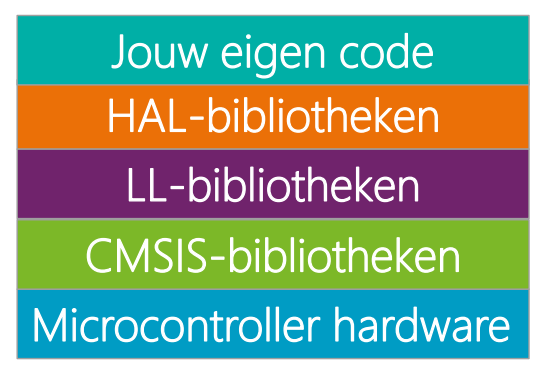
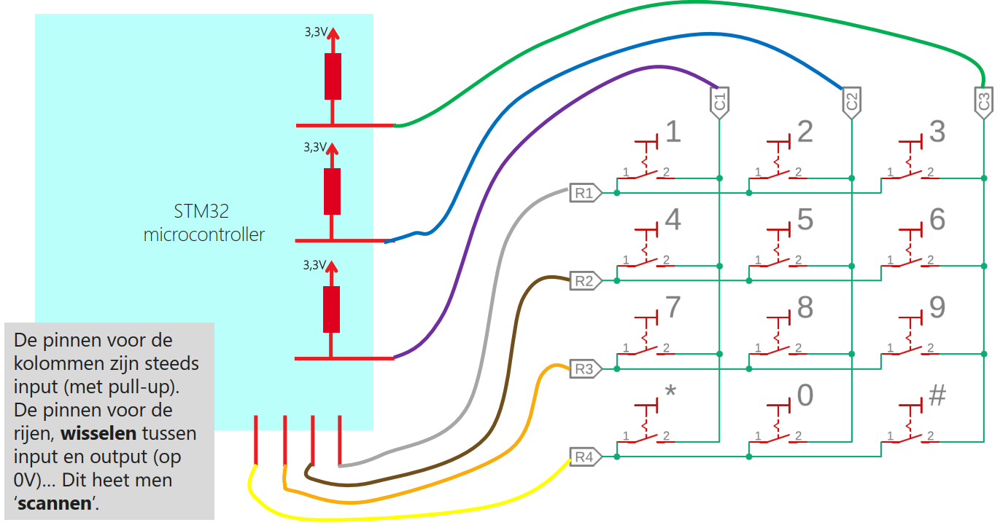
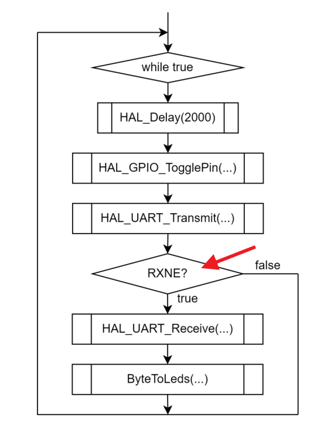
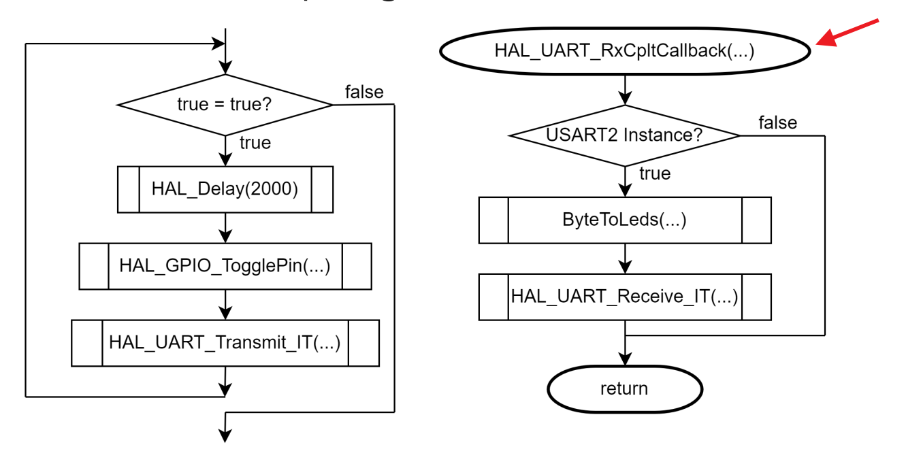
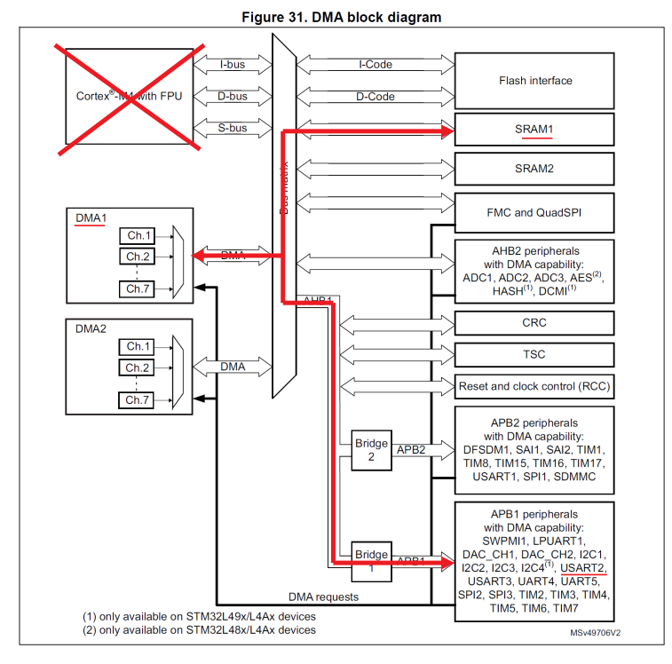
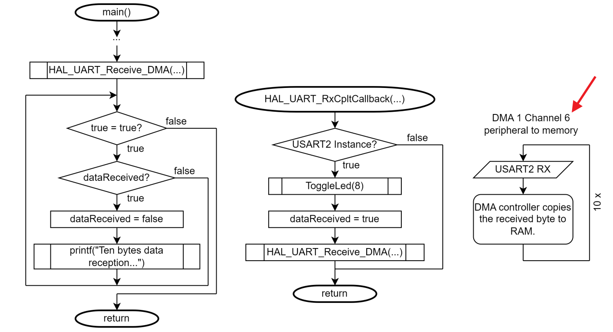

# Examenvoorbereiding: IoT Devices – VIVES Brugge (Bachelor 2)

Deze README is een overzicht voor het examen **IoT Devices**. De structuur is in **vraag-en-antwoordstijl**, met hints waar tekeningen kunnen worden toegevoegd. Antwoorden zijn verborgen, zodat je eerst zelf kan nadenken.

---

## 1. HAL, CMSIS en software-lagen

**1.1. Waarvan is HAL de afkorting?**  

Antwoord
Hardware Abstraction Layer

**1.2. Teken de software-lagenstructuur waarop onze code gebaseerd was**    

Antwoord

- Microcontroller hardware  
- CMSIS-bibliotheken (register abstracts)  
- LL-bibliotheken (Low-Level functies)  
- HAL-bibliotheken (hardware abstraheren)  
- Eigen code (applicatielaag)

**1.3. Wat is typisch bij het afsluiten van een C-string?**  

Antwoord
`\0` op het einde van de array

---

## 2. Basis I/O met HAL

**2.1. Welke techniek gebruiken we om een dubbele 7-segment display aan te sturen bij hardwarematig verbonden anodes?**  

Antwoord

Multiplexing :

wat men eigenlijk doet is zeer snel via de multiplexers de Cathode's "C1" en "C2" beurtelings aan en uit zetten doordat dit zo rap gaat lijkt het alsof ze tegelijk branden maar eigenlijk brand er maar 1 tegelijk.

**2.2. Hoe word een keypad uitgelezen en teken het schema?**  

Antwoord

- deze worden via "scanning" gelezen

- Kolommen: worden ingesteld als inputs met pull-up. Dit betekent dat als er niets ingedrukt is, de pin hoog (3,3 V) leest.
- Rijen: worden één voor één tijdelijk output laag (0 V) gezet tijdens de scan. De andere rijen blijven hoog of in input.
- **Detectie van een knop:**
  - Stel dat rij 1 laag is en een knop tussen rij 1 en kolom 2 is ingedrukt.
  - De kolompin leest laag, want de verbinding met rij 1 (0 V) trekt hem naar laag.
  - Door systematisch alle rijen één voor één laag te zetten en de kolommen te lezen, kan de MCU precies bepalen welke knop ingedrukt is.
  - **Belangrijk:** de spanning wordt niet door de MCU omhoog getrokken. De kolom blijft via de pull-up hoog, tenzij een laag-signaal van een actieve rij de kolom naar laag trekt. Dus eigenlijk "trekt de rij de kolom naar 0 V" en niet andersom.

**2.3. Welke I/O-transfer technieken bestaan er?**

Antwoord

- **Polling**

    De CPU vraagt constant de status van een apparaat.
    
    **Voordelen:** 
        - eenvoudig te implementeren.
    
    **Nadelen:** 
        - inefficiënt, CPU blijft "wachten".

- **Interrupts**

    De CPU wordt gewaarschuwd door hardware wanneer een gebeurtenis gebeurt.
    
    **Voordelen:**
        - efficiënter.

    **Nadelen:** 
        - context switch overhead, 
        - complexere code.

    **Voorbeeld:** 
        - EXTI-knop interrupt,
        - UART receive interrupt.

- **DMA (Direct Memory Access)**

    Een gespecialiseerde controller verplaatst data autonoom tussen geheugen en peripherals, zonder CPU-interventie.

    **Voordelen:** 
        - CPU bijna volledig vrij,
        - zeer efficiënt, ideaal voor grote datastromen.

    **Nadelen:** 
        - configuratie complexer, 
        - kan prioriteitsproblemen hebben als meerdere DMA-kanalen actief zijn.

    **Voorbeeld:** 
        - UART transmissie van een grote buffer via DMA.

## 3. Soorten IO-tranfers

**3.1. Op welke 3 manieren kan er via de verschillende protocollen "gepraat" worden met de buitenwereld?

Antwoord

- Polling : 
    - De CPU vraagt constant de status van een apparaat of flag.

    Voordelen: 
        - eenvoudig te implementeren.

    Nadelen: 
        - inefficiënt, CPU blijft “wachten” en kan dataverlies veroorzaken bij hoge datasnelheden.

    Voorbeeld:
    - UART RXNE-flag checken in een while-lus.

- Interrupts :
    - De CPU wordt gewaarschuwd door hardware wanneer een gebeurtenis gebeurt.

    Voordelen:
        - efficiënter, CPU kan andere taken uitvoeren.

    Nadelen: 
        - context switch overhead,
        - complexere code.

    Voorbeeld:
    - EXTI-knop interrupt,
    - UART receive interrupt.

- DMA (direct memory acces) :
    - Een gespecialiseerde controller verplaatst data autonoom tussen geheugen en peripherals, zonder CPU-interventie.

    Voordelen: 
        - CPU bijna volledig vrij,
        - zeer efficiënt, ideaal voor grote datastromen.

    Nadelen: 
        - configuratie complexer,
        - kan prioriteitsproblemen hebben als meerdere DMA-kanalen actief zijn.

    Voorbeeld:
    - UART transmissie van een grote buffer via DMA.

