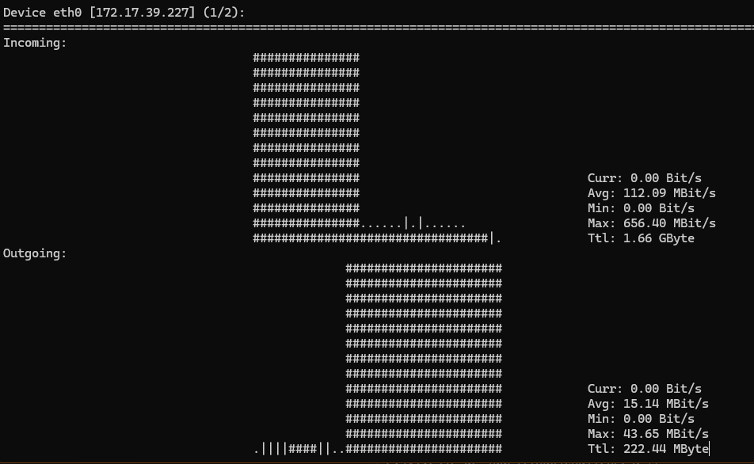
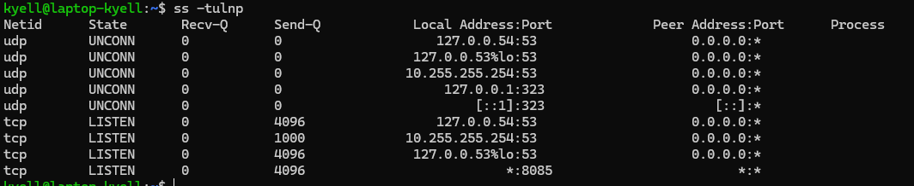
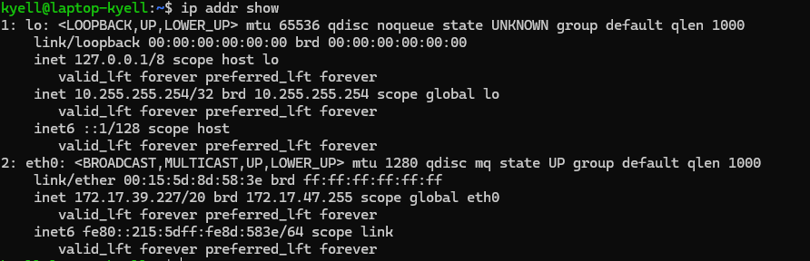
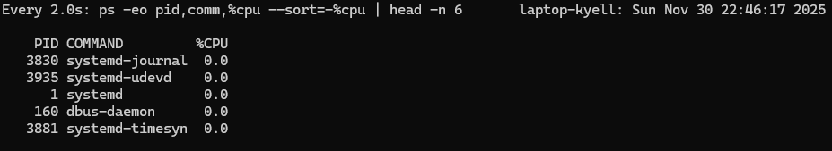
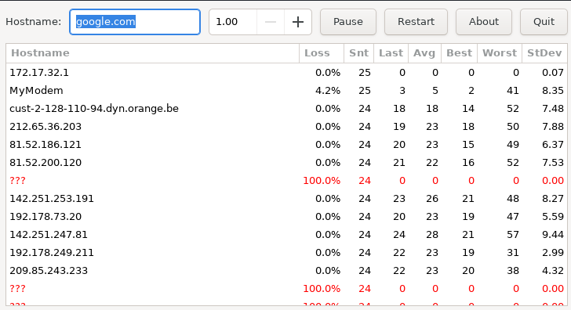
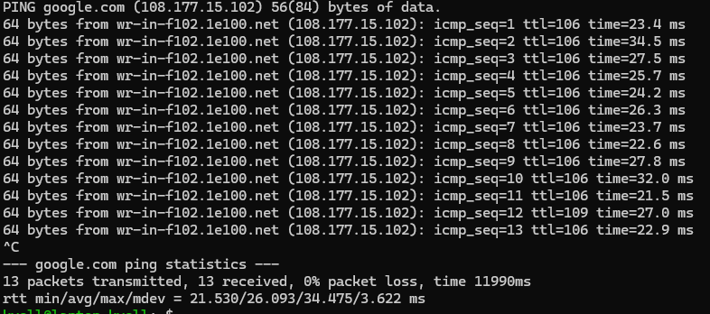
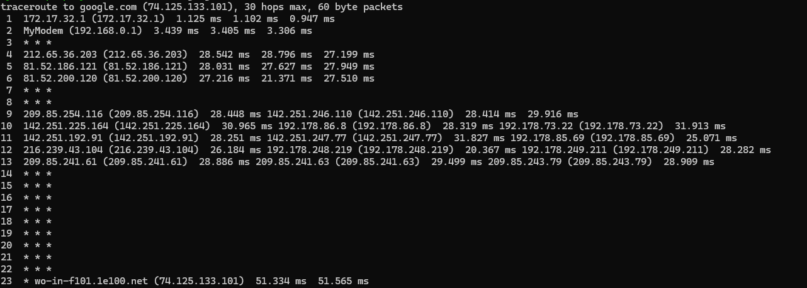

# Systeemmonitoring in Linux – 25 Uitdagende Oefeningen (2de jaar Bachelor Elektronica-ICT)

## 1. Controleer de uptime van het systeem en bereken hoe lang het systeem gemiddeld online is gebleven per dag sinds de laatste boot.
````bash
uptime
18:25:58 up 2 days,  2:24,  3 users,  load average: 0.36, 0.58, 0.67
````
-  `uptime` → toont hoe lang het systeem al draait sinds de laatste herstart.
-  In dit voorbeeld is het systeem 2 dagen en 2 uur actief. Om de gemiddelde uptime per dag te berekenen, deel je de totale uptime in uren door het aantal dagen (bijv. (2*24 + 2) / 2 = 25 uur per dag).
- `18:25:58` # huidige tijd
- `up 2 days,  2:24` # systeem is 2 dagen en 2 uur en 24 minuten actief
- `3 users` # aantal ingelogde gebruikers
- `load average: 0.36, 0.58, 0.67` # gemiddelde systeembelasting over de laatste 1, 5 en 15 minuten

## 2. Schrijf een script dat elke minuut de CPU-load logt naar een bestand, gedurende 1 uur.

````bash
#!/bin/bash

# Bestand waar de CPU-load wordt opgeslagen
LOGFILE="$HOME/cpu_load.log"

# Maak het bestand leeg als het al bestaat
> "$LOGFILE"

# Log de CPU-load elke minuut gedurende 1 uur (60 keer)
for i in {1..60}
do
    # Haal de huidige tijd en CPU-load
    TIMESTAMP=$(date '+%Y-%m-%d %H:%M:%S')
    LOAD=$(uptime | awk -F'load average:' '{print $2}' | sed 's/ //g') # awk == haalt load average op, sed verwijdert spaties
    
    # Schrijf naar het logbestand
    echo "$TIMESTAMP Load:$LOAD" >> "$LOGFILE"
    
    # Wacht 60 seconden
    sleep 60
done

echo "Logging voltooid. Zie $LOGFILE"
````
- Het script maakt een logbestand `cpu_load.log` in de home directory van de gebruiker.
- Elke minuut wordt de huidige tijd en CPU-load opgehaald en toegevoegd aan het logbestand.
- Het script draait gedurende 1 uur (60 iteraties van 1 minuut).
- Na voltooiing wordt een bericht weergegeven met de locatie van het logbestand.

## 3. Vergelijk het RAM-gebruik van twee gelijktijdig draaiende processen.
````bash
ps -o pid,comm,%mem,rss -C procesA,procesB
````
- `ps` → toont informatie over actieve processen.( ps = process status )
- `-o pid,comm,%mem,rss` → specificeert de outputkolommen: proces-ID, commando, percentage RAM-gebruik, resident set size (fysiek geheugen in KB).
- `-C procesA,procesB` → filtert de processen op basis van hun naam (vervang `procesA` en `procesB` door de daadwerkelijke procesnamen).

## 4. Gebruik `iostat` om te bepalen welk block device het meeste wordt gebruikt.
````bash
eerst apt install sysstat # indien iostat nog niet geïnstalleerd is

iostat -dx 1 3

Device            r/s     rkB/s   rrqm/s  %rrqm r_await rareq-sz     w/s     wkB/s   wrqm/s  %wrqm w_await wareq-sz     d/s     dkB/s   drqm/s  %drqm d_await dareq-sz     f/s f_await  aqu-sz  %util
dm-0             0.00      0.00     0.00   0.00    0.00     0.00 1134.00   6892.00     0.00   0.00    1.41     6.08    0.00      0.00     0.00   0.00    0.00     0.00    0.00    0.00    1.60   4.40
dm-1           112.00   3880.00     0.00   0.00    2.25    34.64  979.00   6784.00     0.00   0.00    1.58     6.93    0.00      0.00     0.00   0.00    0.00     0.00    0.00    0.00    1.80  22.40
dm-2             0.00      0.00     0.00   0.00    0.00     0.00    3.00     12.00     0.00   0.00    0.00     4.00    0.00      0.00     0.00   0.00    0.00     0.00    0.00    0.00    0.00   0.00
dm-3             0.00      0.00     0.00   0.00    0.00     0.00    3.00     12.00     0.00   0.00    0.00     4.00    0.00      0.00     0.00   0.00    0.00     0.00    0.00    0.00    0.00   0.00
dm-4             0.00      0.00     0.00   0.00    0.00     0.00    0.00      0.00     0.00   0.00    0.00     0.00    0.00      0.00     0.00   0.00    0.00     0.00    0.00    0.00    0.00   0.00
nvme0c0n1        0.00      0.00     0.00   0.00    0.00     0.00    8.00     60.00     0.00   0.00    0.12     7.50    0.00      0.00     0.00   0.00    0.00     0.00    0.00    0.00    0.00   0.10
nvme0n1          0.00      0.00     0.00   0.00    0.00     0.00    8.00     60.00     0.00   0.00    0.12     7.50    0.00      0.00     0.00   0.00    0.00     0.00    0.00    0.00    0.00   0.10
rbd0             0.00      0.00     0.00   0.00    0.00     0.00    0.00      0.00     0.00   0.00    0.00     0.00    0.00      0.00     0.00   0.00    0.00     0.00    0.00    0.00    0.00   0.00
rbd1             0.00      0.00     0.00   0.00    0.00     0.00    1.00      4.00     0.00   0.00   29.00     4.00    0.00      0.00     0.00   0.00    0.00     0.00    0.00    0.00    0.03   2.80
rbd2             0.00      0.00     0.00   0.00    0.00     0.00    0.00      0.00     0.00   0.00    0.00     0.00    0.00      0.00     0.00   0.00    0.00     0.00    0.00    0.00    0.00   0.00
rbd3             0.00      0.00     0.00   0.00    0.00     0.00    0.00      0.00     0.00   0.00    0.00     0.00    0.00      0.00     0.00   0.00    0.00     0.00    0.00    0.00    0.00   0.00
rbd4             0.00      0.00     0.00   0.00    0.00     0.00    0.00      0.00     0.00   0.00    0.00     0.00    0.00      0.00     0.00   0.00    0.00     0.00    0.00    0.00    0.00   0.00
rbd5             0.00      0.00     0.00   0.00    0.00     0.00    0.00      0.00     0.00   0.00    0.00     0.00    0.00      0.00     0.00   0.00    0.00     0.00    0.00    0.00    0.00   0.00
rbd6             0.00      0.00     0.00   0.00    0.00     0.00    0.00      0.00     0.00   0.00    0.00     0.00    0.00      0.00     0.00   0.00    0.00     0.00    0.00    0.00    0.00   0.00
rbd7             0.00      0.00     0.00   0.00    0.00     0.00    0.00      0.00     0.00   0.00    0.00     0.00    0.00      0.00     0.00   0.00    0.00     0.00    0.00    0.00    0.00   0.00
rbd8             0.00      0.00     0.00   0.00    0.00     0.00    0.00      0.00     0.00   0.00    0.00     0.00    0.00      0.00     0.00   0.00    0.00     0.00    0.00    0.00    0.00   0.00
sda              0.00      0.00     0.00   0.00    0.00     0.00  309.00   6892.00   825.00  72.75    3.19    22.30    0.00      0.00     0.00   0.00    0.00     0.00    0.00    0.00    0.99   4.40
sdb             96.00   3880.00    16.00  14.29    2.26    40.42  277.00   6784.00   702.00  71.71    3.87    24.49    0.00      0.00     0.00   0.00    0.00     0.00    0.00    0.00    1.29  22.40
sdc              0.00      0.00     0.00   0.00    0.00     0.00    3.00     12.00     0.00   0.00    0.00     4.00    0.00      0.00     0.00   0.00    0.00     0.00    0.00    0.00    0.00   0.00
sdd              0.00      0.00     0.00   0.00    0.00     0.00    3.00     12.00     0.00   0.00    0.33     4.00    0.00      0.00     0.00   0.00    0.00     0.00    0.00    0.00    0.00   0.00
sde              0.00      0.00     0.00   0.00    0.00     0.00    0.00      0.00     0.00   0.00    0.00     0.00    0.00      0.00     0.00   0.00    0.00     0.00    0.00    0.00    0.00   0.00


````
- `iostat` → toont statistieken over CPU- en I/O-prestaties van block devices.
- `-d` → toont alleen de I/O-statistieken van block devices.
- `-x` → toont uitgebreide statistieken, inclusief gebruikspercentages.
- `1 3` → geeft aan dat de statistieken elke seconde worden bijgewerkt, gedurende 3 keer.
- Analyseer de kolom `%util` om te bepalen welk block device het meeste wordt gebruikt; hoe hoger het percentage, hoe meer het device wordt belast.

## 5. Visualiseer netwerkverkeer live met `nload` en leg uit wanneer een interface overbelast zou zijn.
````bash
eerst apt install nload # indien nload nog niet geïnstalleerd is
nload
````
- `nload` → een tool die live netwerkverkeer visualiseert per netwerkinterface.
- Een interface wordt als overbelast beschouwd wanneer de inkomende of uitgaande bandbreedte continu dicht bij of op de maximale capaciteit van de interface zit, wat kan leiden tot vertragingen, pakketverlies en verminderde netwerkprestaties. Let op pieken in de grafieken hoge waarden in de "Curr" (huidige snelheid) en "Avg" (gemiddelde snelheid) secties.   



-   curr → huidige snelheid
-   avg → gemiddelde snelheid
-   min → minimum snelheid
-   max → maximum snelheid
-   ttl → totale data overgedragen

legende:
`#`   = netwerkactiviteit
`|`   = schaalgrens / referentiepunt ( meestal 50% van de maximale bandbreedte )
`.`   = geen merkbare activiteit


## 6. Monitor I/O-activiteit van een bepaald proces met `iotop`.
````bash
eerst apt install iotop # indien iotop nog niet geïnstalleerd is
sudo iotop -o -p <PID>
````
- `iotop` → een tool die I/O-activiteit van processen in real-time toont.
- `-o` → toont alleen processen die momenteel I/O uitvoeren.
- `-p <PID>` → filtert de weergave op een specifiek proces-ID (vervang `<PID>` door het daadwerkelijke proces-ID).
- Gebruik `sudo` omdat `iotop` meestal root-rechten vereist om I/O-activiteiten van alle processen te kunnen monitoren
  

## 7. Zoek met `ss` alle open poorten op het systeem, inclusief het proces dat ze geopend heeft.
````bash
ss -tulnp
````
- `ss` → een tool om netwerkverbindingen, sockets en poorten te bekijken.
- `-t` → toont TCP-verbindingen.
- `-u` → toont UDP-verbindingen.
- `-l` → toont alleen luisterende sockets (open poorten).
- `-n` → toont numerieke adressen en poorten in plaats van namen.
- `-p` → toont het proces-ID en de naam van het proces dat de poort heeft geopend.



## 8. Gebruik `ip` om het IP-adres van elke actieve netwerkinterface weer te geven.
````bash
ip addr show
````
- `ip` → een veelzijdige tool voor netwerkconfiguratie en -beheer.
- `addr` → subcommando om IP-adressen te beheren en weer te geven.
- `show` → toont de huidige configuratie van netwerkinterfaces, inclusief hun IP-adressen



-   <loopback,up,lower_up> → geeft aan dat de interface actief is en klaar voor gebruik.
-   `mtu 65536` → geeft de maximum transmissie-eenheid van de interface aan.
-   `qdisc noqueue` → geeft aan dat er geen wachtrijdiscipline is ingesteld voor deze interface.
-   `state UNKNOWN` → geeft de huidige status van de interface aan.
-   `group default` → geeft de groep aan waartoe de interface behoort.
-   `qlen 1000` → geeft de lengte van de wachtrij voor uitgaande pakketten aan.
-   `link/ether 00:0c:29:3e:5b:4c` → geeft het MAC-adres van de interface aan.  
-   `brd ff:ff:ff:ff:ff:ff` → geeft het broadcast-adres van de interface aan.
-   `inet` → het IPv4-adres en subnetmasker van de interface.
-   `inet6` → het IPv6-adres en subnetmasker van de interface.
-   `scope global` → geeft het bereik van het IP-adres aan (bijv. global, link, host).
-   `valid_lft` → geeft de geldigheidsduur van het IP-adres aan.
-   `preferred_lft` → geeft de voorkeursduur van het IP-adres aan.
-   `<uplink,up,lower_up>` → geeft aan dat de interface actief is en klaar voor gebruik.   

## 9. Stel met `watch` een commando op dat de 5 processen met de meeste CPU toont, elke 2 seconden.
````bash
watch -n 2 'ps -eo pid,comm,%cpu --sort=-%cpu | head -n 6'
````
- `watch` → een tool die een commando periodiek uitvoert en de output toont.
- `-n 2` → specificeert het interval in seconden (hier 2 seconden).
- `'ps -eo pid,comm,%cpu --sort=-%cpu | head -n 6'` → het commando dat wordt uitgevoerd:
  - `ps -eo pid,comm,%cpu` → toont alle processen met hun PID, commando en CPU-gebruik. 


  - `--sort=-%cpu` → sorteert de processen op CPU-gebruik in aflopende volgorde.
  - `| head -n 6` → toont alleen de eerste 6 regels van de output (inclusief de header).
  - Dit geeft je een live overzicht van de top 5 CPU-gebruikers op je systeem, bijgewerkt elke 2 seconden.
  - Let op dat de eerste regel de header is, dus de volgende 5 regels zijn de processen met het hoogste CPU-gebruik.
  - `PID` → Process ID
  - `COMM` → Command (naam van het proces)
  - `%CPU` → Percentage van CPU-gebruik door het proces 
## 10. Gebruik `ping` en `mtr` om het netwerkpad naar google.com te analyseren.
````bash
ping google.com
mtr google.com
````
- `ping google.com` → stuurt ICMP-echoverzoeken naar google.com om de bereikbaarheid en responstijd te testen.
- `mtr google.com` → een combinatie van `ping` en `traceroute` die het netwerkpad naar google.com in real-time analyseert, inclusief latentie en pakketverlies bij elke hop.
- Met `mtr` kun je zien welke routers en knooppunten tussen jouw systeem en google.com liggen, evenals de prestaties van elke hop.







## 11. Gebruik `traceroute` en verklaar de verschillen tussen de paden naar twee willekeurige IP-adressen.
````bash
traceroute
Paden naar 8.8.8.8:   Paden naar 1.1.1.1:
1 192.168.1.1           1 192.168.1.1
2 10.10.0.1             2 10.10.0.1
3 203.0.113.1           3 198.51.100.1
4 8.8.8.8               4 1.1.1.1
````
- `traceroute` → een tool die het pad van netwerkpakketten naar een doel-IP-adres of domeinnaam traceert.
- In dit voorbeeld worden de paden naar twee verschillende IP-adressen (8.8.8.8 en 1.1.1.1) vergeleken om te laten zien hoe het netwerkverkeer via verschillende routers kan lopen. 
- De verschillen in paden kunnen worden verklaard door factoren zoals geografische locatie, netwerkconfiguraties van ISP's, en routingprotocollen die bepalen hoe verkeer wordt geleid over het internet.
- Elke regel in de output vertegenwoordigt een hop (router) die het pakket passeert, met de bijbehorende responstijd in milliseconden.


## 12. Stel een `crontab` in die elke dag om 02:00 het RAM-gebruik naar een logfile schrijft.
````bash
crontab -e
````
Voeg de volgende regel toe aan het crontab-bestand:
````bash
0 2 * * * free -h >> /home/gebruikersnaam/ram_usage.log
````
- `crontab -e` → opent de crontab-editor voor de huidige gebruiker.
- `0 2 * * *` → specificeert dat het commando elke dag om 02:00 uur moet worden uitgevoerd.
- `free -h` → toont het huidige RAM-gebruik in een mensvriendelijk formaat.
- `>> /home/gebruikersnaam/ram_usage.log` → voegt de output van het commando toe aan het bestand `ram_usage.log` in de home directory van de gebruiker (vervang `gebruikersnaam` door de daadwerkelijke gebruikersnaam).
- Dit zorgt ervoor dat elke dag om 02:00 uur het RAM-gebruik wordt gelogd naar het opgegeven bestand.


## 13. Bekijk actieve gebruikerssessies en logtijden met `w` en `who`.

## 14. Zoek gebruikers met mislukte loginpogingen via `faillog`.

## 15. Gebruik `journalctl` om fouten van de laatste 24 uur weer te geven.

## 16. Geef alle actieve systemd-services weer die falen of niet draaien.

## 17. Zoek in `/var/log` naar fouten gelinkt aan `sshd`.

## 18. Gebruik `less` om door een logbestand te scrollen. Zoek interactief naar "error".

## 19. Volg een logbestand live met `tail -f` en noteer een gebeurtenis als ze verschijnt.

## 20. Scan je lokale netwerk naar actieve hosts met `nmap`.

## 21. Maak een script dat het gemiddelde CPU-gebruik logt over 10 minuten met `sar`.

## 22. Toon alle processen op je systeem die meer dan 500 MB RAM gebruiken.

## 23. Gebruik `btop` om live gebruik van CPU, RAM en schijf te monitoren. Neem een screenshot van een piek.

## 24. Toon processen gesorteerd op levensduur met `ps`.

## 25. Schrijf een script dat bij overmatig RAM-gebruik (>90%) automatisch een melding stuurt naar een logfile.
