# Linux Essentials — Hoofdstuk 1 (Samenvatting)

Een compacte gids met basisbegrippen, installatie-notities en veelgebruikte commando's voor wie net met Linux begint.

---

## Wat is Linux?

- Linux is een besturingssysteemkern (de kernel) die hardware, processen en geheugen regelt.
- Vaak wordt met "Linux" een complete distributie bedoeld: de kernel plus gebruikersland-software (GNU-tools, systeemservices, enz.).

## Virtuele machine (VM)

- Definitie: een softwarematige computer (guest) die draait op een fysieke host.
- Voordelen: veilig experimenteren, meerdere systemen op één machine, snapshots terugzetten.
- Voorbeeld: Ubuntu in VirtualBox of VMware.

    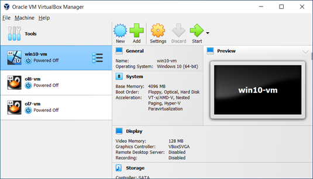
    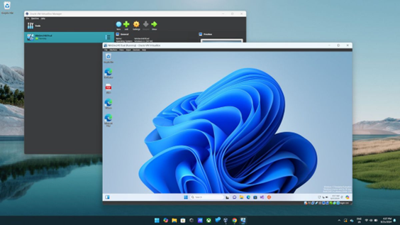

### Installatie (Debian op een VM)

#### VM Instellen

- Naam: Debian
- Type: Linux
- Versie: Debian (64-bit of 32-bit)
- RAM: ≥2GB
- HDD: VMDK, dynamisch, 30GB
- cpu kernen niet meer dan de helft van max kernen
- ⚠️ opgelet:

  - bij nieuwere architecturen (Intel i5/i7/i9 12e generatie en hoger) hebben 2 type kernen

    | Type core                       | Doel            | Kenmerken                                             |
    | ------------------------------- | --------------- | ----------------------------------------------------- |
    | **P-cores (Performance cores)** | Hoge prestaties | Hogere kloksnelheid, beter voor single-threaded taken |
    | **E-cores (Efficiency cores)**  | Energiezuinig   | Langzamer, bedoeld voor achtergrondtaken              |

**🧠 Waarom VirtualBox hier moeite mee heeft:**

     VirtualBox is niet goed geoptimaliseerd voor deze “hybride” CPU-architectuur.
     Het probleem zit in hoe Windows en VirtualBox de CPU-topologie zien:

  1. VirtualBox denkt dat alle cores even sterk zijn.

  2. Windows kan de VM-threads toewijzen aan willekeurige cores (P of E).

  3. Als de VM op E-cores draait, voelt ze traag aan (lag, freezes, slechte timing).

  4. Als VirtualBox zelf op P-cores draait en de VM op E-cores, krijg je synchronisatieproblemen → crashes of vastlopers.

💡 Daarom die **“limiet van 4 cores”**

    Veel gebruikers (en VirtualBox zelf in documentatie/fora) bevelen aan:

    “Gebruik maximaal 4 cores voor VirtualBox op hybride CPU’s.”

Waarom precies:

- VirtualBox kan niet goed schedulen tussen P- en E-cores.

- Als je 4 cores kiest, blijven die meestal beperkt tot P-cores (via Windows scheduler).

- Zo voorkom je dat sommige virtuele CPU’s veel trager reageren dan andere.

- Minder kans dat VirtualBox-VM’s “pauseren” of asynchroon lopen.

#### Installatieproces

- Download ISO van <https://www.debian.org/distrib/>.
- Koppel ISO in VirtualBox.
- Start VM, kies Graphical Debian Installer.

Instellingen:

- Taal: Engels
- Regio: België
- Keyboard: Belgian
- Hostname: debian
- Domain: leeg
- Wachtwoord (root/user): student

#### Partities

- /: 20GB, EXT4
- /boot: 1.5GB, EXT4
- /home: Resterende ruimte, EXT4
- Swap: 2GB

    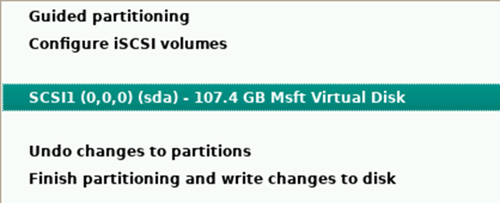

- Selecteer netwerkmirror: deb.debian.org.
- Installeer GRUB op schijf.
- Verwijder ISO na installatie.

---

#### Post-installatie

- open terminl (aplications > terminal emulator)

  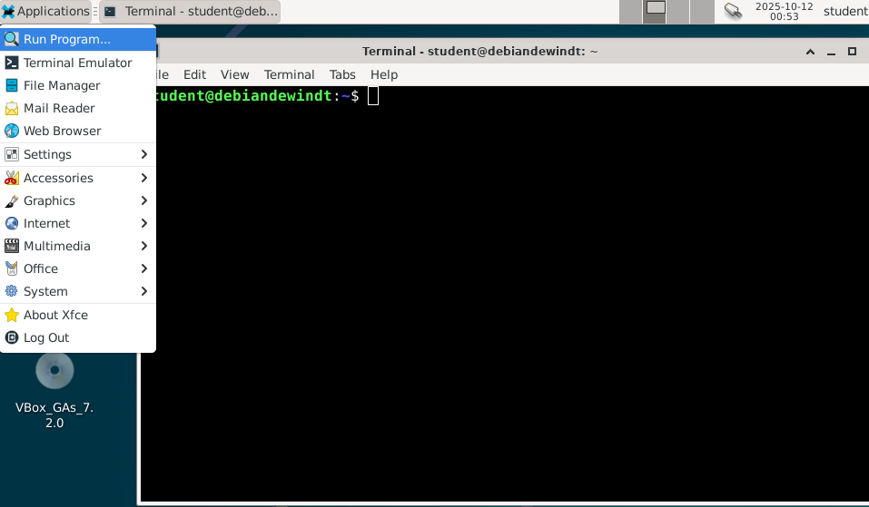

  standaard ben je ingelogd als gewone gebruiker ----> inloggen als root om de gewone gebruiker toe te voegen aan de sudo-groep

  ```linux
  su 
  root wachtwoord invoeren 
  gpasswd –a student sudo 
  ```

- su = switch user (default : superuser "root" )

  ```linux
  su         # switch naar root
  su -       # root met volledige loginomgeving
  su student # switch naar gebruiker 'student'
  su - kyell # login als gebruiker kyell
  ```

- het is in linux normaal dat het wachtwoord input niet zichtbaar is (je typt maar ziet niets)
- gpasswd -a student sudo  (voeg student toe aan de group sudo via de groep beheer-tool)
  - gpasswd = groep password utility
  - -a = voeg toe
  - student = de gebruikersnaam die je wil toevoegen.
  - sudo = de groep waar je de gebruiker aan wil toevoegen.

❗om de veranderingen door te voeren dien je uit te loggen en opnieuw in te loggen.
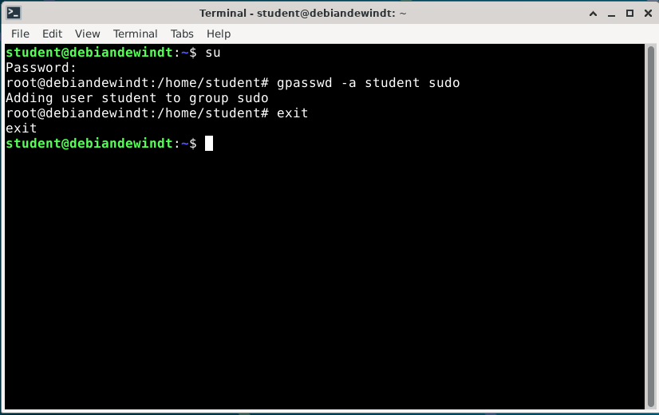

Updates:

locatie:

```linux
cat /etc/apt/sources.list
```

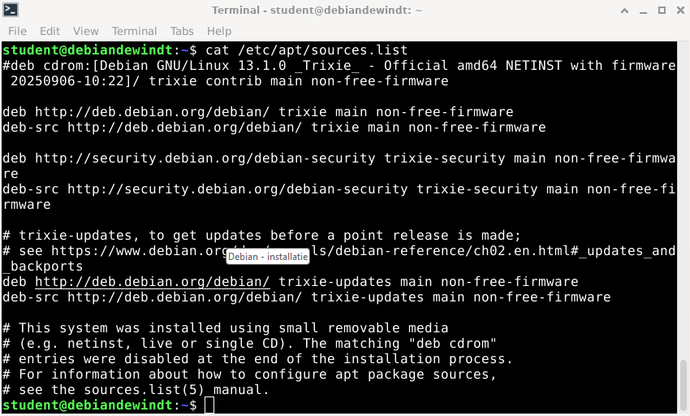

```linux
sudo apt-get update
```

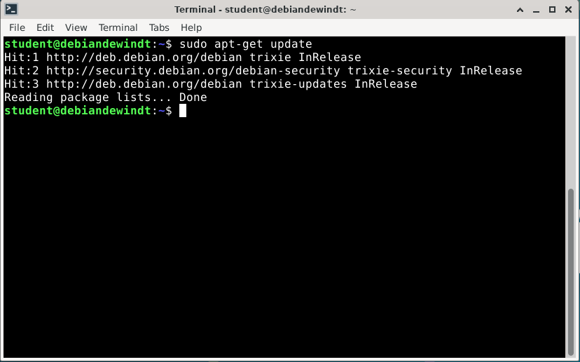

```linux
sudo apt-get upgrade
```

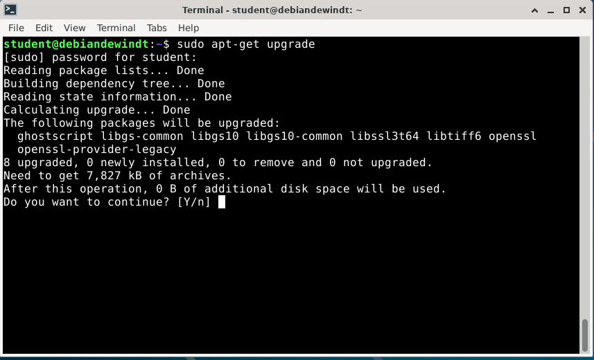

- typ y om te bevestigen.
- typ n om te weigeren.

#### VirtualBox Extensions

- Download: <https://www.virtualbox.org/wiki/Downloads>
- Installeer Extension Pack in VirtualBox.
- Stel in: Shared Clipboard & Drag’n’Drop bidirectioneel.
  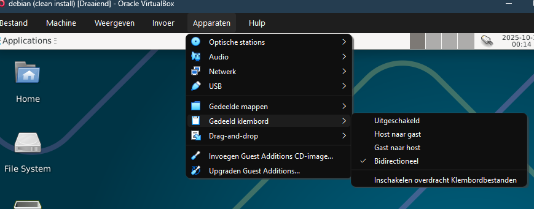
- Start VM opnieuw.
- Plaats Guest Additions CD: Devices > Insert Guest Additions CD.
- Voer uit:

    ```linux
    sudo sh ./VBoxLinuxAdditions.run.
    ```

- Herstart VM, stel Shared Clipboard op bidirectioneel.

- Maak snapshot: “Clean install”.

---

## ISO-bestand

- Een ISO is een digitale kopie van een installatie-cd/dvd.
- Gebruik: koppelen aan een VM als virtuele CD-ROM om een OS te installeren.

## Linux-distributies (distros)

- Distributie = kernel + pakketten + pakketbeheer en vaak een installatieproces.
- Veelvoorkomende distros:
  - Debian — zeer stabiel, basis voor veel andere distros
  - Ubuntu — gebruiksvriendelijk, veel documentatie
  - Fedora — redelijk recentere software, community-gedreven
  - RHEL / CentOS / Rocky / AlmaLinux — enterprise-gericht
  - openSUSE — professioneel, sterke tooling
  - Arch Linux — minimalistisch, rolling release

    [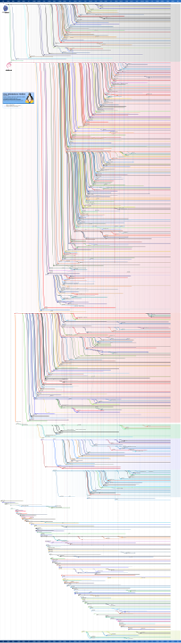](https://upload.wikimedia.org/wikipedia/commons/1/1b/Linux_Distribution_Timeline.svg)

### Pakketbeheer

- Debian/Ubuntu: .deb-pakketten, apt/apt-get
- RHEL/Fedora: .rpm-pakketten, dnf/yum

---

## Debian: korte installatie-notities

- Download de ISO van debian.org.
- VM-instellingen (aanbevolen): Linux type, 64-bit, ≥ 2 GB RAM, 30 GB schijfruimte.
- Tijdens installatie: koppel de ISO, kies Graphical / Guided installer.

Instellingen (voorbeeld):

- Taal: Engels
- Regio: België
- Keyboard: Belgian
- Hostname: debian
- Gebruiker: student (wachtwoord: student) — kies een veiliger wachtwoord in productie

### Partities (voorbeeld)

- / — root (20 GB, EXT4)
- /boot — 1.5 GB (EXT4)
- /home — rest van de schijf (EXT4)
- swap — 2 GB (of gebruik swapfile)

Na installatie:

- Maak de gebruiker sudoer:

    ```linux
    sudo gpasswd -a student sudo (of gebruik usermod)
    ```

- Updates:

    ```linux
    sudo apt-get update && sudo apt-get upgrade
    ```

- VirtualBox Guest Additions: installeer voor gedeelde mappen, muisintegratie en copy-paste
- Maak een snapshot van de schone installatie

---

## Bestandshiërarchie (kort)

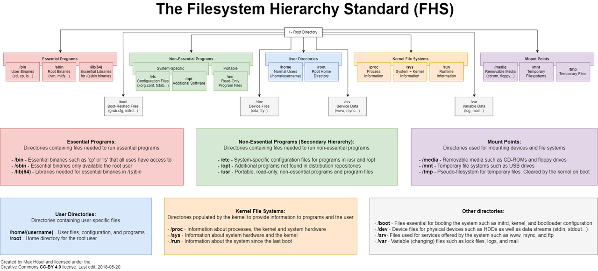

- / — root van het bestandssysteem
- /home/gebruikersnaam — thuismap van gebruikers
- /etc — configuratiebestanden
- /var — variabele data (logs, mail, databases)
- /usr — programma's en libraries
- Symbolische links: shortcuts naar andere locaties (ln -s)

Beveiliging: root is de superuser. Normale gebruikers hebben beperkte rechten.

---

## CLI — basisconcepten en commando's

- Standaardkanalen: stdin (input), stdout (output), stderr (fouten)
- Bestandsnamen zijn hoofdlettergevoelig

Belangrijke commando's:

```linux
pwd            # toont huidige map
ls -la         # lijst bestanden (inclusief verborgen)
cd mapnaam     # wissel van map
mkdir naam     # maak directory
touch bestand  # maak bestand
cat bestand    # toon inhoud bestand in terminal
more bestand   # bekijk lange bestanden pagina per pagina
head bestand   # bekijk eerste 10 regels
cp bron doel   # kopiëren
mv bron doel   # verplaatsen/ hernoemen
rm bestand     # verwijder bestand (voorzichtig)
rmdir mapnaam  # verwijder lege map
rm -r mapnaam  # verwijder map en inhoud (voorzichtig)
sudo <cmd>     # voer commando uit als beheerder
shutdown now   # direct uitschakelen (root)
reboot         # herstarten
```

### Paden: absoluut vs relatief

- Absoluut pad begint bij de root`/` (bijv. `/etc/hostname`)
- Relatief pad is vanaf de huidige map (bijv. `../hostname`)

Voorbeeld-oefening:

```linux
pwd
mkdir ~/test
cd ~/test
touch bestand.txt
ls ~/test   # absoluut
ls ../test  # relatief
```

---

## Systeembeheer (kort)

- Starten: systemen booten automatisch via systeemd (of init op oudere systemen)
- Reboot: herstart lost soms problemen op
- Shutdown: zorgt dat processen netjes stoppen om dataverlies te voorkomen

---

## Verder leren

- Probeer een Live-USB of installeer in een VM (VirtualBox). Gebruik WSL (Windows Subsystem for Linux) als je Windows gebruikt en snel een shell wil.
- Documentatie: <https://debian.org>, <https://ubuntu.com>, <https://linux.org>, <https://archlinux.org>

---

_Gemaakt als compacte samenvatting voor beginners._
