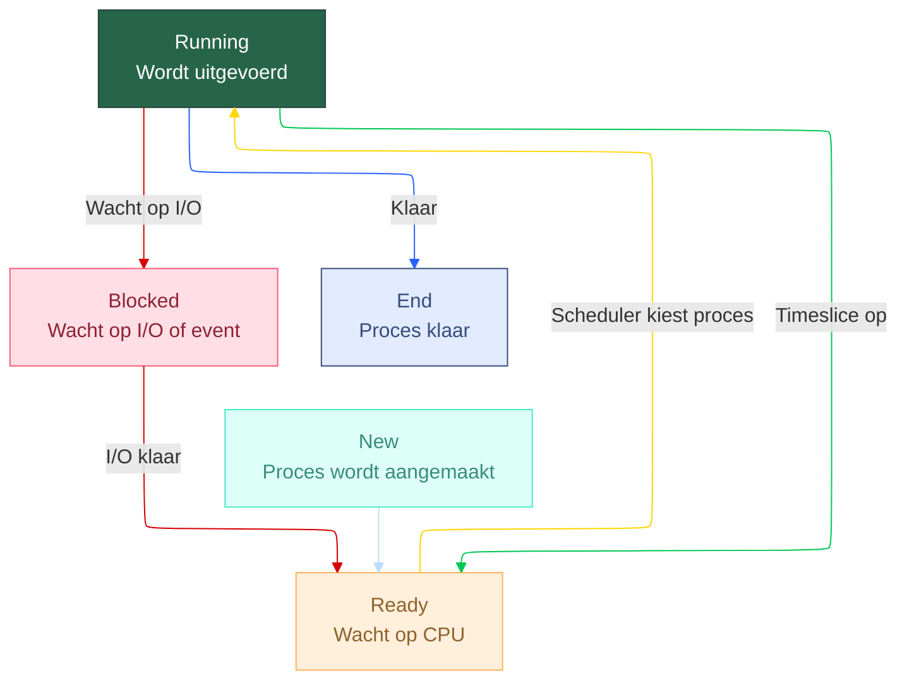

# Computer Architecture: referentievragen en antwoorden

---

## Chapter 1  Introducing Computer Architecture

### Vragen

<details>
<summary><strong>
Licht enkele technologische problemen toe die Charles Babbage ervoer bij het ontwerp van zijn Analytical Engine.
</strong></summary>


- **mechanische precisie**
  
  - in die tijd was het nog niet mogelijk om tandwielen met voldoende precisie te maken.

- **wrijving**
  
  - door de vele bewegende delen was er veel wrijving, wat leidde tot slijtage en verminderde betrouwbaarheid.

- **tandwielspeling**

  - de speling tussen de tandwielen veroorzaakte onnauwkeurigheden in de berekeningen.

❗dit probleem werd opgelost door locking mechanisms te ontwerpen. deze zorgden ervoor dat de tandwielen werden vergrendeld en in geldige posities werden geforceerd.

- **slijtage**
  
  - de mechanische onderdelen waren onderhevig aan slijtage door continu gebruik, wat de levensduur van de machine beperkte.

- **hoge kosten**
  
  - de bouw van zo'n complex mechanisch apparaat was duur en vereiste gespecialiseerde vakmensen.

- complexiteit carry propagation
  
  - het doorvoeren van carries in berekeningen was ingewikkeld en leidde tot vertragingen en fouten.

</details>

<details>
<summary><strong>
Wat betekent ENIAC en bespreek bondig de Von Neumann architectuur?
</strong></summary>


- **ENIAC** staat voor **Electronic Numerical Integrator And Computer**. Het was een van de eerste elektronische algemene computers, gebouwd in de jaren 1940.

- **Von Neumann architectuur**:
  
  - **Geheugen:** zowel data als programma-instructies worden opgeslagen in hetzelfde geheugen.
  
  - **CPU:** bestaat uit een rekenkundig-logische eenheid (ALU) en een besturingseenheid (CU) die instructies ophalen, decoderen en uitvoeren.
  
  - **Instructiecyclus:** de CPU voert een cyclus uit van ophalen, decoderen en uitvoeren van instructies.
  
  - **Seriele verwerking:** instructies worden sequentieel uitgevoerd, wat kan leiden tot bottlenecks (Von Neumann bottleneck).


</details>

**De microprocessor van de oorspronkelijke IBM PC is de Intel 8088, die tot de Intel 80x86 microprocessor familie behoort.**

**Deze i80x86 microprocessoren werken met een gesegmenteerd geheugenmodel:**

<details>
<summary><strong>
Wat is een segment?
</strong></summary>

- een segment is een blok geheugen met een eigen basisadres.
  In de i80x86 architectuur wordt geheugen opgedeeld in segmenten van maximaal 64 KB.

</details>

<details>
<summary><strong>
Wat zijn de voordelen van het gesegmenteerd geheugenmodel?
</strong></summary>
  
- ***grotere adresseerbare ruimte:*** door segmentatie kan een programma meer geheugen gebruiken dan de limiet van een enkel 16-bit adres.
  
- ***logische opdeling:*** segmentatie maakt het mogelijk om code, data en stack in aparte segmenten te plaatsen, wat de organisatie van programma's verbetert.
  
- ***hergebruik van code:*** segmenten kunnen worden gedeeld tussen verschillende programma's, wat geheugenbesparing oplevert.

</details>

<details>
<summary><strong>
Ondanks de 16-bits architectuur van de registers, is de adresseerbare geheugenruimte 1 MB. Verklaar.
</strong></summary>

- in de i80x86 architectuur wordt het fysieke adres berekend met behulp van een segment:offset combinatie.
  
- elk segmentregister bevat een 16-bit waarde die wordt vermenigvuldigd met 16 (of verschoven naar links met 4 bits) om het basisadres van het segment te verkrijgen.
  
- het offset is ook een 16-bit waarde die wordt toegevoegd aan het basisadres van het segment om het uiteindelijke fysieke adres te bepalen.
  
- hierdoor kan het fysieke adres worden berekend als: fysieke adres = (segment 0 — 16) + offset.
  
- aangezien zowel het segment als het offset 16 bits zijn, resulteert dit in een maximaal fysiek adres van 20 bits (16 + 4), wat overeenkomt met 2^20 = 1 MB aan adresseerbaar geheugen.


</details>

<details>
<summary><strong>
Omschrijf de Wet Van Moore.

 Bespreek enkele limieten die de linearisatie van deze wet in de toekomst niet meer ondersteunen.

- Verklaar de afkortingen CPU en GPU en verklaar enkele essentiele verschillen tussen de werking van een CPU en een GPU.

</strong></summary>

- **Wet van Moore:**

  - het aantal transistors op een geïntegreerde schakeling verdubbelt ongeveer elke twee jaar, wat leidt tot een exponentiële groei in rekenkracht en een afname van de kosten per transistor.

- **Limieten van de Wet van Moore:**
  
  - **Fysieke limieten:**
    - naarmate transistors kleiner worden, komen ze dichter bij de atomaire schaal, men kan niet kleiner gaan dan atomen.
  - **Warmteontwikkeling:**
    - hogere transistor dichtheden leiden tot meer warmte, wat koelingsproblemen veroorzaakt.
  - **energieverbruik:**
    - kleinere transistors kunnen leiden tot hogere lekstromen, wat het energieverbruik verhoogt. wat leidt tot inefficiëntie.
  - **Kosten:**
    - de kosten voor het produceren van steeds kleinere transistors stijgen aanzienlijk.
  - **snelheid:**
    - er zijn fysieke en technische beperkingen aan hoe snel transistors kunnen schakelen.

</details>

<details>
<summary><strong>
Verklaar de afkortingen CPU en GPU en verklaar enkele essentiele verschillen tussen de werking van een CPU en een GPU.
</strong></summary>

**CPU (Central Processing Unit):**

- de CPU is het hoofdonderdeel van een computer dat instructies uitvoert en algemene taken verwerkt. Het is ontworpen voor veelzijdigheid en kan een breed scala aan taken aan.

**GPU (Graphics Processing Unit):**

- de GPU is gespecialiseerd in het verwerken van grafische gegevens en is geoptimaliseerd voor parallelle verwerking. Het wordt voornamelijk gebruikt voor rendering van beelden en video, maar ook voor andere parallelle taken zoals machine learning.

**Verschillen tussen CPU en GPU:**

| CPU                 | GPU                            |
| ------------------- | ------------------------------ |
| Weinig sterke cores | Zeer veel simpele cores        |
| Sequentieel werk    | Parallel werk                  |
| Complexe logica     | Simpele herhaalde berekeningen |
| Lage latency        | Hoge throughput                |
| Geschikt voor algemene taken | Geschikt voor grafische en parallelle taken |

</details>

<details>
<summary><strong>
Gegeven: de 6502 microprocessor instructie set

[instructie set 6502](./instructie%20set%206502.md)
</strong></summary>

**Opgave 1:**

schrijf 6502 assembly code om twee 16-bits waarden op te slaan op adressen $00-$01 en $02-$03.

Tel deze twee 16-bits waarden op en bewaar het resultaat op adressen $04-$05.

Houd rekening met de carry.

```asm
CLC         ; Clear carry flag (voor start optelling)
LDA $00     ; Laad laagste byte van eerste waarde
ADC $02     ; Tel laagste byte van tweede waarde met carry
STA $04     ; Sla resultaat laagste byte op
LDA $01     ; Laad hoogste byte van eerste waarde
ADC $03     ; Tel hoogste byte van tweede waarde met carry
STA $05     ; Sla resultaat hoogste byte op
```

---

**Opgave 2:**

schrijf 6502 assembly code om het verschil te berekenen van twee 16-bits waarden opgeslagen op adressen $00-$01 en $02-$03.

Sla het resultaat op in adressen $04-$05.

Houd rekening met de borrow.

```asm
SEC         ; Set carry flag (voor borrow bij aftrekking)
LDA $00     ; Laad laagste byte van eerste waarde
SBC $02     ; Trek laagste byte van tweede waarde af met borrow 
STA $04     ; Sla resultaat laagste byte op
LDA $01     ; Laad hoogste byte van eerste waarde
SBC $03     ; Trek hoogste byte van tweede waarde af met borrow
STA $05     ; Sla resultaat hoogste byte op
```

---

**Opgave 3:**

schrijf 6502 assembly code om twee 32-bits waarden op te slaan op adressen $00-$03 en $04-$07.

Tel de twee 32-bits waarden op via een lus/sprong constructive, die doorheen alle bytes itereert.

Sla het resultaat op in adressen $08-$0B. Houd rekening met de carry.

```asm
LDX #0        ; start bij laagste byte (X = 0)
CLC           ; Clear carry flag (voor start optelling)
loop:
  LDA $00,X   ; Laad byte van eerste waarde (low naar high)
  ADC $04,X   ; Tel byte van tweede waarde (met carry)
  STA $08,X   ; Sla resultaat byte op
  INX         ; Volgende byte
  CPX #4      ; Hebben we alle 4 bytes gedaan?
  BNE loop    ; Zo niet, herhaal de lus
```

</details>

---

## Chapter 3  Processor Elements

### Vragen

<details>
<summary><strong>
Verklaar de afkorting CISC en de afkorting RISC en benoem de verschillen tussen beide computerarchitecturen.
</strong></summary>

- CISC: Complex Instruction Set Computer
  - complexe instructies die meerdere operaties kunnen uitvoeren in één enkele instructie.
  - prograama's kunnen korter zijn omdat minder instructies nodig zijn.
  - vaak langere uitvoeringstijd per instructie vanwege de complexiteit.
  - complexe hardware nodig om de instructies te decoderen en uit te voeren.

- voorbeelden: x86 (Intel, AMD)

- RISC: Reduced Instruction Set Computer
  - eenvoudige instructies die meestal één enkele operatie uitvoeren.
  - programma's kunnen langer zijn omdat meer instructies nodig zijn.
  - snellere uitvoeringstijd per instructie vanwege de eenvoud.
  - eenvoudigere hardware, wat kan leiden tot hogere kloksnelheden en betere pipelining.

- voorbeelden: ARM (smartphones, Raspberry Pi, Apple M1/M2)

- belangerijkste verschillen:

| Eigenschap                      | CISC                             | RISC                             |
| ------------------------------- | -------------------------------- | -------------------------------- |
| Betekenis                       | Complex Instruction Set Computer | Reduced Instruction Set Computer |
| Instructies                     | Complex                          | Simpel                           |
| Aantal instructies in programma | Weinig                           | Veel                             |
| Klokcycli per instructie        | Meerdere                         | Meestal 1                        |
| Hardware                        | Complex                          | Simpel                           |
| Energieverbruik                 | Hoger                            | Lager                            |

</details>

<details>
<summary><strong>
Verklaar de werking van de 6502 stapel-instructies PHA en PLA. De werking van de 6502 stapel is volgens het LIFO-principe en wat is de relatie met het S-register en de processorvlaggen?
</strong></summary>

- **PHA (Push Accumulator):**
  - de inhoud van de accumulator (A-register) wordt op de stapel geplaatst.
  - de stack pointer (S-register) wordt verlaagd met 1 om ruimte te maken voor de nieuwe waarde.
  - de waarde van A wordt opgeslagen op het adres dat wordt aangegeven door het S-register.
- **PLA (Pull Accumulator):**
  - de waarde bovenop de stapel wordt van de stapel gehaald en in de accumulator (A-register) geplaatst.
  - de waarde wordt gelezen van het adres dat wordt aangegeven door het S-register.
  - de stack pointer (S-register) wordt verhoogd met 1 om aan te geven dat de waarde is verwijderd van de stapel.

- s-register:
  - het S-register houdt de huidige positie van de stapel bij.
  - het begint meestal bij $FF en groeit naar beneden (afnemend adres).
    - ❗dit betekent dat de stack adressen van `$FF` naar `$00` gaan naarmate er meer waarden worden gepusht.
  - bij PHA wordt S verlaagd, bij PLA wordt S verhoogd.

- processor vlaggen:
- de PHA en PLA instructies beïnvloeden de status van de processorvlaggen niet direct.
  - echter, de waarden die worden gepusht of gepulld kunnen de vlaggen beïnvloeden als ze later worden gebruikt in berekeningen.
  - bijvoorbeeld:
    - als de waarde in de accumulator na een PLA-instructie wordt gebruikt in een berekening, kunnen de vlaggen (zoals zero, negative) worden bijgewerkt op basis van het resultaat van die berekening.

• Verklaar het verschil tussen een maskable en non-maskable interrupt. Wat zijn de adressen van de interrupt service routines van beide interrupts en welke interrupt is level- of edge sensitive?

- **Maskable Interrupt (IRQ):**
  - kan worden uitgeschakeld (gemaskeerd) door de CPU.
  - wordt vaak gebruikt voor minder kritieke taken.
  - adres van de interrupt service routine (ISR): $FFFE (laag byte) en $FFFF (hoog byte).
  - meestal level-sensitive: de interrupt activeert als een signaal hoog of laag is.

| Actieve laag | Trigger | Pin rust |
| ------------ | ------- | -------- |
| **High**     | Hoog    | Laag     |
| **Low**      | Laag    | Hoog     |

💡 Ezelsbrug: active = de waarde die het signaal moet hebben om te “activeren”

- **Non-Maskable Interrupt (NMI):**
  - kan niet worden uitgeschakeld door de CPU.
  - wordt gebruikt voor kritieke taken die onmiddellijke aandacht vereisen, zoals hardwarefouten.
  - adres van de interrupt service routine (ISR): $FFFA (laag byte) en $FFFB (hoog byte).
  - meestal edge-sensitive: de interrupt wordt geactiveerd door een overgang van laag naar hoog.

</details>

<details>
<summary><strong>
Licht de 3 manieren van I/O-processing toe en wat zijn de verschillen tussen port-mapped I/O en memory-mapped I/O?
</strong></summary>

- **Polling:**

  - de CPU controleert continu de status van een I/O-apparaat om te zien of het klaar is voor gegevensoverdracht.
  - eenvoudig te implementeren, maar inefficiënt omdat de CPU tijd verspilt aan het controleren van apparaten die mogelijk niet klaar zijn.

- **Interrupts:**
  - het I/O-apparaat stuurt een signaal naar de CPU wanneer het klaar is voor gegevensoverdracht.
  - efficiënter dan polling, omdat de CPU andere taken kan uitvoeren totdat het interrupt signaal wordt ontvangen.
- **Direct Memory Access (DMA):**
  - een speciale hardwarecontroller beheert de gegevensoverdracht tussen I/O-apparaten en het geheugen zonder tussenkomst van de CPU.
  - zeer efficiënt voor grote gegevensoverdrachten, omdat de CPU vrij blijft voor andere taken.

- **Port-mapped I/O:**
  - I/O-apparaten hebben een aparte adresruimte, gescheiden van het hoofdgeheugen.
  - speciale instructies worden gebruikt om te communiceren met I/O-apparaten.

- **Memory-mapped I/O:**
  - I/O-apparaten delen dezelfde adresruimte als het hoofdgeheugen.
  - dezelfde instructies worden gebruikt voor zowel geheugen- als I/O-toegang.

</details>

#### Oefening 4 checksum

- Bij het overdragen van gegevensblokken over een foutgevoelig transmissiemedium is het gebruikelijk om een checksum
te gebruiken om vast te stellen of gegevensbits verloren zijn gegaan of beschadigd zijn tijdens de verzending.

- De checksum wordt meestal aan het transferred data record toegevoegd.

  - Een checksumalgoritme gebruikt deze stappen:

    - Tel alle bytes in het transferred data record bij elkaar op, behoudens alleen de laagste 8 bits van de som.
    - De checksum is het twee's complement van de 8-bits som.
    - Voeg de checksumbyte toe aan het transferred data record.
    - Na ontvangst van een gegevensblok met de bijgevoegde checksum kan de processor bepalen of de
    checksum geldig is door eenvoudigweg alle bytes in het record, inclusief de checksum, bij elkaar op te tellen.
    - De checksum is geldig als de laagste 8 bits van de som nul zijn.
  - Implementeer dit checksumalgoritme met behulp van 6502-assemblagetaal.
  - De gegevensbytes beginnen op de geheugenlocatie opgeslagen op adres $10-$11 en het aantal bytes (inclusief
de checksumbyte) wordt gegeven als invoer in het X-register.
  - Zet het A-register op 1 als de checksum geldig is, en op 0 als deze ongeldig is.

  <details>
  <summary><strong>Antwoord:</strong></summary>

  ```asm
  ; Input:
  ; $10 = low byte van pointer
  ; $11 = high byte van pointer
  ; X = aantal bytes inclusief checksum

          LDY #0          ; Y = offset 0
          LDA #0          ; A = accumulator voor som

  checksum_loop:
          CLC             ; clear carry voor ADC
          LDA ($10),Y     ; laad byte van data
          ADC sum         ; tel bij huidige som
          STA sum         ; sla op
          INY             ; volgende byte
          DEX             ; verminder teller
          BNE checksum_loop ; zolang X != 0, herhaal

          LDA sum         ; laad totale som
          CMP #0          ; vergelijk met 0
          BEQ checksum_ok ; als som = 0 → checksum correct
          LDA #0          ; anders, A = 0
          JMP checksum_done ; jump naar checksum_done

  checksum_ok:
          LDA #1         ; A = 1 (checksum correct)

  checksum_done:
          RTS              ; A = 1 of 0


  sum:
          .byte 0       ; tijdelijke opslag voor som
  ```

  Uitleg

  $10/$11 → startadres van de data

  X → loopt door alle bytes inclusief checksum

  Som = lage 8 bits → als totaal = 0 → checksum correct

  Output in A = 1 (valid) of 0 (invalid)

  </details>

---

## Chapter 5 Hardware-Software Interface

### Vragen

<details>
<summary><strong>
Wat betekenen de afkortingen PCI en PCIe?
</strong></summary>


- **PCI:** Peripheral Component Interconnect
  - een standaard voor het aansluiten van randapparatuur op een computer via een busarchitectuur.
  - ondersteunt meerdere apparaten en biedt een gedeelde communicatie-interface.
  - uitsparing zit rechts op slot ➡️

- **PCIe:** PCI Express
  - een snellere en meer geavanceerde versie van PCI, die seriële communicatie gebruikt.
  - biedt hogere bandbreedte en lagere latentie, waardoor het geschikt is voor moderne randapparatuur zoals grafische kaarten en SSD's.
  - uitsparing zit links op slot ⬅️

</details>

<details>
<summary><strong>
Licht bondig volgende kenmerken toe, die van toepassing zijn bij PCI/PCIe:

- Hot plugging
- Automated configuration
- Bulk DMA transfer
- Multi-lane serial connections
- Root Complex
- End Point

</strong></summary>

| Kenmerk                  | Toelichting                                                                 |
|---------------------------|----------------------------------------------------------------------------|
| Hot plugging              | Kaart in- of uitpluggen terwijl de computer aanstaat (alleen PCIe).       |
| Automated configuration   | Systeem wijst automatisch resources toe (adresruimte, IRQ, etc.).         |
| Bulk DMA transfer         | Data rechtstreeks naar/van geheugen sturen zonder CPU-interventie.        |
| Multi-lane serial connections | Meerdere seriële datapaden parallel voor hogere bandbreedte (x1, x4, x16). |
| Root Complex              | Verbindingspunt tussen CPU/geheugen en PCIe-bus, startpunt van communicatie. |
| End Point                 | Eindapparaat op de PCIe-bus (bv. GPU, SSD) dat data verzendt/ontvangt.   |

</details>

<details>
<summary><strong>
Over welke functies moet een Linux device driver minimaal beschikken?

Eén concreet voorbeeld is de mydevice_init() functie.

Vul de functies verder aan en verklaar het doel van elk van deze functies
</strong></summary>

| Functie                                            | Doel / Verklaring                                                                                                                   |
| -------------------------------------------------- | ----------------------------------------------------------------------------------------------------------------------------------- |
| **mydevice_init()**                                | Wordt uitgevoerd bij het laden van de driver (module). Registreert het apparaat bij het systeem en initialiseert hardware/software. |
| **mydevice_exit()**                                | Wordt uitgevoerd bij het verwijderen van de driver (module unload). Ruimt resources op, deregistreert het apparaat.                 |
| **open()**                                         | Wordt aangeroepen wanneer een programma het apparaat opent (bv. via `/dev/mydevice`). Controleert of het apparaat beschikbaar is.   |
| **release() / close()**                            | Wordt aangeroepen bij het sluiten van het apparaat. Sluit het apparaat netjes af en maakt resources vrij.                           |
| **read()**                                         | Wordt gebruikt om data van het apparaat te lezen. Plaatst gegevens van de hardware in het gebruikersgeheugen.                       |
| **write()**                                        | Wordt gebruikt om data naar het apparaat te schrijven. Verstuurt gegevens van de gebruiker naar de hardware.                        |
| **ioctl()**                                        | Gebruikt voor speciale commando’s of configuraties die niet met gewone read/write kunnen.                                           |
| **probe()** (optioneel voor platform/PCI devices)  | Detecteert of de hardware aanwezig is en kan gebruikt worden door deze driver.                                                      |
| **remove()** (optioneel voor platform/PCI devices) | Wordt uitgevoerd bij het loskoppelen van de hardware.                                                                               |

</details>

<details>
<summary><strong>
Verklaar volgende afkortingen en licht de begrippen toe:

- BIOS
- POST
- UEFI

</strong></summary>

- **BIOS (Basic Input Output System):**
  - firmware die wordt uitgevoerd bij het opstarten van een computer.
  - initialiseert hardwarecomponenten en laadt het besturingssysteem vanaf de opslagmedia.
- **POST (Power On Self Test):**
  - diagnostische test die wordt uitgevoerd door de BIOS bij het opstarten.
  - controleert of hardwarecomponenten correct functioneren voordat het besturingssysteem wordt geladen.
- **UEFI (Unified Extensible Firmware Interface):**
  - moderne vervanger van BIOS.
  - biedt een uitgebreidere interface tussen besturingssysteem en firmware, ondersteunt grotere schijven, snellere opstarttijden en meer beveiligingsfuncties.

</details>

<details>
<summary><strong>
Wat zijn de beperkingen van MBR partities en verklaar hoe UEFI partities deze beperkingen oplossen?
</strong></summary>

- **Beperkingen van MBR (Master Boot Record) partities:**
  - ondersteunt maximaal 4 primaire partities per schijf.
  - ondersteunt schijven tot een maximale grootte van 2 TB.
  - beperkte ondersteuning voor moderne hardware en besturingssystemen.

- **Oplossingen met UEFI/GPT (GUID Partition Table):**
  - ondersteunt tot 128 partities per schijf zonder de noodzaak voor uitgebreide partities
  - ondersteunt schijven groter dan 2 TB, tot wel 9.4 ZB (zettabytes).
  - biedt verbeterde gegevensintegriteit en fouttolerantie door het gebruik van redundante partitiegegevens.
  - beter compatibel met moderne hardware en besturingssystemen.

💡 wist je datje

- 9,4 zetabyte is ongeveer 9,4 miljard terabyte of 9,4 miljoen petabyte – kortom, extreem veel data, genoeg om honderden miljoenen full HD-films op te slaan.

| Grootte        |     naam     | Bytes                     |  Vergelijking                               |
|----------------|--------------|-------------------------- |---------------------------------------------|
|1 bit           |bit           | 0.125 B                   | stelt 1 of 0 voor                           |
|4 bits          |nibble        | 0.5 B                     | halve byte                                  |
| 1 byte         |byte          | 8 bits                    | 1 karakter in ASCII                         |
| 1 KB           |kilobyte      | 1.024 B                   | Kleine tekstbestanden                       |
| 1 MB           |megabyte      | 1.024 KB                  | Een paar minuten MP3-muziek                 |
| 1 GB           |gigabyte      | 1.024 MB                  | Enkele uren video of honderden foto’s       |
| 1 TB           |terabyte      | 1.024 GB                  | 250–300 films in HD                         |
| 1 PB           |petabyte      | 1.024 TB                  | Gigantische datacenters, archieven          |
| 1 EB           |exabyte       | 1.024 PB                  | Internet-scale opslag                       |
| 1 ZB           |zettabyte     | 1.024 EB                  | Wereldwijd internet, zeer theoretisch       |

</details>

<details>
<summary><strong>
Welke taken moet de operating system kernel uitvoeren tijdens het boot-process?
</strong></summary>

| Stap / Taak                     | Uitleg                                                                                             |
| ------------------------------- | -------------------------------------------------------------------------------------------------- |
| **Initialisatie van hardware**  | Detecteert en configureert CPU, geheugen (RAM), timers en basishardware.                           |
| **Memory management opstarten** | Zet de geheugenbeheerstructuren op (pagina’s, virtueel geheugen, heap/stack).                      |
| **Device drivers laden**        | Kernel laadt drivers voor opslag, netwerk, USB, enz., zodat hardware werkt.                        |
| **Bestandssysteem mounten**     | Mount het root filesystem zodat het OS bestanden kan lezen en uitvoeren.                           |
| **Kernel subsystems opstarten** | Initieert processen, scheduler, inter-process communication (IPC) en I/O subsystemen.              |
| **Init / systemd starten**      | Start het eerste gebruikersproces (`init` of `systemd`) dat alle andere gebruikersprocessen laadt. |
| **Beveiliging en privileges**   | Stelt kernel privileges en beveiligingsmechanismen in (bijv. user vs kernel mode).                 |

</details>

<details>
<summary><strong>
Wat zijn de verschillen tussen threads en processes?
</strong></summary>

| Kenmerk               | Process                          | Thread                           |
|-----------------------|----------------------------------|----------------------------------| 
| Definitie             | Zelfstandig uitvoerend programma | Lichtgewicht uitvoerende eenheid binnen een proces |
| Geheugenruimte        | Eigen geheugenruimte (virtueel)  | Delen geheugenruimte van het proces |
| Context switch        | Duurder (volledige context)      | Goedkoper (gedeelde context) |
| Communicatie          | Moeilijker (inter-process communication) | Eenvoudiger (gedeeld geheugen) |
| Overhead              | Hoger (meer resources nodig)     | Lager (minder resources nodig) |
| Gebruik               | Voor zware, geïsoleerde taken    | Voor lichte, parallelle taken binnen hetzelfde programma |

</details>

<details>
<summary><strong>
Wat zijn de vier toestanden die een process kan aannemen en licht elke toestand bondig toe?
</strong></summary>

| Toestand              | Uitleg                                                                                  |
| --------------------- | --------------------------------------------------------------------------------------- |
| **New**               | Het proces wordt aangemaakt, maar is nog niet klaar om te draaien.                      |
| **Ready**             | Het proces is klaar om te draaien, wacht op CPU-toewijzing.                             |
| **Running**           | Het proces wordt actief uitgevoerd door de CPU.                                         |
| **Blocked / Waiting** | Het proces wacht op een gebeurtenis (bijv. I/O) en kan tijdelijk niet verder uitvoeren. |

Kort gezegd:

een proces gaat van New → Ready → Running → (eventueel Blocked) en daarna weer terug naar Ready totdat het klaar is.



</details>

<details>
<summary><strong>
Wat betekenen de afkortingen TCB en PCB en licht bondig hun functie toe?
</strong></summary>

| Afkorting | Betekenis                | Functie / Toelichting                                                                                   |
|-----------|--------------------------|---------------------------------------------------------------------------------------------------------|
| **TCB**   | Thread Control Block     | Bevat informatie over een thread, zoals thread-ID, status, registers, stack pointer en prioriteit.     |
| **PCB**   | Process Control Block    | Bevat informatie over een proces, zoals proces-ID, status, geheugenbeheer, open bestanden en CPU-registraties. |

</details>

<details>
<summary><strong>
Noem vier scheduling algorithms en bespreek de eigenschappen van elke van deze scheduling algorithms (nonpreemptive/preemptive?, process priority?, …)
</strong></summary>

| Algorithm                          | Preemptive?                                               | Priority? | Eigenschappen                                                                                                             |
| ---------------------------------- | --------------------------------------------------------- | --------- | ------------------------------------------------------------------------------------------------------------------------- |
| **FCFS (First Come First Served)** | ❌ Non-preemptive                                          | ❌ Nee     | Processen worden uitgevoerd in volgorde van aankomst. Simpel, maar trage processen kunnen alles ophouden.                 |
| **SJF (Shortest Job First)**       | ❌ Meestal non-preemptive (bestaat ook preemptive variant) | ❌ Nee     | Kortste taak eerst → minimale gemiddelde wachttijd. Nadeel: je moet weten hoe lang een proces duurt.                      |
| **Round Robin (RR)**               | ✅ Preemptive                                              | ❌ Nee     | Elk proces krijgt een vaste tijdslice. Goed voor multitasking, eerlijk, maar te kleine timeslice = veel context switches. |
| **Priority Scheduling**            | ✅ Of ❌ (kan beide)                                        | ✅ Ja      | Proces met hoogste prioriteit eerst. Risico: starvation (lage prioriteit komt nooit aan de beurt).                        |

`FCFS` = “wie eerst komt, eerst maalt”

`SJF` = “korte taken eerst”

`Round Robin` = “iedereen om de beurt een beetje tijd”

`Priority` = “de belangrijkste eerst”

💡 preemptive = onderbreekbaar

</details>

<details>
<summary><strong>
Wat is een symmetrische multiprocessor architectuur en verklaar de begrippen SIMD en MIMD?
</strong></summary>

- **Symmetrische Multiprocessor (SMP) Architectuur:**
  - een systeem waarbij meerdere identieke processors (CPU's) gelijkwaardig samenwerken binnen één computer.
  - elke processor heeft toegang tot hetzelfde gedeelde geheugen en I/O-systemen.
  - taken kunnen dynamisch worden toegewezen aan elke processor, wat zorgt voor betere prestaties en schaalbaarheid.

- **SIMD (Single Instruction, Multiple Data):**
  - een parallelle verwerkingsarchitectuur waarbij één enkele instructie wordt uitgevoerd op meerdere gegevenspunten tegelijkertijd.
  - vaak gebruikt in vectorverwerking en grafische toepassingen, waar dezelfde bewerking op grote datasets moet worden toegepast.
- **MIMD (Multiple Instruction, Multiple Data):**
  - een parallelle verwerkingsarchitectuur waarbij meerdere instructies onafhankelijk worden uitgevoerd op verschillende gegevenspunten.
  - geschikt voor algemene doeleinden en complexe taken waarbij verschillende processen tegelijkertijd kunnen draaien.


</details>

---

## Chapter 6 Specialized Computing Domains

## Antwoorden in het kort

**Hard real-time:** deadline missen = fout.
**Soft:** mag soms missen.
**Firm:** resultaat nutteloos na deadline.

**RTOS vs GPOS:** RTOS = voorspelbaar in tijd.

**Mutex:** lock op resource.
**Semaphore:** teller voor meerdere toegangen.

**Critical section:** stuk code dat maar door één thread tegelijk mag gebruikt worden.

**GPU voordeel:** massaal parallel → grafiek, AI, video.

---

# Chapter 7 Processor and Memory Architectures

**Von Neumann:** data + code samen.
**Harvard:** apart.
**Modified:** mix.

**MMU + TLB:** versnellen virtueel → fysiek adres.

---

# Chapter 8 Performance-Enhancing Techniques

**Cache hit/miss:** zit data in cache of niet.

**Locality:** data dichtbij in tijd en plaats.

**Direct / Set / Full associative:** verschillende manieren om cache te koppelen.

**Write-through / write-back:** direct naar RAM of later.

**Pipeline:** meerdere instructies tegelijk in verschillende fases.

**Out-of-order:** CPU herschikt instructies voor snelheid.

---

# Chapter 9 Specialized Processor Extensions

**Interrupt vs exception:** interrupt = extern, exception = intern.

**Privilege modes:** kernel / user.

**IEEE754:** sign, exponent (biased), mantissa.

**DVFS:** Dynamic Voltage and Frequency Scaling. P ≈ C · V² · f

**TPM:** beveiligde chip voor sleutels en integriteit.

---

Einde samenvatting.
