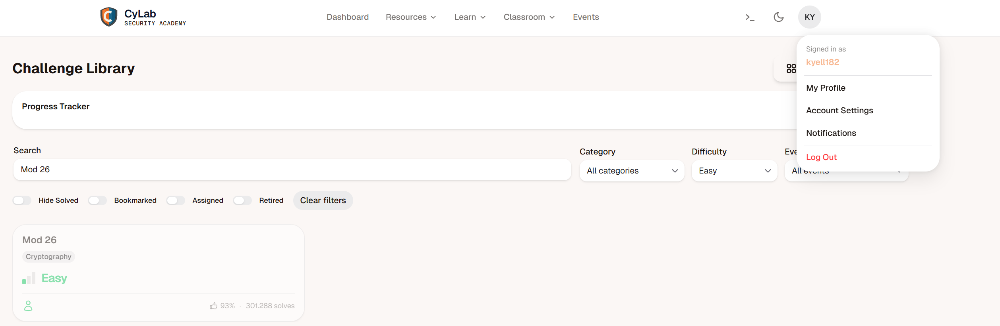

# PicoCTF Challenge Rapport : Mod 26

---

# 1. Challenge-informatie

**Naam challenge:**  Mod 26
**Categorie:** Cryptography
**Difficulty:** Easy
**PicoCTF platform:** picoCTF  
**Datum opgelost:**  15/05/2026
**PicoCTF username:**  kyell182

## Probleemstelling

De challenge geeft een versleutelde tekst:

cvpbPGS{arkg_gvzr_V'yy_gel_2_ebhaqf_bs_ebg13_45559noq}.

De titel "Mod 26" is een hint naar het alfabet (26 letters) en een klassiek rotatie-algoritme.

## hints

- This can be solved online if you don't want to do it by hand!
- Cryptography can be easy, do you know what ROT13 is?

---

## 2. Eerste Analyse (Reconnaissance)

Bij het bekijken van de tekst valt de structuur direct op: cvpbPGS{...}. Dit lijkt sprekend op de vlag-structuur picoCTF{...}.

De letter c staat op de plek van de p.

De letter v staat op de plek van de i.

De letter p staat op de plek van de c.

Dit wijst op een substitutieversleuteling, waarbij elke letter is vervangen door een andere letter die een vast aantal plaatsen verderop in het alfabet staat. In de cryptografie noemen we dit een Caesar Cipher.

gezien de hint "ROT13" is het waarschijnlijk dat de tekst is versleuteld met een ROT13-cijfer, waarbij elke letter 13 plaatsen verderop in het alfabet wordt vervangen.

### stap 1

ik heb eerst alle letters van het alfabet op een rijtje gezet en deze een nummer gegeven van 1 tot 26 (a=1, b=2, ..., z=26). Vervolgens heb ik de letters in de versleutelde tekst omgezet naar hun corresponderende nummers.

### stap 2

Vervolgens heb ik 13 opgeteld bij elk nummer (omdat ROT13 een verschuiving van 13 is). Als het resultaat groter was dan 26, heb ik 26 afgetrokken om weer binnen het bereik van het alfabet te blijven.

### stap 3

Tot slot heb ik de nieuwe nummers weer omgezet naar letters, wat me de volgende tekst gaf:

picoCTF{next_time_I'll_try_2_rounds_of_rot13_45559abd}

ik kon dit ook in een online ROT13 decoder plakken, wat hetzelfde resultaat gaf.

maar ik vind het leuker om het zelf te doen, omdat het me helpt om het concept van ROT13 beter te begrijpen en het is een goede oefening in het werken met ciphers.

---

## 4. Technische Uitleg

Caesar Cipher:

Een van de oudste encryptietechnieken. Het werkt volgens de formule $E_n(x) = (x + n) \mod 26$. In dit geval is $n = 13$.Symmetrie: ROT13 is zijn eigen inverse. Dit betekent dat hetzelfde algoritme wordt gebruikt voor zowel encryptie als decryptie.

Modulo-rekenen:

De titel "Mod 26" verwijst naar de wiskundige modulo-operatie. Wanneer je bij de 'Z' bent en nog 1 stap verder moet, begin je weer bij de 'A' (26 mod 26 = 0).

## 5. Reflectie: Preventie in een echte omgeving

Encryptie is niet hetzelfde als codering:

Net als Base64 (bij WebDecode) biedt ROT13 geen werkelijke veiligheid. Het is een vorm van obfuscatie. In moderne systemen mag dit nooit gebruikt worden om wachtwoorden of persoonlijke data te beschermen.

Brute Force:

Omdat er bij een Caesar Cipher maar 25 mogelijke verschuivingen zijn (sleutels), kan een computer dit binnen een fractie van een milliseconde kraken door alle opties te proberen.

Gebruik van standaarden:

Voor mijn projecten (zoals de mail-service voor het 3D Lab) gebruik ik altijd bewezen cryptografische bibliotheken en protocollen zoals TLS/SSL en AES-256 in plaats van zelf een algoritme te verzinnen of een zwakke cipher te gebruiken.

