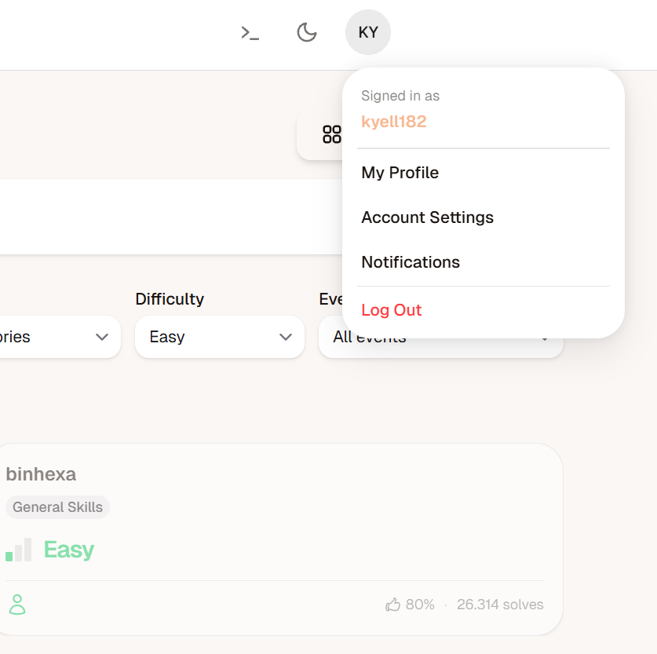

# PicoCTF Challenge Rapport : binhexa

---

# 1. Challenge-informatie

**Naam challenge:** binhexa
**Categorie:** General skills
**Difficulty:** Easy
**PicoCTF platform:** picoCTF  
**Datum opgelost:**  15/05/26
**PicoCTF username:**  kyell182

## Probleemstelling

De opdracht is om een interactief programma in de terminal te doorlopen dat verschillende binaire operaties op twee getallen uitvoert. Als alle berekeningen kloppen, moet je het eindresultaat omzetten naar hexadecimaal om de vlag te krijgen.

### hints

geen

---

## 2. Eerste Analyse (Reconnaissance)

Bij het maken van de verbinding via Netcat (nc titan.picoctf.net 61409) kreeg ik direct twee binaire getallen te zien:

Binary Number 1: 00110001

Binary Number 2: 00011100

Het programma vereist dat je stapsgewijs operaties uitvoert op deze getallen. Dit test de basiskennis van binaire logica die we ook in de lessen digitale elektronica gebruiken.

---

## 3. Onderzoek en Stappenplan (Volledig Denkproces)

### Stap 1

de operaties uitvoeren die gevraagd zijn ik heb een tool in mijn tablet die dit kan doen maar je kan ook gewoon een rekenmachine gebruiken die bitwise operaties ondersteunt.

```bash
kyell182-academy@webshell:~$ nc titan.picoctf.net 61409

Welcome to the Binary Challenge!"
Your task is to perform the unique operations in the given order and find the final result in hexadecimal that yields the flag.

Binary Number 1: 00110001
Binary Number 2: 00011100


Question 1/6:
Operation 1: '>>'
Perform a right shift of Binary Number 2 by 1 bits .
Enter the binary result: 00001110
Correct!

Question 2/6:
Operation 2: '&'
Perform the operation on Binary Number 1&2.
Enter the binary result: 00010000
Correct!

Question 3/6:
Operation 3: '|'
Perform the operation on Binary Number 1&2.
Enter the binary result: 00111101
Correct!

Question 4/6:
Operation 4: '*'
Perform the operation on Binary Number 1&2.
Enter the binary result: 010101011100
Correct!

Question 5/6:
Operation 5: '<<'
Perform a left shift of Binary Number 1 by 1 bits.
Enter the binary result: 01100010
Correct!

Question 6/6:
Operation 6: '+'
Perform the operation on Binary Number 1&2.
Enter the binary result: 01001101
Correct!

Enter the results of the last operation in hexadecimal: 77
Incorrect answer!

Enter the results of the last operation in hexadecimal: 77.0

Incorrect input. Provide the right input!

Enter the results of the last operation in hexadecimal: 4D

Correct answer!
The flag is: picoCTF{b1tw^3se_0p3eR@tI0n_su33essFuL_d6f8047e}
```

Ik heb de vragen systematisch beantwoord door de gevraagde bitwise en rekenkundige operaties uit te voeren:

Right Shift (>>): Bits naar rechts opschuiven (delen door 2).

AND (&): Alleen een '1' als beide bits '1' zijn.

OR (|): Een '1' als minstens één bit '1' is.

Multiplication (*): De getallen vermenigvuldigen als integers.

Left Shift (<<): Bits naar links opschuiven (vermenigvuldigen met 2).

Addition (+): De binaire som berekenen met carry-bits.

---

### Stap 2

Hoewel dit handmatig kan, heb ik voor de snelheid en nauwkeurigheid de Windows Calculator (Programmer Mode) gebruikt. Hiermee kon ik direct tussen de binaire en hexadecimale weergave schakelen, wat essentieel was voor de laatste stap.

---

### Stap 3

De laatste stap was het omzetten van het resultaat van de optelling (01001101) naar hex.

Linker nibble: 0100 = 4

Rechter nibble: 1101 = 13 (wat in Hex de letter D is).

Eindresultaat: 4D.

---

## 4 technische details en uitleg

Wat hier technisch gebeurt, is directe manipulatie van data op het laagste niveau.

Bitwise operaties: Deze werken op de individuele bits en zijn extreem efficiënt omdat ze direct door de ALU (Arithmetic Logic Unit) van de processor worden afgehandeld.

Hex-conversie: In de ICT gebruiken we hexadecimaal omdat het een compacte weergave is van binaire data. Eén hex-karakter vertegenwoordigt precies 4 bits, wat het makkelijker maakt om geheugenadressen of registerwaardes te lezen.

## 5 reflectie

Waarom is deze basiskennis belangrijk voor cybersecurity?

Foutieve Logica: In talen zoals C kunnen fouten in bit-shifting (<< of >>) leiden tot dataverlies of het overschrijven van aangrenzende geheugenlocaties.

Integer Overflows: Bij de optelling (+) en vermenigvuldiging (*) kan een resultaat groter worden dan de gereserveerde ruimte (bijv. 8-bit). Als een programmeur hier geen rekening mee houdt, kan dit een "overflow" veroorzaken die aanvallers misbruiken om de programmastroom te manipuleren.

Netwerkbeheer: In mijn eigen omgeving gebruik ik binaire AND-operaties voor subnetberekeningen. Een fout in deze logica kan ertoe leiden dat firewall-regels niet correct worden toegepast op de juiste IP-ranges.

#### conclusie

ik had niet goed opgelet en had de laatste binaire uitkomst niet goed omgezet naar hexadecimaal. Na het corrigeren van deze fout kreeg ik de vlag te zien.

er is geen echte moeilijkheid in deze challenge, het is gewoon een kwestie van de juiste binaire operaties uitvoeren en de laatste uitkomst correct omzetten naar hexadecimaal.

