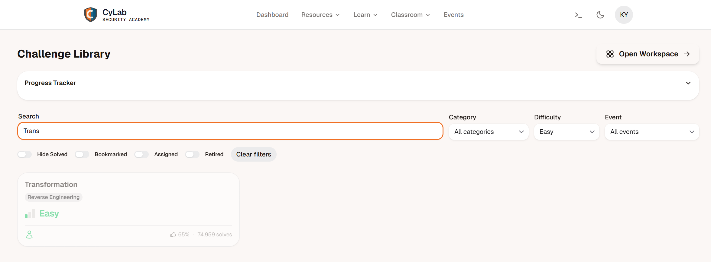

# PicoCTF Challenge Rapport : Transformation

---

# 1. Challenge-informatie

**Naam challenge:**  Transformation
**Categorie:** Reverse engineering
**Difficulty:** Easy
**PicoCTF platform:** picoCTF  
**Datum opgelost:** 16/05/2026
**PicoCTF username:**  kyell182

## Probleemstelling

De challenge geeft een bestand genaamd enc met daarin een vreemde reeks Unicode-karakters:

灩捯䍔䙻ㄶ形楴獟楮獴㌴摟潦弸形㝦㘲捡㕽.

Daarnaast krijgen we een regel Python-code die laat zien hoe deze tekst is gegenereerd vanuit de originele vlag:

```python
''.join([chr((ord(flag[i]) << 8) + ord(flag[i + 1])) for i in range(0, len(flag), 2)])
```

hints:

- You may find some decoders online

---

## 2. Eerste Analyse (Reconnaissance)

Een normale PicoCTF-vlag is opgebouwd uit ASCII-karakters (picoCTF{...}). De aanwezigheid van Chinese tekens betekent dat de data is gemanipuleerd.

Als we de meegeleverde Python-code ontleden, zien we exact wat er gebeurt:

```python
ord(flag[i]) << 8
```

: Het eerste ASCII-karakter wordt gepakt en de bits worden 8 posities naar links verschoven. Dit vormt het Most Significant Byte (MSB).

```python
+ ord(flag[i + 1])
```

: De waarde van het tweede ASCII-karakter wordt erbij opgeteld. Dit vormt het Least Significant Byte (LSB).

```python
chr(...)
```

: Van deze gecombineerde 16-bit waarde wordt één nieuw Unicode-karakter gemaakt.

Kortom: telkens twee 8-bit ASCII-karakters zijn samengevoegd tot één 16-bit Unicode-karakter.

### Hypothese 1

> we gaan moeten bytes manipuleren om zo de flag te kunnen reconstrueren.
> ik denk dat litlle endian hier een rol speelt, omdat de eerste byte (MSB) wordt verschoven en de tweede byte (LSB) er direct achteraan komt.

---

## 3. Onderzoek en Stappenplan (Volledig Denkproces)

### Stap 1

ik heb eerst geprobeerd om de tekst te decoderen met een online Unicode-decoder, maar dit gaf geen bruikbare resultaten. De reden hiervoor is dat de tekens niet zomaar Unicode zijn, maar specifiek geconstrueerd uit twee ASCII-tekens.

#### Waarom probeerde ik dit?

Omdat ik wilde zien of er een eenvoudige manier was om de tekens terug te vertalen naar ASCII, zonder zelf een script te hoeven schrijven.

#### Tool

Ik gebruikte een online Unicode-decoder, maar dit was niet geschikt voor deze specifieke transformatie.

### Stap 2

ik ben op onderzoek gegaan naar een tool die dit type in 1 keer kon ongedaan maken en vond CyberChef een veelzijdige tool voor data-analyse en -transformatie.

deze tool word bljkbaar zeer veel gebruikt in CTF's en is als het ware een Zwitsers zakmes voor data-manipulatie.

#### Waarom probeerde ik dit?

Omdat CyberChef een breed scala aan functies heeft, waaronder bitmanipulatie en het omkeren van transformaties. Ik dacht dat ik hiermee de originele ASCII-tekens zou kunnen herstellen.

#### Tool

CyberChef (https://gchq.github.io/CyberChef/)

### Stap 3

In CyberChef heb ik de volgende stappen uitgevoerd:

1. **Input**: Ik heb de gegeven tekst in het inputveld geplakt.

2. in de output sectie heb je een knop om de output te veranderen naar verschillende formats zoals UTF-8 UTF-16, Hex, Base64 etc. ik heb hier UTF-16BE gekozen omdat dit big endian is en de MSB voorop staat.

3. **Output**: Na het selecteren van UTF-16BE kreeg ik de volgende output:

```text
picoCTF{16_bits_inst34d_of_8_b7f6ca5}
```

waardoor ik geen python-script hoefde te schrijven om de transformatie ongedaan te maken.

---

## 4. Technische Uitleg

doordat dit een combinatie van 2 bytes is en er een bitshift van 8 is toegepast, betekent dit dat de originele data in UTF-16BE (Big Endian) is gecodeerd. In deze codering worden de meest significante bytes eerst opgeslagen, wat precies overeenkomt met de transformatie die in de Python-code wordt beschreven.

ik heb wat geluk gehad dat de originele vlag precies 16 bytes lang was, waardoor er geen padding nodig was en ik direct de juiste codering kon kiezen in CyberChef.

door trail and error met verschillende encodings in CyberChef kon ik uiteindelijk de juiste combinatie vinden die de originele ASCII-tekst terugbracht.

---

## 5. Reflectie: Preventie in een echte omgeving

Deze challenge is een klassiek voorbeeld van data-obfuscation door middel van bit-shifting en bitwise operaties.

Het toont aan dat encryptie en obfuscation twee heel verschillende dingen zijn:

zonder een geheime sleutel (key) is een puur wiskundige transformatie zoals deze direct omkeerbaar zodra je het achterliggende algoritme begrijpt.

Voor een security-analist is het begrijpen van hoe data in het geheugen wordt opgeslagen (MSB, LSB, Big-Endian vs Little-Endian) essentieel bij het analyseren van custom malware-encoders of netwerkprotocollen die data proberen te camoufleren.

