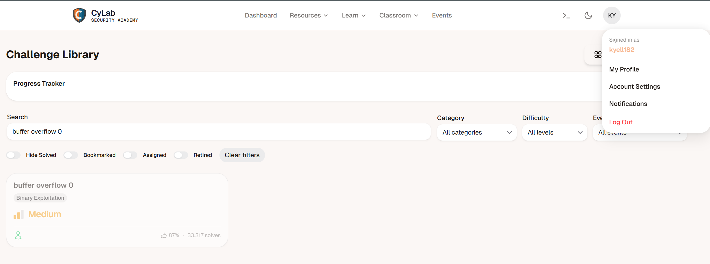

# PicoCTF Challenge Rapport : Buffer overflow 0

---

# 1. Challenge-informatie

**Naam challenge:**  Buffer overflow 0
**Categorie:** Binary exploitation
**Difficulty:** Medium
**PicoCTF platform:** picoCTF  
**Datum opgelost:**  14/05/2026
**PicoCTF username:**  kyell182

## Probleemstelling

we moeten de juiste buffer overflowen van het programma om de flag te kunnen vinden.
we krijgen het programma vuln en de source file vuln

## hints

- How can you trigger the flag to print?
- If you try to do the math by hand, maybe try and add a few more characters. Sometimes there are things you aren't expecting.
- Run man gets and read the BUGS section. How many characters can the program really read?

---

## 2. Eerste Analyse (Reconnaissance)

windows defender geeft geen virus terug.

na downloaden geopend met vscode en dit is c code

bij uitvoeren van de code krijg ik een hoop onzin te zien en heel veel nul blokken

### Observaties

de code is zo geschreven dat hij de vlag print als sigsegv getriggerd word.

```c
void sigsegv_handler(int sig) {
  printf("%s\n", flag);
  fflush(stdout);
  exit(1);
}
```

er is een functie die volgens mij en de hints niet check hoe groot de ingegeven waarde is.

```c
gid_t gid = getegid();
```

de buffer van buf1 is 100 bytes groot.

```c
  char buf1[100];
  gets(buf1); 
  vuln(buf1);
```

sigsegv is een segmentatie fout trigger die getriggerd word als het geheugen gecorupted word.

### Hypothese 1

als ik die functie kan gebruiken om de memory te laten corrupten dan kan hij buiten zijn buffer gaan. en zal hij crashen en de flag outputen.

---

## 3. Onderzoek en Stappenplan (Volledig Denkproces)

### Stap 1

ik zal kijken om via een python scriptje meer dan 100 bytes te versturen naar het programma en zo de buffer te overloaden.

#### Waarom probeerde ik dit?

dit moet ervoor zorgen dat de sigsegv getriggerd word en zo het programma doet crashen en de flag zou moeten printen.

#### Tool

pico ctf webshell

#### comando's

```bash
nc saturn.picoctf.net 65214
Input: python3 -c "print('n'*150)"
picoCTF{ov3rfl0ws_ar3nt_that_bad_c5ca6248}

```

`nc saturn.picoctf.net 65214` = netcat is een tool die gebruikt word om verbindingen te maken en data te versturen over het netwerk. in dit geval gebruik ik het om verbinding te maken met de server van picoCTF en mijn payload te versturen.

`input` = hier geef ik mijn payload in

`picoCTF{ov3rfl0ws_ar3nt_that_bad_c5ca6248}` = dit is de flag die ik terug krijg als het gelukt is.

`-c "print('n'*150)"` = dit is een python commando dat een string van 150 'n' karakters print. dit gebruik ik als payload om de buffer te overloaden.

---

## 4. technische details en uitleg

Wat er technisch gebeurde:

Door een te lange string in te voeren, trad er een Buffer Overflow op. De overtollige 'n's overschreven de aangrenzende geheugenlocaties op de stack, inclusief de return address of andere kritieke variabelen.

Techniek: Stack Smashing.

Waarom dit werkte:

Omdat de programmeur een onveilige functie (gets) gebruikte die de invoerlengte niet valideert, kon ik het geheugen van het programma manipuleren. De crash activeerde de sigsegv_handler, die geprogrammeerd was om de vlag te tonen bij een crash.

---

## 5. Conclusie

Gebruik veilige functies:

Gebruik nooit gets(). Gebruik in plaats daarvan fgets(), waarbij je expliciet aangeeft hoeveel bytes er maximaal gelezen mogen worden (bijv. fgets(buf, 100, stdin)).

Stack Canaries:

Moderne compilers voegen vaak "canaries" (waardes aan het einde van een buffer) toe. Als deze waarde verandert, weet het systeem dat er een overflow is en sluit het programma veilig af voordat de exploit kan draaien.

ASLR & DEP:

Schakel moderne OS-beveiligingen in zoals Address Space Layout Randomization (ASLR), wat het lastiger maakt voor aanvallers om te voorspellen waar data in het geheugen staat.

Input Validatie:

Controleer altijd de lengte en het type van de input aan de poort van je applicatie, of dit nu een webformulier is of een console-input.

Door deze best practices te volgen, kunnen ontwikkelaars de kans op succesvolle buffer overflow-aanvallen aanzienlijk verminderen en de veiligheid van hun applicaties verbeteren.

