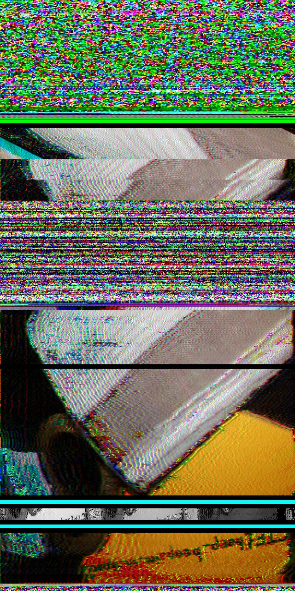
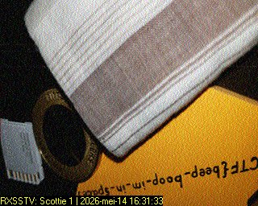
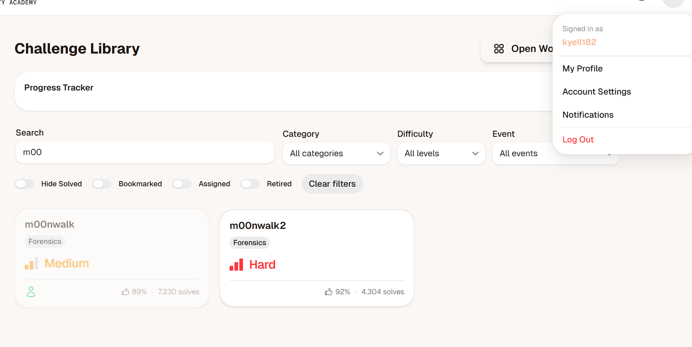

# PicoCTF Challenge Rapport : m00nwalk

---

# 1. Challenge-informatie

**Naam challenge:**  m00nwalk
**Categorie:** Forensics
**Difficulty:** Medium
**PicoCTF platform:** picoCTF  
**Datum opgelost:**  14/05/26
**PicoCTF username:**  kyell182

## Probleemstelling

we moeten een bericht decoderen die van de "maan" komt.

## hints

- How did pictures from the moon landing get sent back to Earth?
- What is the CMU mascot?, that might help select a RX option

---

## 2. Eerste Analyse (Reconnaissance)

via defender geen vlaggen gekregen dus geen virus

dit is een audio opname met veel ruis en static noise

### Observaties

- dit is een .wav dat is een geluid bestand geen image of tekstbestand
- de hint verwijst naar hoe nasa afbeelding terug naar de aarde stuurde.
- de andere hint verwijst naar een CMU mascot en dit zou helpen om een RX optie te kiezen => RX =  Recieved dus ontvangen

### Hypothese 1

> ik vermoed dat in het audio bestand waarschijnlijk een afbeelding of bericht verscholen zit die we met de techniek die nasa gebruikte zullen moeten omzetten.
---

## 3. Onderzoek en Stappenplan (Volledig Denkproces)

### Stap 1

ik zal hem eerst eens binnen halen op de webshell van pico ctf en dan eens kijken wat ik er mee kan doen

#### Waarom probeerde ik dit?

de linux omgeving heeft veel tools die ik kan gebruiken om bestanden en zo te analyseren.

#### Tool

pico ctf webshell

#### comando's

```bash
wget https://challenge-files.picoctf.net/c_fickle_tempest/c9834b19f74a20802d7c53dc42fe1ccd8a69da4cf5c38fa5b6aab8ec472efdd3/message.wav
```

---

### Stap 2

ik zal nu kijken om naar de meta data en file structuur om te zien of ik hier iets uit kan opmaken.

#### Waarom probeer ik dit?

mischien kan ik hier iets uit afleiden.

#### Tool

exiftool

#### comando's

```bash

exiftool message.wav
ExifTool Version Number         : 12.40
File Name                       : message.wav
Directory                       : .
File Size                       : 11 MiB
File Modification Date/Time     : 2025:11:21 19:10:37+00:00
File Access Date/Time           : 2026:05:14 14:13:59+00:00
File Inode Change Date/Time     : 2026:05:14 14:13:59+00:00
File Permissions                : -rw-rw-r--
File Type                       : WAV
File Type Extension             : wav
MIME Type                       : audio/x-wav
Encoding                        : Microsoft PCM
Num Channels                    : 1
Sample Rate                     : 48000
Avg Bytes Per Sec               : 96000
Bits Per Sample                 : 16
Duration                        : 0:01:55
```

#### bevindingen

- ik zie dat de file read en write rechten geeft voor de user en group maar dat others enkel read rechten geeft.
- het bestand is 11Mib groot
- het is een WAV bestand wat een een waveform audio file is een codec van microsof wat ook ondersteund word door de encoding
- de sample rate is 48 KHz

alles wijst erop dat dit een standaard onveranderde wav file is waar niet aan gepruts is.

---

### stap 3

na veel research en opzoek werk ben ik op volgende gevallen nasa gebruikte tijdens de apollo missies sstv ( slow-scan - tv) dit is een techniek die stilstaande afbeeldingen over geluid ( small-band ) verstuurde en waar een ontvanger met de juiste setting dit geluid kan omzetten in een afbeelding ( pixel data ).

de hint naar de mascote van MCU verwijst naar een hond die scottie noemt en dit is een standaard die gebruikt word in amerika en japen bij deze transmissies.

ik heb een tool gevonden die ik op mijn smartphone kan installeren en als ik op mijn laptop dit bestand afspeel zou ik een image moeten zien.

ik vermoed een hond te zien.

#### Tool

Robot36 <https://play.google.com/store/apps/details?id=xdsopl.robot36>

#### bevindingen

het resultaat is volgende :



ik zie in de afbeelding vanonder een omgekeerde vlag staan maar dit is niet goed leesbaar.

#### waarom werkte dit niet goed?

doordat ik dit via de speakers hheb laten afspelen en door geluid achtergrond heeft dit de data wat veranderd waardoor dit niet goed is gelukt.

---

### stap 4

ik zal nu kijken of ik dit kan verbeteren en niet via de box zelf maar met een programma kan doen waardoor ik de ruis en achtergrond geluid kan elimeneren en puur de data in het geluid fragment kan isoleren.

ik ga dit in windows doen omdat in de shell ik niet zomaar alles kan instaleren

#### Tools

RX-SSTV = dit zet het geluid om in beeld
vcbdriver-cable = dit om het geluid rechtstereeks in RX-SSTV te krijgen zonder noise

#### bevindingen

- we krijgen volgend beeld



en daarin vinden we de vlag van deze challenge

picoCTF{beep_boop_im_in_space}

---

#### analyse

dit is een zeer mooi voorbeeld hoe data in andere mediums of formats zich kan verplaatsen en "kan vestopt worden" men kan via mail of dergelijke een ogenschijnlijke onschuldig audio fragment afspelen en denken he wat een raar geluid.

maar er kunnen toestellen aan het luisteren zijn of processen en dit eigenlijk als commando's of instructies interpreteren.

wat dit ook aantoond is dat dit niet kan gedetecteerd worden door anti virusen omdat dit een legitieme bestand is wat antivirusen betreft zij denken dit is gewoon een audio bericht of muziek en zullen dit dus zelden tot nooit detecteren zonder diepgaande analyse van het bestand.

dit toont nogmaals aan dat je enkel dingen mag openen of beluisteren die je echt vertrouwd en de nodige checks gedaan hebt en dan nog kan je niet 100% zeker zijn.

---

#### wat kan er tegen gedaan worden?

Stop met "Security through Obscurity":

Deze challenge bewijst dat het verbergen van data in een ongebruikelijk formaat (zoals audio) geen echte beveiliging is. In een productieomgeving moeten we altijd uitgaan van het Zero Trust principe.

Encryptie aan de bron:

Data moet digitaal versleuteld worden met algoritmes zoals AES-256 voordat het verzonden wordt. Zelfs als een aanvaller het SSTV-signaal dan onderschept, ziet hij alleen versleutelde ruis in plaats van de vlag.

Deep Packet Inspection (DPI):

Firewalls moeten geconfigureerd worden om niet alleen naar poorten te kijken, maar ook naar de inhoud van data-stromen (zoals VoIP) om afwijkende analoge patronen te detecteren die kunnen wijzen op data-exfiltratie (het weglekken van info).

Data Loss Prevention (DLP):

Gebruik tools die bestanden scannen op verborgen kanalen (covert channels) voordat ze het netwerk verlaten.

bij kritieke installaties moeten gsm en elke vorm van audio generatie waar mogelijk vermeden worden of gewoonweg niet aanwezig zijn alsook elek vorm van onvanger waar niet nodig gewoon niet aanwezig zijn.

---

