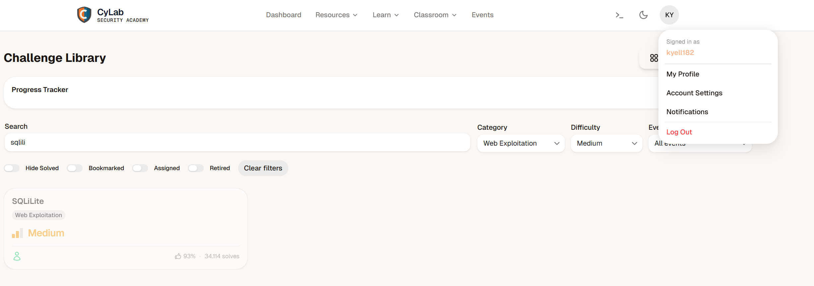

# PicoCTF Challenge Rapport : SQLiLite

---

# 1. Challenge-informatie

**Naam challenge:** SQLiLite
**Categorie:** Web Exploitation
**Difficulty:** Medium
**PicoCTF platform:** picoCTF  
**Datum opgelost:**  16/05/2026
**PicoCTF username:**  kyell182

## Probleemstelling

De challenge linkt naar een webpagina met een inlogformulier (gebruikersnaam en wachtwoord).

We hebben geen geldige inloggegevens, maar de titel van de challenge verraadt al dat de applicatie gebruikmaakt van een kwetsbare SQLite-database aan de achterkant.

Het doel is om de authenticatie te omzeilen.

### hints

- admin is the user you want to login as.

---

## 2. Eerste Analyse (Reconnaissance)

### poging 1

Omdat de challenge "Easy/Medium" leek, ben ik eerst gewoon domweg beginnen gokken.

Ik heb standaard combinaties geprobeerd zoals:

admin / admin

admin / password

root / root

Dit werkte natuurlijk totaal niet en ik kreeg telkens een foutmelding dat de gegevens niet klopten.

### poging 2

Daarna dacht ik aan de vorige challenge (WebDecode) en heb ik met F12 de broncode bekeken.

Ik heb gezocht in de HTML en de scripts naar een verborgen wachtwoord of een Base64-string, maar er stond helemaal niks bruikbaars in de frontend.

Alles werd netjes naar de backend gestuurd.

Toen besefte ik dat het probleem echt bij de database zelf lag en dat ik SQL-injectie moest gebruiken.

---

## 3. Onderzoek en Stappenplan (Volledig Denkproces)

### Stap 1

Ik wist uit de theorie dat een inlogscherm aan de achterkant waarschijnlijk zo'n soort query uitvoert:

```sql
SELECT * FROM users WHERE username = 'INVOER' AND password = 'PASSWORD';
```

Als ik een single quote (') invoer, kan ik die string dus feitelijk "breken".

Mijn eerste test was gewoon ' invullen bij username.

De site gaf een SQL-foutmelding, wat voor mij het bewijs was dat de invoer onbeveiligd in de query werd geplakt!

```txt
username: '
password: 
SQL query: SELECT * FROM users WHERE name=''' AND password=''
```

---

### stap 2

Ik probeerde eerst de bekende payload:

- admin'.

Dit werkte nog niet, omdat de SQL-query aan de achterkant dan crashte op het resterende deel van de code (AND password = '...'). De syntax klopte niet meer.

```txt
username: admin'
password: 
SQL query: SELECT * FROM users WHERE name='admin'' AND password=''
```

#### stap 3

Ik moest het restant van de query dus "wegcommentariëren".

In SQLite doe je dat met --.

Ik vulde uiteindelijk dit in bij username:

```txt
admin' OR 1=1 --
```

- OR 1=1 zorgt ervoor dat de WHERE-clausule altijd waar is, ongeacht het wachtwoord.
- -- zorgt ervoor dat de rest van de query (AND password = '...') genegeerd wordt.

Het wachtwoordveld liet ik gewoon leeg.

dit werkte en ik kon inloggen ik kreeg een tekst te zien met:

logges in! But can you see the flag, its in plainsight.

ik ben dan in inspecter gaan kijken ( F12) en ik zag dat er een p hidden tag stond in de HTML-code:

```html
<p hidden="">Your flag is: picoCTF{L00k5_l1k3_y0u_solv3d_it_d3c660ac}</p>
```

#### technische uitleg

Door mijn invoer veranderde de query aan de achterkant in:

```sql
SELECT * FROM users WHERE name='admin' OR 1=1 --' AND password='';
```

Omdat -- ervoor zorgt dat alles erachter als commentaar wordt gezien, negeert de database de hele wachtwoordcontrole.

De voorwaarde OR 1=1 is altijd waar (True).

De database dacht dus: "Oké, dit klopt," en logde mij automatisch in als de eerste gebruiker in de tabel (de admin).

De vlag verscheen meteen op het scherm.

#### analyse

Als ICT-student die zelf backends bouwt (zoals Express met Node.js), is dit echt een eye-opener:

Nooit strings aan elkaar plakken:

Als ik een query bouw, mag ik nooit variabelen rechtstreeks in de SQL-string plakken met template literals (bijv. `SELECT * FROM ... '${user}'`).

Prepared Statements:

Je moet altijd "parameterized queries" of prepared statements gebruiken. De database weet dan dat de invoer pure tekst is en zal ' OR 1=1 -- nooit als code uitvoeren.

ORM (Object-Relational Mapping):

In grotere projecten is het slimmer om een ORM zoals Sequelize te gebruiken, die regelt dit soort beveiliging automatisch aan de achterkant.

men moet ook opassen wat men in de console log print omdat men aan de hand van de responses soms dingen kan afleiden over de database of de backend.


