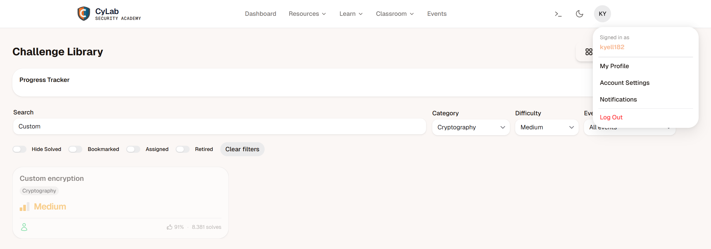

# PicoCTF Challenge Rapport: Custom encryption

---

# 1. Challenge-informatie

**Naam challenge:** Custom encryption
**Categorie:** Cryptography
**Difficulty:** Medium
**PicoCTF platform:** picoCTF  
**Datum opgelost:**  16/05/2026
**PicoCTF username:**  kyell182

## Probleemstelling

We krijgen een Python-script dat de vlag heeft versleuteld, en een tekstbestand met de uitkomst:

een lijst met grote getallen en een paar startvariabelen (a, b, p, g).

De bedoeling is om de stappen van het script om te draaien om de vlag terug te krijgen.

## hints

- Understanding encryption algorithm to come up with decryption algorithm.

---

## 2. Eerste Analyse (Reconnaissance)

### poging 1

Toen ik de code opende, zag ik meteen een hoop wiskundige formules staan.

Mijn eerste gedachte was: "pffff laat maar zitten, dit is veel te ingewikkeld."

Ik heb eerst geprobeerd om handmatig wat logica te zoeken in de getallen, maar daar kwam ik natuurlijk nergens mee.

Pas toen ik beter keek, zag ik dat de waarden voor de formules (a, b,) gewoon al in het tekstbestand stonden.

en dat (p, g) ook gewoon in het script stonden.

Ik hoefde de wiskunde dus helemaal niet zelf te snappen; ik kon die code gewoon kopiëren en Python het rekenwerk laten doen.

### poging 2

Nadat ik de getallen had omgerekend, dacht ik de vlag te hebben en smeet ik de uitkomst in een online XOR-decoder.

Dat werkte niet.

Het script bleek de vlag namelijk eerst achterstevoren te hebben gezet voordat het ging versleutelen.

De online tool liep hierop vast, dus moest ik zelf een simpel scriptje schrijven om het op te lossen.

---

## 3. Onderzoek en Stappenplan (Volledig Denkproces)

### Stap 1

Om te weten hoe ik moest de-encrypten, moest ik eerst begrijpen wat hun script deed.

Bij het bestuderen van de encrypt-functie in het meegeleverde script zag ik dit basisteken staan: ^.

```python
def dynamic_xor_encrypt(plaintext, text_key):
    cipher_text = ""
    key_length = len(text_key)
    for i, char in enumerate(plaintext[::-1]):
        key_char = text_key[i % key_length]
        encrypted_char = chr(ord(char) ^ ord(key_char))
        cipher_text += encrypted_char
    return cipher_text
```

In Python (en de meeste programmeertalen) staat het dakje (^) voor een Bitwise XOR-operatie.

Omdat XOR een symmetrische operatie is (je kunt het omdraaien met exact dezelfde logica), wist ik dat ik in mijn eigen script ook het ^ teken moest gebruiken om de letters weer terug te draaien.

### 2

In plaats van zelf te rekenen, heb ik een kort Python-script geschreven dat de stappen van de encryptie simpelweg achteruit doorloopt:

```python
# Gegeven variabelen uit de challenge
p, g, a, b = 97, 31, 94, 21
cipher = [131553, 993956, 964722, 1359381, 43851, 1169360, 950105, 321574, 1081658, 613914, 0, 1213211, 306957, 73085, 993956, 0, 321574, 1257062, 14617, 906254, 350808, 394659, 87702, 87702, 248489, 87702, 380042, 745467, 467744, 716233, 380042, 102319, 175404, 248489]

# 1. Laat Python de geheime sleutelfactor berekenen
shared_key = pow(pow(g, b, p), a, p)
key_factor = shared_key * 311

# 2. Deel de getallen door de sleutelfactor om de letters terug te krijgen
semi_cipher = [chr(num // key_factor) for num in cipher]

# 3. Draai de XOR-versleuteling om met de sleutel "trudeau" (herkend aan het ^ teken)
text_key = "trudeau"
plaintext = ""
for i, char in enumerate(semi_cipher):
    plaintext += chr(ord(char) ^ ord(text_key[i % len(text_key)]))

# 4. Zet de vlag weer in de juiste richting (omdraaien)
flag = plaintext[::-1]
print(flag)
```

Na het runnen van het script door deze aantemaken met volgende commando:

```bash
nano solve.py
```

en daarna:

```bash
python3 solve.py
```

kreeg ik de vlag te zien:

```txt
picoCTF{custom_d2cr0pt6d_8b41f976}
```

---

## 4. Conclusie

De computer rekent, niet ik:

Deze challenge bewijst dat je geen wiskundige hoeft te zijn voor cryptografie.

De computer voert de formules (pow en //) perfect uit, zolang je de logische stappen maar in de juiste (omgekeerde) volgorde zet.

XOR-logica:

Het herkennen van het ^ symbool was de sleutel.

XOR is heel populair in CTF's omdat het handig is:

als je letter A versleutelt met sleutel B, krijg je C. Doe je daarna C opnieuw XOR met sleutel B, dan ben je direct weer terug bij letter A.

## 5 reflectie

Don't Roll Your Own Crypto:

Dit is de gouden regel in security.

De maker van deze challenge dacht een veilig systeem te bouwen door wiskunde en XOR te combineren.

Maar omdat de logica rammelt en alle startvariabelen open en bloot in het bestand stonden, stelde de beveiliging niks voor.

Link met mijn projecten:

In mijn eigen code (zoals de mail-service voor het 3D-printproject) ga ik nooit zelf proberen om een encryptiesysteem te verzinnen.

Het is veel te makkelijk om fouten te maken in de logica.

Het is veiliger om standaard, kant-en-klare libraries (zoals crypto of bcrypt in Node.js) te gebruiken die door experts zijn getest.


